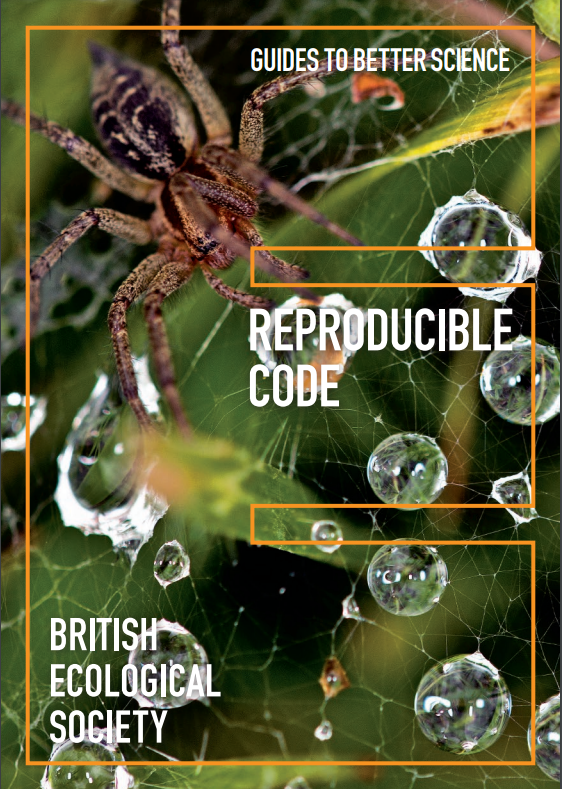

```{r, echo = FALSE}
# clipboard
htmltools::tagList(
  xaringanExtra::use_clipboard(
    button_text = "Copy code <i class=\"fa fa-clipboard\"></i>",
    success_text = "Copied! <i class=\"fa fa-check\" style=\"color: #90BE6D\"></i>",
    error_text = "Not copied 😕 <i class=\"fa fa-times-circle\" style=\"color: #F94144\"></i>"
  ),
  rmarkdown::html_dependency_font_awesome())
```

# Course structure

- Diogo Melo - [damelo@princeton.edu](damelo@princeton.edu)
- Scott Wolf - [swwolf@princeton.edu](swwolf@princeton.edu)

- Website: [eeb330.github.io](http://eeb330.github.io)

- Two lectures per week 
  - some presentations and some in class exercises

- One precept with Scott

- Office hours:
  - Guyot 301
  - TBD

---

# Grading

  - **No exams**
  - Weekly-ish coding exercises (30%)
    - Graded for coherence, not correctness

  - Class and precept participation (15%)
    - Participation and in-class quizzes

  - Two coding projects (35%)
    - Midterm and Final projects
    - Around 2-3 weeks 

  - Open-science exercise (20%)
    - Small presentation during finals period reproducing the analysis and/or plots from a published paper. 
    - More details later in the course


---

# Modern biology is computational biology

- Biology has become an eminently computational field
- Bioinformatics, statistics, handling large data are now basic tools of biological practice


---

# Replication crisis


# Excel is very popular


---

# A recent Excel debacle

"Growth in the time of Debt" controversy

Reinhart, Carmen M., and Kenneth S. Rogoff. 2010. American Economic Review, 100 (2): 573-78. DOI: 10.1257/aer.100.2.573
.pull-left[

- Super influential, around 5k citations
- Used to justify economic policy
]
.pull-right[

]


---

# Coding errors in spreadsheets are common

Thomas Herndon et al. "Does high public debt consistently stifle economic growth? A critique of Reinhart and Rogoff", Cambridge Journal of Economics, Volume 38, Issue 2, March 2014, Pages 257–279, https://doi.org/10.1093/cje/bet075


---

# Spreadsheet software have poor numerical accuracy

Almiron, M. G., Lopes, B., Oliveira, A. L. C., Medeiros, A. C., & Frery, A. C. (2010). On the Numerical Accuracy of Spreadsheets. Journal of Statistical Software, 34(4), 1–29. https://doi.org/10.18637/jss.v034.i04


---

# Code and analysis sharing

.pull-left[
- Reproducibility

- Reuse

- For academics: 
  - Post-publication peer-review
  - Community can modify and extend an analysis

- Example from us: [github.com/wolfffff/exp_var](https://github.com/wolfffff/exp_var)
]
.pull-right[

]

---

# Bespoke Custom Analysis

.pull-left[
- Programming allows you to tailor software for the specific problem you have.

- Sophisticated, custom analysis is more likely solve the exact question you are asking.
  - Canned solutions might solve some other problem that is only related to what you really care about.

- Once a bespoke software solution exists, it can be adapted to other situations, via code sharing or generic packages.
]
.pull-right[

]
---

# Why R and/or python?

- Great package ecosystem (CRAN, conda, bioconductor, ...)
- Easy to learn
- Good balance of easy-to-write and fast-to-run code
- Both can easily call code from faster languages if needed

.pull-left[
  
]
.pull-right[
  
]
---

# Effective Visualization 

- Visualization is essential for understanding and communicating data.
- R offers powerful visualization libraries, such as ggplot2.

```{r iris plot, out.height = 300}
library(ggplot2)
library(cowplot)
ggplot(iris, aes(Sepal.Width, Sepal.Length, color = Species)) + 
geom_point() + stat_ellipse() + theme_cowplot()
```

---


# Take home

.pull-left[
- Reproducible research ensures transparency and verifiability.

- R enables bespoke custom analysis and independence in model creation.

- Effective visualization enhances data understanding and communication.

- Sharing analytical tools and leveraging package ecosystems promote collaboration.
]
.pull-right[

### Suggested Readings

- [A (very) short introduction to R](https://cran.r-project.org/doc/contrib/Torfs+Brauer-Short-R-Intro.pdf)
- [British Ecological Society Guides](https://www.britishecologicalsociety.org/publications/guides-to/)

Longer texts: 
- [R for Data Science](https://r4ds.hadley.nz/)
- [Bioinformatics Data Skills](https://vincebuffalo.com/book/)
- [Advanced R](https://adv-r.hadley.nz/)
]

---

# What are we covering?

.pull-left[
- Basic interactions with a programming language
- Version control
- Some computer science concepts, like control flow and types
- Data science skills
- Data visualization
- Bioinformatics tools and genomic sequence analysis
- Using clusters and genomics pipelines
- Some extra topics we can discuss (TBD)

### Objective

**To give you the independence to use (and create) tools for solving problems in biological science.**

]

--

.pull-right[
### What are we not covering?

- Statistics and data analysis
- Algorithms
- CS theory
]

---

# How to draw an owl

.center[

]

---

# Possible extra topics

- By popular demand, we can cover some of these (maybe 3)

  - Digital Typography
  - Machine learning
  - Parallel computing
  - Interacting with lower level languages (C, FORTRAN)
  - Writing fast code and profiling
  - LLMs for development and testing
  - Sequence alignment
  - Finding new genes (Cara lecture)
  - Analysis of count data for gene expression analysis
  - Phylogenetic and evolutionary analysis
  - Something else?