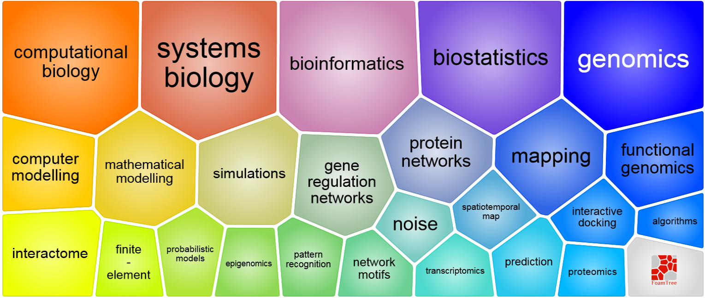
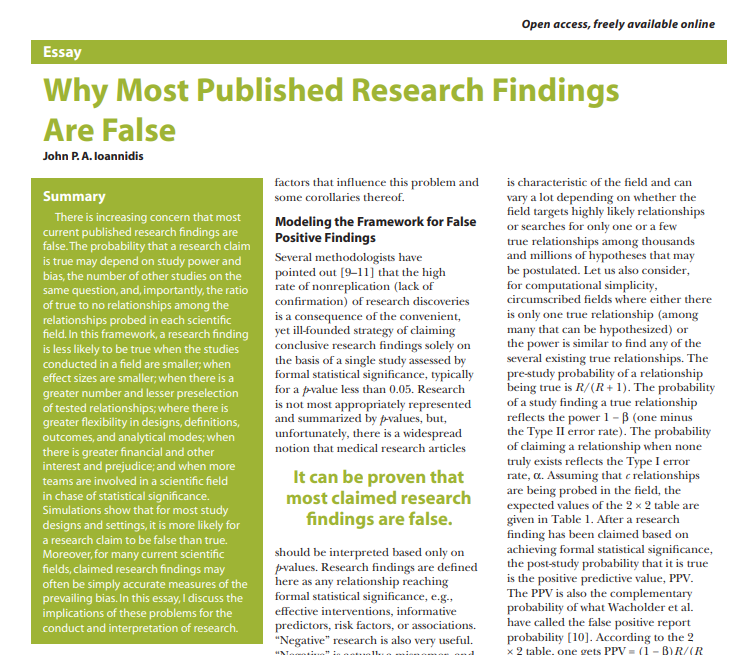
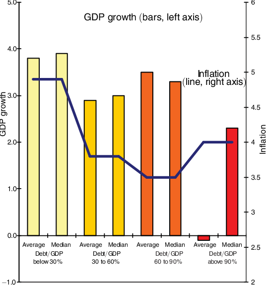
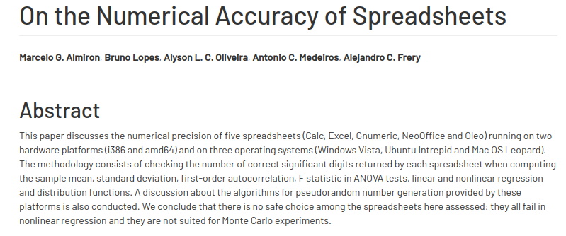

```{r, echo = FALSE}
# clipboard
htmltools::tagList(
  xaringanExtra::use_clipboard(
    button_text = "Copy code <i class=\"fa fa-clipboard\"></i>",
    success_text = "Copied! <i class=\"fa fa-check\" style=\"color: #90BE6D\"></i>",
    error_text = "Not copied 😕 <i class=\"fa fa-times-circle\" style=\"color: #F94144\"></i>"
  ),
  rmarkdown::html_dependency_font_awesome())
```

## Modern biology is computational biology

- Biology has become an eminently computational field
- Bioinformatics, statistics, handling large data are now basic tools of biological practice



---

## Replication crisis




## Excel is very popular


---

## Bespoke Custom Analysis

- Bespoke custom analysis refers to tailored analyses for specific problems.
- Programming provides a flexible environment for creating custom analyses.
- With R, you can:
    - Write custom functions.
    - Utilize various statistical packages.
    - Apply advanced techniques to unique data challenges.

---

## Growth in the time of Debt

Reinhart, Carmen M., and Kenneth S. Rogoff. 2010. "Growth in a Time of Debt." American Economic Review, 100 (2): 573-78. DOI: 10.1257/aer.100.2.573



---

## Coding errors in spreadsheets are common

Thomas Herndon et al. "Does high public debt consistently stifle economic growth? A critique of Reinhart and Rogoff", Cambridge Journal of Economics, Volume 38, Issue 2, March 2014, Pages 257–279, https://doi.org/10.1093/cje/bet075


---

## Spreadsheet software have poor numerical accuracy

Almiron, M. G., Lopes, B., Oliveira, A. L. C., Medeiros, A. C., & Frery, A. C. (2010). On the Numerical Accuracy of Spreadsheets. Journal of Statistical Software, 34(4), 1–29. https://doi.org/10.18637/jss.v034.i04



---

## Independence for Creating Models

- R allows you to create models independently, without relying on proprietary software.
- You have full control over the modeling process.
- R provides a wide range of modeling techniques, including:
    - Linear regression.
    - Logistic regression.
    - Decision trees.
    - Random forests.
    - Support vector machines.

---

## Effective Visualization

- Visualization is essential for understanding and communicating data.
- R offers powerful visualization libraries, such as ggplot2.
- Key features of effective visualization include:
    - Choosing appropriate plots for the data type.
    - Using colors, labels, and annotations to enhance understanding.
    - Creating interactive visualizations with packages like plotly.

---

## Sharing Analytical Tools

- R allows you to share your analytical tools with others.
- You can create custom R packages that encapsulate your code and functions.
- Sharing analytical tools promotes collaboration and reproducibility.
- Packages like devtools and roxygen2 facilitate package development in R.

---

## Package Ecosystems

- R has a rich ecosystem of packages for various data analysis tasks.
- Packages like dplyr, tidyr, and lubridate provide powerful data manipulation capabilities.
- Bioconductor offers a comprehensive collection of packages for bioinformatics.
- CRAN (Comprehensive R Archive Network) hosts thousands of packages for diverse domains.

---

## Conclusion

- Reproducible research ensures transparency and verifiability.
- R enables bespoke custom analysis and independence in model creation.
- Effective visualization enhances data understanding and communication.
- Sharing analytical tools and leveraging package ecosystems promote collaboration.

---


