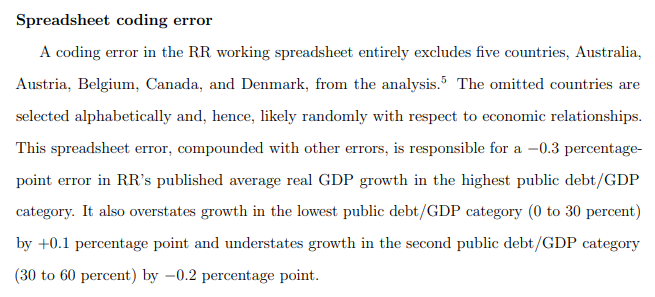
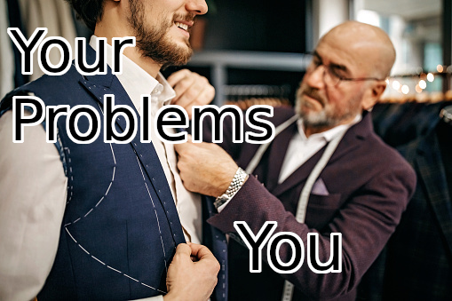

```{r, echo = FALSE}
# clipboard
htmltools::tagList(
  xaringanExtra::use_clipboard(
    button_text = "Copy code <i class=\"fa fa-clipboard\"></i>",
    success_text = "Copied! <i class=\"fa fa-check\" style=\"color: #90BE6D\"></i>",
    error_text = "Not copied 😕 <i class=\"fa fa-times-circle\" style=\"color: #F94144\"></i>"
  ),
  rmarkdown::html_dependency_font_awesome())
```

# Course structure

- Guillaume Falmagne - [g.falmagne@princeton.edu](g.falmagne@princeton.edu)
- Michelle White - [mw0425@princeton.edu](mw0425@princeton.edu)

- Website: [eeb330.github.io](http://eeb330.github.io). Contains schedule, [Google Calendar](https://calendar.google.com/calendar/u/1?cid=Y182NjA5NWU5ZTJkNjY3Y2Y2ZjQzMTdhMzU4Nzg2MTkwMDA0MDkyN2JkNWVjYjJlYTliOTgzOWUxZTI4OTFlZTM5QGdyb3VwLmNhbGVuZGFyLmdvb2dsZS5jb20), and lectures and precepts.

- Two lectures per week (Mon and Wed, 3pm)
  - Presentations and some in-class exercises

- One precept per week with Michelle (Thu 10 and 11am)

- Office hours:
  - Guyot 104a, by appointment
  - This week: special office hour, Thursday 10am in place of the precept  
    &rarr; **help installing** R + python + Rstudio/VsCode + git

---

# Grading

  - **No exams**
  - Weekly-ish coding exercises (30%)
    - Graded for coherence, not correctness

  - Class and precept participation (15%)
    - Participation and in-class quizzes

  - Two coding projects (40%: 20% each)
    - Midterm and Final projects
    - Around 2 weeks to complete them

  - Open-science exercise (15%)
    - Small presentation during finals period reproducing the analysis and/or plots from a published paper. 


---
class: inverse, center, middle

# Why learn programming?

---

# Modern biology is computational biology

- Biology has become an eminently computational field &ndash; as many other fields!
- Bioinformatics, statistics, handling large data sets = now basic tools of biology research and applications


---

# Central part of analysis pipeline

&nbsp;&nbsp;

.pull-left[
What does a typical academic research project look like?
- Ideation / research question
- Literature review
- Experiments (field or lab) and **data collection**
- **Data analysis**
- **Plotting results**
- Writing paper, then submitting for publication

Similarly important in industrial projects!
]
.pull-right[

]

**Need to be "fluent in coding" so that the science part stays at the center**

---
# Exponentially growing data + computing power
<div class='left' style='float:left;width:43%'>


</div>
<div class='right' style='float:right;width:57%'>
.center[
  
]

.left[
- Easy to loose track of research goal and hypotheses
- Earlier (excellent) biologists were not trained to treat this big data...  
&rarr; lack of expertise in programming and statistics at this scale  
&rarr; window of opportunity for fresh mindsets
]
</div>

???
Changed in last 10-20 years + researchers are constant learners

---

# Replication crisis

.pull-left[
Need clean code to share in papers, to ease:
- reproducibility of results
  - "Most published findings are false"   
  &ndash; also p-hacking
- check of **correctness** (peer review)
- post publication, community can:
  - **Reuse** the code (Open Science)
  - Modify and **extend** an analysis


]
.pull-right[

]

---

# Excel is very popular


---

# Coding errors in spreadsheets reach far

.pull-left[
*Growth in the time of Debt*  
Reinhart and Rogoff, 2010, American Economic Review

- Super influential, around 5k citations
- Used to justify economic policy


]
.pull-right[
*Does high public debt consistently stifle economic growth? A critique of Reinhart and Rogoff*  
Thomas Herndon et al., 2014, Cambridge Journal of Economics


]

---

# Spreadsheet are not made for data science

**Poor numerical accuracy**

Almiron et al., 2010, Journal of Statistical Software


**Black box functions**  
Poor knowledge/readability of the content of functions used in spreadsheets leads to bad science!

---
class: inverse, center, middle

# What and how to learn programming?

---

# Bespoke Custom Analysis

.pull-left[
- Custom program for your custom analysis:
  - is more likely to solve *your* exact question
  - does what you designed it for 
- Canned solutions might solve some other problem only *related* to what you really care about.

- Bespoke software solution can then be adapted to other situations via code sharing or generic packages:
  - For you
  - From you
]
.pull-right[

]
---

# Why R and/or python?


.pull-left[

- Great package ecosystem  
(CRAN, conda, bioconductor, ...)
- Easy to learn
- Good balance of easy-to-write (and to read)  
and fast-to-run code
- Both can easily call code from faster languages  
(e.g. C++) if needed
- Widely used 
]
.pull-right[
  
]
---

# Effective Visualization 

- Visualization is pivotal for understanding and communicating data and results.

.pull-left[
- R offers great visualization libraries, such as ggplot2.

```{r iris plot, out.height = 300}
library(ggplot2)
library(cowplot)
ggplot(iris, aes(Sepal.Width, Sepal.Length, color = Species)) +
geom_point() + stat_ellipse() + theme_cowplot()
```
]
.pull-right[
- In Python: matplotlib


]

---

# Take home

.pull-left[
- Reproducible research ensures **transparency and verifiability**.

- Coding functions and your model yourself (in R, Python, ...) allows for **tailored analysis + independence and creativity** in methods.

- Effective visualization enhances **data understanding and communication**.

- Sharing analytical tools and leveraging package ecosystems promotes **collaboration (Open Science)**.
]
.pull-right[

### Suggested Readings

- [**A (very) short introduction to R**](https://cran.r-project.org/doc/contrib/Torfs+Brauer-Short-R-Intro.pdf)
- [**Python Introduction, W3schools**](https://www.w3schools.com/python/python_intro.asp)
- [Python cheat sheet](https://perso.limsi.fr/pointal/_media/python:cours:mementopython3-english.pdf)
- [British Ecological Society Guides](https://www.britishecologicalsociety.org/publications/guides-to/)
- [Regular Expressions in R](https://r4ds.hadley.nz/regexps)
- [Data Wrangling Cheat Sheet](https://www.rstudio.com/wp-content/uploads/2015/02/data-wrangling-cheatsheet.pdf)

Longer texts

- [R for Data Science](https://r4ds.hadley.nz/)
- [Bioinformatics Data Skills](https://vincebuffalo.com/book/)
- [Advanced R](https://adv-r.hadley.nz/)
- [Mastering Regular Expressions](http://regex.info/book.html)
- [ggplot2 book](https://ggplot2-book.org/)
]

---
class: inverse, center, middle

# What to expect in this course?

---

# Content to expect 

.pull-left[
**What we are covering**
- Basic interactions with a programming language
- Version control
- Some computer science concepts, like control flow and types
- Data science skills, including basic statistics
- Data visualization
- Bioinformatics tools and genomic pipelines + sequence analysis
- Using clusters
]

--

.pull-right[
**What we are *not* covering**

- Advanced statistics and data analysis
- Logics and algorithms
- CS theory
]

---

# Objectives of the course: teach you to teach yourself

.pull-left[
- Programming ***has to be*** learned by doing, googling, leaving the comfort zone


]
.pull-right[

- Goal of the course: **primer in multiple essential tools**, so that you:
  - can code simple programs independently 
  - get the confidence and skills to **navigate the jungle of available resources**
  - can **learn yourself** the code to adress your specific questions in biological science
  - do this faster thanks to shared experience


]

---
# Prerequisites: to be installed

Check the website [eeb330.github.io](http://eeb330.github.io) for instructions to install:
- R
- Python
- VsCode (preferred) *OR* Rstudio
- Git and github account

Help proposed Thursday 10am (Guyot 104a) if problems