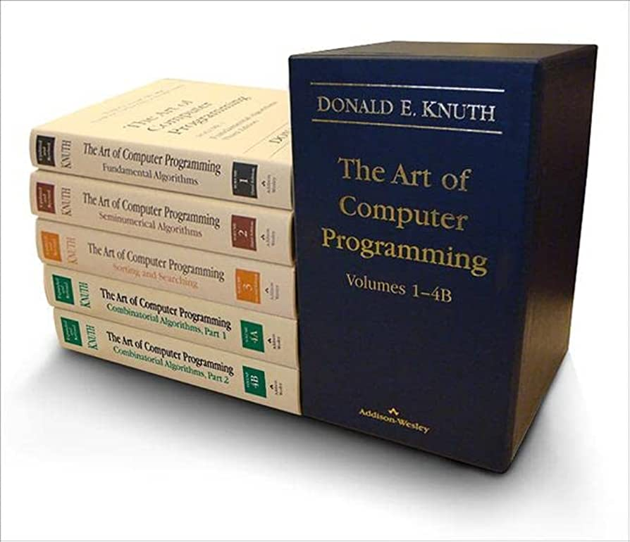

## What is programming?

Never forget:

.center[
Computers are absurdly, mind-numbingly dumb
]

.pull-left[
Programming is the art (?) of telling the computer what to do so that the screen shines in the correct patterns.]

.pull-right[
  
]

## Parts of the computer

- Memory
- Storage
- Processing
- Input/output

## Structure of computer code

- Text files
- Early programming methods

## History of computer languages

## Types of computer languages

## Levels of instructions

- Assembly
- Compiled languages
- Interpreted languages

## Trade-offs between ease of use and execution

## Folder structure and files in the computer

## R and python as examples

