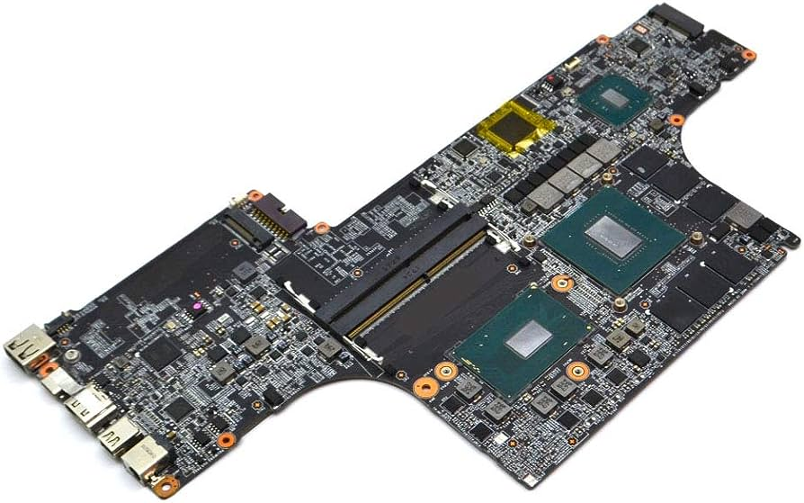
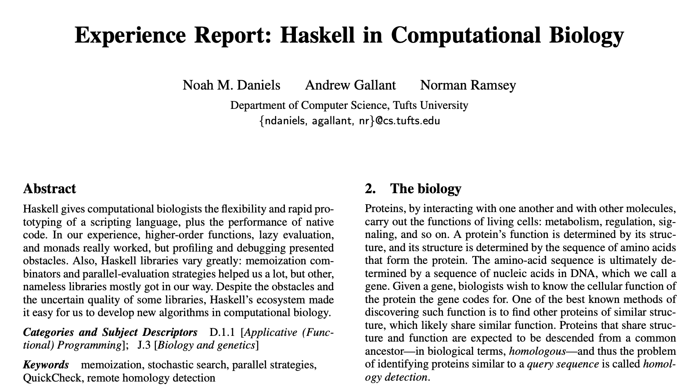

class: title-slide, left, top
background-image: url(figures/art.jpg)
background-position: center right
background-size:  50%

# What is programming?

.pull-left[

Never forget:

- Computers are absurdly, mind-numbingly dumb

- Programming is the art (?) of telling the computer what to do so that the screen shines in the correct patterns.
]

---
class: inverse, center, middle

# Computer Parts

---


class: left, top
background-image: url(figures/ram.jpeg)
background-position: center right
background-size:  50%

# Random Access Memory (RAM)

.pull-left[
- RAM stands for Random Access Memory.
- It is a type of computer memory that is used to store data and instructions that the CPU needs to access quickly.
- RAM is volatile memory, meaning it loses its contents when the computer is powered off.
- It plays a crucial role in determining a computer's performance, as it allows for fast data access and retrieval.

- Home work: 
  - Watch the [Stevie Wonder & Daft Punk & Pharrell Williams - Get Lucky ( Medley )](https://www.youtube.com/watch?v=xBJMr1v5Zuw)
]

---

# Storage

.pull-left[
- Storage refers to the devices or media used to store data in a computer system.
- It provides long-term storage for files, applications, and the operating system.
- Common types of storage include hard disk drives (HDDs), solid-state drives (SSDs), and external storage devices.
- Storage capacity and speed influence the amount of data that can be stored and accessed.]

.pull-right[]

---

# Processing Units 

### Central Processing Unit (CPU)

- The CPU, or Central Processing Unit, is the brain of the computer.
- It performs most of the calculations and instructions that enable the computer to function.
- The CPU executes program instructions, performs mathematical calculations, and manages data flow between different parts of the computer.
- It consists of an arithmetic logic unit (ALU) and control unit (CU), along with registers and cache memory.

### Graphics Processing Unit (GPU)

- A GPU, or Graphics Processing Unit, is a specialized processor designed to handle graphics-related tasks efficiently.
- It is responsible for rendering images, videos, and animations.
- GPUs are widely used in gaming, video editing, 3D modeling, and other graphically intensive applications.
- They excel at parallel processing, allowing them to handle multiple calculations simultaneously and accelerate tasks.

---

# Chipset

- The chipset is a set of integrated circuits that connects and controls various components of the computer.
- It acts as the communication hub between the CPU, memory, storage, and other peripherals.
- The chipset includes the Northbridge and Southbridge components, which manage data flow and provide connectivity options.
- It plays a vital role in determining the compatibility and performance of different hardware components.

.center[
  
]

---

# Input/Output (I/O)

- Input/Output, or I/O, refers to the communication between the computer and external devices.
- Input devices allow users to provide data or commands to the computer, such as keyboards, mice, and touchscreens.
- Output devices display or present information generated by the computer, such as monitors, printers, and speakers.
- I/O interfaces enable data transfer between the computer and peripheral devices, such as USB, HDMI, and Ethernet ports.

### Screen/Display

- The screen or display is the visual output device of the computer.
- It presents information, images, and videos in a readable and understandable format.
- Screens can be of various types, such as LCD (Liquid Crystal Display), LED (Light-Emitting Diode), or OLED (Organic Light-Emitting Diode).
- The resolution, size, and quality of the screen impact the overall user experience and visual representation of content.

---

class: inverse, center, middle
# Programming languages

---


# History of programming languages


---

class: left, top
background-image: url(figures/source.png)
background-position: center right
background-size:  45%

# Source code 

.pull-left[
- Programming works using plain-text source files
- We need a text editor to produce these files (not word)
- There are two types of editors we can use:
 1. Plain text editors: vim, emacs, vscode, notepad++, sublime...
 2. Integrated developement environments (IDEs): Rstudio 
 3. (Honorable mention: jupyter notebooks)

- vscode is our usual choice, but Rstudio is great too:
  - https://code.visualstudio.com/docs/languages/r
  - https://posit.co/download/rstudio-desktop/
]

---


# Interpreted and Compiled Languages

- Two broad categories of programming languages.
- They have distinct characteristics and approaches to code execution.

## Interpreted Languages

- Interpreted languages execute code directly without prior compilation.
- Code is read and executed line by line at runtime.
- Examples: R, Python, JavaScript.

## Compiled Languages

- Compiled languages are transformed into machine code before execution.
- Code is translated into an executable file through a compilation process.
- Examples: C, C++, Rust.

---

# Key Differences: Compiled vs Interpreted

Interpreted Languages:
- Execute code directly without compilation
- Often dynamic and flexible
- Can be slower due to interpretation overhead

Compiled Languages:
- Transform code into machine code before execution
- Generally faster performance
- Requires a compilation step before running

---

# Functional and Procedural Languages

- Functional and procedural languages are two different paradigms in programming.
- They have distinct approaches to structuring and executing code.

## Functional Languages

- Emphasize immutability and pure functions.
- Functions are the primary building blocks for solving problems.
- Examples: Haskell, Lisp, Erlang.

## Procedural Languages

- Emphasize step-by-step instructions and procedures.
- Execution is based on a sequence of statements.
- Examples: C, Pascal, Fortran, Python.

---

# Use Cases

Interpreted Languages:
- Rapid prototyping and scripting tasks
- Data analysis and statistical computing
- Dynamic and interactive applications

Compiled Languages:
- System programming and low-level operations
- Performance-critical applications
- Resource-constrained environments

Functional Languages:
- Mathematical modeling and theorem proving
- Concurrency and parallel processing
- Domain-specific languages (DSLs) development

---

# R

- R is an interpreted language used for statistical computing and graphics.
- Executes code line by line without compilation.
- Interpreted by R interpreter, such as RStudio or R console.

```{r}
# Example code in R
x <- 5
y <- 10
result <- x + y
print(result)
```

---

# Python

- Python is an interpreted high-level programming language.
- Executes code line by line without compilation.
- Interpreted by Python interpreter, such as CPython or PyPy.

```python
# Example code in Python
x = 5
y = 10
result = x + y
print(result)
```

---

# Fortran

- Fortran is a compiled language commonly used in scientific and engineering applications.
- Source code is compiled into machine code before execution.
- Executable files are generated, allowing direct execution.

```fortran
! Example code in Fortran
program main
   integer :: x, y, result
   x = 5
   y = 10
   result = x + y
   print *, result
end program main
```

---

# C

- C is a compiled language widely used for system programming.
- Source code is compiled into machine code before execution.
- Executable files are generated, which can be directly run on the target machine.

```c
// Example code in C
#include <stdio.h>

int main() {
   int x = 5;
   int y = 10;
   int result = x + y;
   printf("%d\n", result);
   return 0;
}
```

---

# Rust

- Rust is a compiled systems programming language focused on safety and performance.
- Source code is compiled into machine code before execution.
- Executable files are generated, enabling direct execution.

```rust
// Example code in Rust
fn main() {
    let x = 5;
    let y = 10;
    let result = x + y;
    println!("{}", result);
}
```

---

# Julia

- Julia is a high-level, high-performance dynamic language for technical computing.
- Code is just-in-time (JIT) compiled, combining elements of compilation and interpretation.
- JIT compilation occurs at runtime for improved performance.

```julia
# Example code in Julia
x = 5
y = 10
result = x + y
println(result)
```

---

# Haskell

- Haskell is a statically typed, purely functional programming language.
- Source code is compiled into machine code before execution.
- Executable files are created for the target machine.

```haskell
-- Example code in Haskell
main :: IO ()
main = do
    let x = 5
        y = 10
        result = x + y
    print result
```

---

# Haskell for bioinformatics

Daniels, N. M., Gallant, A. & Ramsey, N. Experience report: Haskell in computational biology. SIGPLAN Not. 47, 227–234 (2012)



---

# IDE and text editors

## Text Editors

A text editor is a tool used for creating and editing plain text files. It's a fundamental tool for developers.

.pull-left[
### Features of Text Editors

- Syntax highlighting
- Auto-indentation
- Code completion
- Multiple themes
- Plugins and extensions
]
.pull-right[
### Examples of Text Editors

- Visual Studio Code
- Sublime Text
- Atom
- Notepad++
- Vim
]
---

# Compiling and running code

.pull-left[
  Finding prime factors using C
.code40[
```c
#include <stdio.h>
#include <stdlib.h>

// Function to print prime factors of a given number
void primeFactors(int n) {
    // Print the number of 2s that divide n
    while (n % 2 == 0) {
        printf("%d ", 2);
        n = n / 2;
    }
    // n must be odd at this point, so a skip of 2 (i = i + 2) can be used
    for (int i = 3; i * i <= n; i = i + 2) {
        // While i divides n, print i and divide n
        while (n % i == 0) {
            printf("%d ", i);
            n = n / i;
        }
    }
    // If n is a prime greater than 2, it will be left unprocessed
    if (n > 2) {
        printf("%d ", n);
    }
}
int main(int argc, char *argv[]) {
    if (argc != 2) {
        printf("Usage: %s <number>\n", argv[0]);
        return 1;
    }
    int number = atoi(argv[1]);
    if (number <= 0) {
        printf("Please enter a positive integer.\n");
        return 1;
    }
    printf("Prime factors of %d are: ", number);
    primeFactors(number);
    printf("\n");
    return 0;
}
```
]
]

--

.pull-right[
Finding prime factors using R

```{r}
library(numbers)
primeFactors(56)
```
]