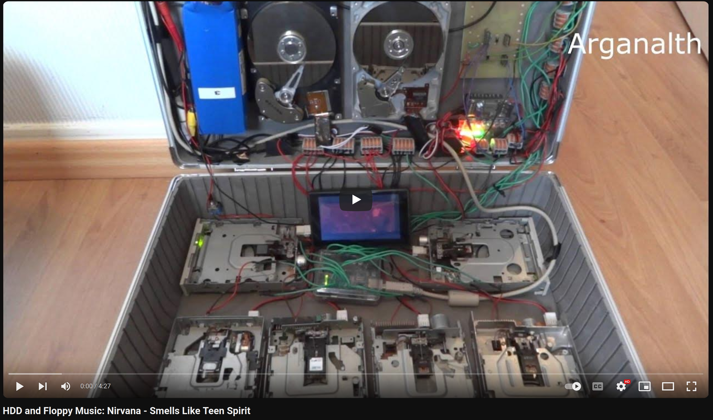

class: title-slide, left, top
background-image: url(figures/art.jpg)
background-position: center right
background-size: 50%

# What is programming?

.pull-left[

Never forget:

- Computers are absurdly, mind-numbingly dumb

- Programming is the art (?) of telling the computer what to do so that the screen shines in the correct patterns.
]

---
class: inverse, center, middle

# Computer Parts

---


class: left, top
background-image: url(figures/ram.jpeg)
background-position: center right
background-size:  50%

# Random Access Memory (RAM)

.pull-left[
- RAM is memory that stores data and instructions that the CPU needs to **access quickly**.
- RAM memory is volatile, meaning it loses its contents when your program ends.
- Crucial role in a computer's performance: amount of fast data access and retrieval.

Lessons:
- Algorithms often trade-off computational complexity **(# of operations) vs amount of RAM**
- Sometimes ample RAM allows for inefficient code... sometimes lack of RAM leads to ugly code

Homework: 
- Watch the [Stevie Wonder & Daft Punk & Pharrell Williams - Get Lucky ( Medley )](https://www.youtube.com/watch?v=xBJMr1v5Zuw)
]

---

# Storage

.pull-left[
- Long-term storage for content of files, applications, and the operating system.
- Common types: 
  - hard disk drives (HDDs)
  - solid-state drives (SSDs)
- Important quantities: 
  - storage capacity
  - speed of data transfer  
- Will be used for your **input and output data**
]
.pull-right[]

.pull-left[
Homework: 
- Watch the [HDD and Floppy Music: Nirvana - Smells Like Teen Spirit](https://www.youtube.com/watch?v=G081hD0nwWE)
]
.pull-right[]

---

# Processing Units 

### Central Processing Unit (CPU)

- A CPU is the "brain", performing:
  - program instructions
  - mathematical calculations
  - management of data flow between different components of the computer
- It consists of an arithmetic logic unit (ALU) and control unit (CU), along with registers and cache memory.

### Graphics Processing Unit (GPU)

- A GPU is a processor handling graphics-related tasks efficiently
- Images, videos, animatioms, 3D modeling, gaming ...
- They excel at parallel processing = handling multiple calculations simultaneously to  accelerate tasks.

### Note on farm computing

- CPUs used to be the workhouse of farm computing (relevant units on clusters)
- But now GPUs take over, as they are structurally better for parallel operations needed in neural networks and AI

---

# Chipset

- Set of integrated circuits that connects and controls various components of the computer.
- Acts as the **communication hub** between the CPU, memory, storage, and other peripherals.
- Includes the Northbridge (high speed communication) and Southbridge (slower input/output) components.
- Important for determining the **compatibility** and performance of different hardware components.

.center[
  
]

---

# Input/Output (I/O)

- Communication between the computer and external devices
- From person to computer: give data and commands with keyboard, mouse, and touchscreen...
- From computer to person: display information generated by the computer with monitor, printer, speaker...
- I/O interface enables data transfer between the computer and peripheral devices: USB, HDMI, Ethernet ports...

### Screen/Display

- The screen or display is the visual output, presenting information in a human-readable form.
- LCD (Liquid Crystal Display), LED (Light-Emitting Diode), OLED (Organic Light-Emitting Diode)...
- User experience is affected by resolution, size, and quality of the screen.

---

class: inverse, center, middle
# Programming languages

---


# History of programming languages


---

class: left, top
background-image: url(figures/source.png)
background-position: center right
background-size:  45%

# Source code 

.pull-left[
- Programs start from a "script" = plain-text source files
- We need a **text editor** to produce these files (not word)
- There are two types of editors we can use:
 1. Plain text editors: vim, emacs, nano, sublime...
 2. **Integrated developement environments** (IDEs): Rstudio, VsCode (advanced editor)
 3. (Honorable mention: jupyter notebooks)

- **VsCode** is our usual choice, but **Rstudio** is great too. 
  - Install one of these with instructions from our website [eeb330.github.io](http://eeb330.github.io)
]

--

.pull-right[

]

---

# Interpreted Vs Compiled Languages

.left-column[
- Two categories with distinct approaches to code execution.

## Interpreted Languages

- Interpreted languages execute code directly **without prior compilation**.
- Code is read and executed line by line at runtime.
- **Dynamic and flexible**, but can be slower due to interpretation overhead
- Examples: R, Python, JavaScript.

## Compiled Languages

- Code is translated into an **executable** file through a compilation process.
- This executable is machine code that is then "executed" = ran
- **Generally faster**, but prior compilation step needed (which can help spot errors)
- Examples: C, C++, Rust.
]

.right-column[

]

---

# Functional VS Procedural VS Object-oriented Languages

- Different paradigms in programming = approaches to structuring and executing code
- Some languages can be adapted to multiple paradigms

#### Functional Languages

- Emphasize **immutability** and pure functions.
- **Functions** are the primary building blocks for solving problems.
- Examples: Haskell, Lisp, Erlang.

#### Procedural Languages

- Emphasize **step-by-step instructions**/routines/procedures.
- Execution is based on a sequence of computational steps.
- Examples: C, Pascal, Fortran, Python.

#### Object-oriented languages

- Based on **objects**, that contain data as **attributes** and procedures called **methods** 
- **Classes** are blueprints of an object
- Examples: C++, Python, Java, Ruby

---

# Use Cases

Interpreted Languages:
- Rapid prototyping and scripting tasks
- Data analysis and statistical computing
- Dynamic and interactive applications

Compiled Languages:
- System programming and low-level operations
- Performance-critical applications
- Resource-constrained environments

Functional Languages:
- Mathematical modeling and theorem proving
- Concurrency and parallel processing (thanks to immutability and **lazyness**)
- Domain-specific languages (DSLs) development

---

# R

- R is an interpreted language used for statistical computing and graphics.
- Interpreted by R interpreter, such as RStudio or R console.
- Great ecosystem of packages, great support due to wide use

```{r}
# Example code in R
x <- 5
y <- 10
result <- x + y
print(result)
```

---

# Python

- Python is an interpreted high-level programming language.
- Interpreted by Python interpreter, such as CPython or PyPy.
- Great ecosystem of packages, great support due to wide use
- Often due to wrap-up code from more efficient languages

```python
# Example code in Python
x = 5
y = 10
result = x + y
print(result)
```

---

# Fortran

- Fortran is a compiled language commonly used in scientific (including Physics) and engineering applications.

```fortran
! Example code in Fortran
program main
   integer :: x, y, result
   x = 5
   y = 10
   result = x + y
   print *, result
end program main
```

---

# C

- C is a compiled language widely used for system programming.

```c
// Example code in C
#include <stdio.h>

int main() {
   int x = 5;
   int y = 10;
   int result = x + y;
   printf("%d\n", result);
   return 0;
}
```

---

# C++

- C++ is an object-oriented upgrade of C++, widely used for **efficiency in computational applications**.
- Lengthier code, notably due to necessary **typing** of variables (int, float, ...)

```c
// Example code in C
#include <stdio.h>

int main() {
   int x = 5;
   int y = 10;
   int result = x + y;
   printf("%d\n", result);
   return 0;
}
```

---

# Rust

- Rust is a compiled systems programming language focused on safety and performance.

```rust
// Example code in Rust
fn main() {
    let x = 5;
    let y = 10;
    let result = x + y;
    println!("{}", result);
}
```

---

# Julia

- Julia is a high-level, high-performance dynamic language for technical computing.
- Code is just-in-time (JIT) compiled, combining elements of compilation and interpretation.
- JIT compilation occurs at runtime for improved performance.

```julia
# Example code in Julia
x = 5
y = 10
result = x + y
println(result)
```

---

# Haskell

- Haskell is a compiled, statically typed, purely functional programming language.
- Has been somewhat used in computational biology

```haskell
-- Example code in Haskell
main :: IO ()
main = do
    let x = 5
        y = 10
        result = x + y
    print result
```
