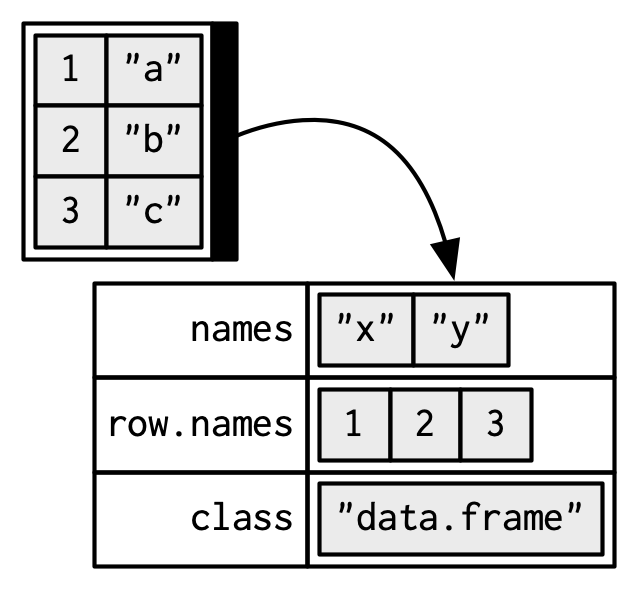

# What is R?

- R is a programming language with a focus on statistical computing

- Open source implementation of the S-language from the mid-70s

- Very popular in academia, with over 17000 user-contributed packages

---

# Why do we like R? 

- Open source, cross platform, easy to learn, with a strong focus on data exploration

- Several high quality plotting libraries 

- Careful code can be reasonably fast

- Easy interaction with faster languages like C++ and FORTRAN

- Accommodates several different programmings paradigms 

- The number of packages means there is a very high probability that the analysis
you want is already implemented.

- Large helpful online community

---

class: title-slide, left, top
background-image: url(figures/R_inferno.jpg)
background-position: center right
background-size:  32%

# Why do we hate it? 


- Typical code is very slow

- Freedom comes at a cost...

- Not really suited for being a general purpose language
  - but people try anyway

- The R-Inferno is a great reference for all the traps in R


---


class: title-slide, left, top
background-image: url(figures/rstudio-panes-labeled.jpeg)
background-position: center
background-size:  65%

# Rstudio

---

class: title-slide, left, top
background-image: url(figures/rconsole.png)
background-position: center
background-size:  65%

# R console

---

# R arithmetic and math functions   
  
```{r, echo = TRUE}
# This is a comment, which is ignored by R because it's after the #  
2 + 3
```
  
```{r, echo = TRUE}
sin(4) + tan(8) * asin(0.4) + (log(15) - exp(3))/sqrt(27)
```

---

# Assigning Variables

Variables can be assigned using the assignment operator `<-` or `=`.

```{r}
x <- 10
y = 5
```

Typing a variable's name will show its contents:

```{r}
x
```

The [1] in the output refers to the position 

---

# Vectors

.pull-left[
- Vectors are the main data structure in R
- All objects in a vector are of the same type
- Single variables are length-one vectors

```{r}
# Concatenate function
x <- c(1, 2, 3, 4) 
y <- c("a", "b", "c", "d")
```

```{r}
# Sequences
x <- 1:4
```

```{r}
# seq function 
x <- seq(1, 4, by = 1)
```

```{r}
# rep function 
one_four_times <- rep(1, 4)
```
]
.pull-right[

]

---

# A variable name and its contents

```{r}
x <- c(1, 2, 3)
x
```


```r
y <- x
```


---

# Manipulating Variables

Basic arithmetic operations can be performed on variables.

```{r}
x = c(1, 3)
y = c(2, 5)
sum <- x + y
sum
difference <- x - y
difference
```

---

# Vectorized operations

```{r}
x <- seq(1, 13, length.out = 8)
x
```

```{r}
x + 1
```

```{r}
sqrt(x)
```

---

# Indexing objects

Values inside an object can be accessed by the bracket `[]` operator

```{r}
x = 1:6
x[2]    # Indexing a single value
```

```{r}
x[1:3] # Indexing using a vector
```

```{r}
x[x<4] # Indexing using a logical condition
```

---

# Matrices 

- Matrices are like vectors but with two dimensions

```{r}
mat = matrix(1:12, nrow = 4, ncol = 3)
mat
```

- We index matrices using a comma [rows, columns]

```{r}
mat[1,2]
```

---

# Matrices

We can check the shape a matrix using dim()

```{r}
dim(mat)
```

We can access full rows or columns by ommiting one index

```{r}
mat[,1] # First column 
```

```{r}
mat[1,] # First row 
```

---

# Vectors and matrices are homogeneous

.pull-left[
- All the elements in an (atomic) vector or matrix must be of the same type


```{r}
(num_x = rnorm(3))
(char_y = letters[1:3])
(logic_z = num_x > 0)
```
]
.pull-right[

]

---

# Auto-conversion of types

```{r}
num_x[4] <- "a"
num_x
```

- This can cause subtle bugs:

```r
num_x + 1
```
Error in `num_x + 1`:

! non-numeric argument to binary operator
---

# Factor vectors

- Kind of cross between numeric and character
- Internally numeric, but each number is linked to a character variable
- Designed to handle categorical data, especially in the context of linear models
  - Things like: Species, Batch, Sex, Treatment-Control, ...
- Has a fixed number of possible values


```{r}
# Factor example
```

---

# Lists


.pull-left[

- Lists are a vector of references to variables of any kind

```{r}
l1 <- list(1, 2, 3)
```


]
.pull-right[

- List positions are indexed using the double bracket `[[]]`

```{r}
l1[[2]] <- "a"
l1
```
]

---

# Names attributes

.pull-left[
- Vectors, matrices, list, and other objects can have names associated with their contents.

- You can name a vector in three ways:

```{r}
# When creating it: 
x <- c(a = 1, b = 2, c = 3)

# By assigning a character vector to names()
x <- 1:3
names(x) <- c("a", "b", "c")

# Inline, with setNames():
x <- setNames(1:3, c("a", "b", "c"))
x
```
]
.pull-right[


]

---

## Objects can be indexed by their names

.pull-left[
- Vectors

```{r}
x <- c(a = 1, b = 2, c = 3)
x["a"]
x[c("c", "b")]
```
]
.pull-right[
- Lists
```{r}
l <- list(a = 1, b = 2, c = 3)
l[["a"]]
l[c("c", "b")]
```

]
---

# Dataframes


.pull-left[

- The secret sauce of R for biology

- Basically a list of vectors of the same length

- Each column is an atomic vector of a given type

```{r}
d1 <- data.frame(x = c(1, 5, 6), 
                 y = c(2, 4, 3), 
                 id = c("a", "b", "c"))
d1
```
]
.pull-right[
- Dataframes have 2 attributes:
    - rownames (don't use these)
    - names (column names)

```r
df = data.frame(x = 1:3,
                y = letters[1:3])
```

]

---

# Functions in R

.pull-left[
- Functions are small(ish) pieces of code that given a set of arguments produce some output

- Functions allow us to repeat the same procedure several times with different inputs without repeating code

- Creating and using functions are an integral part of programming in R

- Packages are mostly just groups of related functions

- The help() function shows the help page for any function

```r
help(apply)
?apply
```


]
.pull-right[

- Arguments can be used to alter a function's behavior
```{r}
input = c(3, 4, 7, 7, 8, NA)
mean(x = input)
```

- `NA` is a special object meaning "missing" value in R

- We can deal with it using an argument of the mean function

```{r}
mean(x = input, na.rm = TRUE)
```
]

---


# Creating Functions

Functions can be defined using the `function()` keyword.

```{r}
multiply <- function(a, b) {
  result <- a * b
  return(result)
}
multiply

multiply(3, 2)
```

---

# Loading Packages

To load packages in R, use the `library()` function.

```r
library(dplyr)
library(ggplot2)
```


---


# Working Directory

- To check the current working directory, use `getwd()`.

```r
current_dir <- getwd()
```

To set the working directory, use `setwd()`.

```r
setwd("/path/to/directory")
```

**Using Rstudio or vscode projects takes care of this for you.**

---
