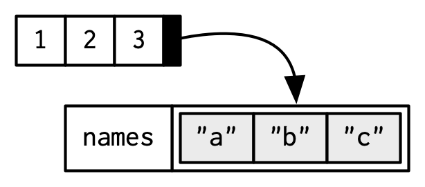

# What is R? What is Python?

.pull-left[
## .center[R]
- R is a programming language with a focus on **statistical computing and data visualization**

- Created in 1993

- Open source implementation of (derived from) the S-language from the mid-70s

- Very popular in academia, with over 17000 user-contributed **packages**
]
.pull-right[
## .center[Python]
- Python is a **general-purpose** programming language, focusing on **readability**

- Created in 1991

- One of the most popular languages, especially since the rise of **machine learning**

- General purpose = including scientific/academic/statistics problems 
]

---

# Why do we like them? 

## R and Python
- **Open source**, cross platform, easy to learn, **concise** and readable

- Careful code can be reasonably fast

- Easy interaction/**interface with faster languages** like C++ (and FORTRAN)

- Accommodates **several programmings paradigms** (though R is not great at object-oriented programming)

- Large helpful **online community**

.pull-left[
## .center[R]
- strong focus on data exploration + high quality plotting libraries 
- 17,000 packages = very high probability that the analysis
you want is already implemented.
]
.pull-right[
## .center[Python]
- There are great modules in all domains, not only plotting or statistics
]

---

class: left, top
background-image: url(figures/slowpython.jpg)
background-position: center right
background-size:  30%

# Why do we hate it? 

- **Typical code is very slow**  
... but can be more than **compensated by using appropriate modules**  
implemented in more efficient languages (typically C++)

### R 
- Not really suited for general purposes (while Python is!), but people push it

- Check R-Inferno for all the traps in R


---

class: left, top
background-image: url(figures/offandon.jpg)
background-position: center right
background-size:  33%

# A few practical things to know

### R and Python
- **case-sensitive**

- **dynamically-typed**: no need to specify the type of a variable when it is defined  
(it "automatically" determines its type from the input content),  
whereas necessary in e.g. C++

### Python
- **Indentation** is used as key syntax (e.g. embedded loops)

### *All* languages
- Environment variables, stuck processes, conflicting commands, cache,  
broken untested situation...  
**Turning off and on again** can often solve mysterious error messages,   
especially for introductory steps!

---

# Modules / packages / namespace

How to use functions that are *not from the "core" language* and not within your main script?  
**Namespace** = set of names of functions/object/... from an module or package

.pull-left[
### R
- Functions from installed packages can be called **without reference** to the package namespace. But this can lead to **conflicts** (one function name used in two packages)
```{r, eval=F}
library(DescTools)
a <- c(1,2,2,3)
Mode(a)
# also works, and safer for namespace
 `DescTools::`Mode(a)
```
]
.pull-right[
### Python
- **"modules"** must be imported to use the associated functionalities. Must specify that functions are from that module.
```python
import numpy as `np`
import scipy as `sc`
a = `np`.array([1,2,2,3])
mode = `sc`.stats.mode(a)
```
]

---

class: left, top
background-image: url(figures/rstudio-panes-labeled.jpeg)
background-position: center
background-size:  65%

# Rstudio

---

class: left, top
background-image: url(figures/VsCode.png)
background-position: center
background-size:  83%

# VsCode

---

# Arithmetics and math functions   

.pull-left[
### R

```{r, echo = TRUE}
# This is a comment, 
# which is ignored by R because it's after the #  
1 + 3**2
```
```{r, echo = TRUE}
sin(0.4) * log(15) + exp(3) / atan(27)
```
]
.pull-right[
### Python

```{python, echo = TRUE}
# Same comment syntax in Python
1 + 3**2
```
```{python, echo = TRUE}
import math as m
m.sin(0.4) * m.log(15) + m.exp(3) / m.atan(27)
```
]

---

# Assigning Variables

.pull-left[
### R

Variables can be assigned using the assignment operator `<-` or `=`

```{r}
x <- 10
y = 5
```

Typing a variable's name will show its contents:

```{r}
x
```

The [1] in the output refers to the position in the vector (here, a scalar) 
]
.pull-right[
### Python

Assignment only with `=`

```python
x = 10
y = 5
```
Same in Python console
```{python, echo = TRUE}
x = 10
x
```
]


---

# Vectors and arrays

.pull-left[
### R 

- Vectors are the main data structure in R
- All objects in a vector are of the same type  
(logical, integer, double, character, ...)
- Single variables are length-one vectors

```{r}
# Concatenate function
x <- c(1, 2, 3, 4) 
y <- c("a", "b", "c", "d")

# Sequences
one_to_four <- 1:4

# seq function 
one_to_four <- seq(1, 4, by = 1)

# rep function 
one_four_times <- rep(1, 4)
```
]
.pull-right[
### Python

- **numpy** is key for arrays
- All objects in an array are of the same type  
(bool, float, ...)

```python
import numpy as np

x = np.array( [1, 2, 3, 4] )
# simple lists are better for strings in python
y = ["a", "b", "c", "d"]

# List and array versions exist
one_to_four = list(range(1, 4))
one_to_four = np.arange(1, 4)

one_to_four = np.arange(1, 5, 1)

one_four_times = np.full(4, 1)
```
]


---

# Indexing objects

- Values inside an object can be accessed by the bracket `[]` operator
- **Indexing starts at 0 in Python (vs 1 in R)**. This means the last element of `range(0, n)` is `n-1`


.pull-left[
### R

```{r}
x = 1:6
x[2]    # Indexing a single value
```

```{r}
x[1:3] # Indexing using a vector
```

```{r}
x<4
x[x<4] # Indexing using a logical condition
```
]
.pull-right[
### Python


```{python, echo=TRUE}
import numpy as np
x = np.arange(1, 7)
x[1]

x[0:3]

x<4
```

```python
x[x<4]
```
]


---

# Lists

- Lists are a vector of references to variables of any kind

.pull-left[

### R
```{r}
l1 <- list(1, 2, 3)
```


```{r}
l1[[2]] <- "a"
l1
```
]
.pull-right[
### Python

- Lists are the basic object of Python.  
- Extremely versatile and allows magic syntax (list comprehension).  
- But can be very slow!
```{python, echo=TRUE}
l1 = [1, 'a', 3]
l2 = [2*i for i in l1]
l2
```
]

---

# R: A variable name and its contents

.pull-left[
```{r}
x <- c(1, 2, 3)
x
```


```r
y <- x
```

]
.pull-right[

- Copy on modify

```{r}
x <- c(1, 2, 3)
y <- x

y[[3]] <- 4
x
```


]

---

# Python: variables are references!

```{python, echo=TRUE}
i = 5     # create int(5) instance, bind it to i
j = i     # bind j to the same int as i
j = 2     # create int(3) instance, bind it to j
i         # i still bound to the int(5), j bound to the int(3)
```

Lists, as integers, are objects that are "referenced" (i.e. pointed to) by variable names
```{python, echo=TRUE}
i = [1,2,3]   # create the list instance, and bind it to i
j = i         # bind j to the same list as i
i[0] = 4      # change the first item of i
j             # j is still bound to the same list as i
```

Those are **not bugs, but features**... They become bugs if you are not aware of how mutability works for your object!

---

# Special values in R: `NA` and `NULL`

.pull-left[
- `NA` stands for "Not Available".
- Used to represent missing values in R.
- Can have a class (like `NA_real_`, `NA_integer_`).

```{r NA_example, echo=TRUE, results='asis'}
# Vector with NA values
data_vector <- c(1, 2, NA, 4, 5)

# Sum function with NA
sum(data_vector) # This will return NA

# Handling NA values
sum(data_vector, na.rm = TRUE) 
```

- There is an equivalent of `NA` in `pandas`   
(extension of numpy)
- It is usually `np.nan` (not-a-number), also used for `/0`
]
.pull-right[
- `NULL ` represents the absence of a value or an undefined value. It's different than NA. 
- While NA represents missingness, NULL indicates the absence of a structure.
- NULL can be output when the result is undefined.

```{r}
# Length of NA and NULL
length(NA)    # Returns 1
length(NULL)  # Returns 0
```

- The equivalent of `NULL` in Python is `None`
]
---

# Arithmetics on vectors

Basic arithmetic operations can be performed on variables.

.pull-left[

### R

```{r}
x = c(1, 3)
y = c(2, 5)
Sum <- x + y
Sum
product <- x * y
product
```

]
.pull-right[
### Python

```{python, echo=TRUE}
import numpy as np
x = np.array([1,3])
y = np.array([2,5])
Sum = x+y
Sum
product = x * y
product
```
]


---

# Vectorized operations

.left-column60[
### R
```{r}
x <- seq(1, 13, length.out = 5)
x
x + 1
sqrt(x)
```

### Python
Vectorized operations are extremely faster than for loops! Try this:
```
x = np.arange(0,100000) 
np.sqrt(x)
[sqrt(x) for i in x] # extremely slower!
```
]
.right-column60[

]

---

# Matrices 


.pull-left[

### R

- Matrices are like vectors but with two dimensions

```{r}
mat = matrix(1:12, nrow = 4, ncol = 3)
mat
```

- We index matrices using a comma [rows, columns]

```{r}
mat[1,2]
```
]
.pull-right[
### Python
- This is where numpy starts to show its power
- Can have arbitrary number of dimensions
```{python, echo=TRUE}
import numpy as np
mat = np.arange(1, 13).reshape((4, 3), order='F')
mat
mat[0,1]
mat4 = np.ones((3,3,3,3)) # 4-dim matrix of 1's
```
]


---

# Matrices


.pull-left[

### R
We can check the shape a matrix using dim()

```{r}
dim(mat)
```

We can access full rows or columns by ommiting one index

```{r}
mat[1,] # First row 
mat[,1] # First column 
```
]
.pull-right[
### Python
```{python, echo=TRUE}
mat.shape
mat[0, :] # First row
mat[:, 0] # First column 
```
]


---

# Vectors and matrices are homogeneous

- All the elements in an atomic vector or matrix (R) or array (Python) must be of the same type


.pull-left[
### R

```{r}
(num_x = rnorm(3))
(char_y = letters[1:3])
(logic_z = num_x > 0)
```

### Python
Can define type in numpy arrays
```{python}
floatarray = np.arange(5, dtype=float)
```
]
.pull-right[

]

---

# R: auto-conversion of types

```{r}
num_x[4] <- "a"
num_x
```

- This can cause subtle bugs:

```r
num_x + 1
```
Error in `num_x + 1`:  
! non-numeric argument to binary operator

This is **impossible with numpy** (immutable type), but possible with Python lists

---

# R: Factor vectors

- A factor is a data type used in R for categorical variables.
- Kind of cross between numeric and character
- Internally, R stores factors as integers and maintains a level set for factor values.
- Designed to handle categorical data, especially in the context of linear models
  - Things like: Color, Species, Batch, Sex, Treatment-Control, ...
- Has a fixed number of possible values

```{r factor_example, echo=TRUE}
# Create a sample vector
color_vector <- c("Red", "Blue", "Green", "Red", "Blue")

# Convert the vector to factor type
color_factor <- factor(color_vector)

# Display the factor
color_factor
```

- Equivalent in Python, with `pandas`: `s = pandas.Series(["a","b","c","a"], dtype="category")`

---
# Python: dictionaries

- Dictionaries are extremely practical for any **book-keeping** task
- They **match pairs of values** of any type. Keys and values are **not** ordered.

```{python, echo=TRUE}
dicto = {'first': 1, 'second': 2.0, 'my_third_object': 'not_an_int'}
dicto.keys()
dicto.values()
dicto['second']
dicto['first'] = [1, 5, 7]
```

---

# R: Names attributes

.pull-left[
- Vectors, matrices, list, and other objects can have names associated with their contents.

- You can name a vector in three ways:

```{r}
# When creating it: 
x <- c(a = 1, b = 2, c = 3)

# By assigning a character vector to names()
x <- 1:3
names(x) <- c("a", "b", "c")

# Inline, with setNames():
x <- setNames(1:3, c("a", "b", "c"))
x
```
]
.pull-right[



- In Python, would need to use dictionaries for this functionality, but not recommended for numerical computations.  
`dataframe` in `pandas` can get names for columns.
]

---

# Objects can be indexed by their names

.pull-left[
- Vectors

```{r}
x <- c(a = 1, b = 2, c = 3)
x["a"] # single brackets give you a list or vector
x[c("c", "b")]
```
]
.pull-right[
- Lists
```{r}
l <- list(a = 1, b = 2, c = 3)
l[["a"]] # double brackets give you a single element
l[c("c", "b")]
```

]
---

# R: Dataframes


.pull-left[

- The secret sauce of R for biology

- Basically a list of vectors of the same length

- Each column is an atomic vector of a given type

```{r}
d1 <- data.frame(x = c(1, 5, 6), 
                 y = c(2, 4, 3), 
                 id = c("a", "b", "c"))
d1
names(d1)
```
]
.pull-right[
- Dataframes have 2 attributes:
    - rownames (don't use these)
    - names (column names)

```r
df = data.frame(x = 1:3,
                y = letters[1:3])
```

]

---

# R: Dataframe columns

- Data frame colums can also be indexed using the `$` operator
- This operator can also create new columns

.pull-left[
```{r}
d1
d1$x
d1$sum <- d1$x + d1$y
d1$sum
```
]

--

.pull-right[

- We can also use `$` to erase columns
```{r}
d1
d1$sum <- NULL
d1
```
]

---
# Python: pandas dataframes

.left-column60[
- Very similar functions than R dataframes
- `pandas` has enormous amounts of useful functionalities 
- Equivalent of `rownames`: `df.index`

```{python, echo=TRUE}
import pandas as pd 
data = { # dictionaries is only one of the initialisation methods
        'x' : [1, 5, 6], 
        'y' : [2, 4, 3], 
        'id' : ['a', 'b', 'c'], 
        }
#load data into a DataFrame object:
df = pd.DataFrame(data)
print(df)
```
]
.right-column60[
- Can access row and columns,  
both returning a `Series` object, equivalent of `numpy` array
```{python, echo=TRUE}
df.loc[0] # row access.  
df['id'] # column access.
```
]
---

# R: With and within

.pull-left[
- `with()` function

- Used to evaluate expressions in the context of a specific dataset.
- Helps to reduce text redundancy when referring to data frame columns.

```{r with_example, echo=TRUE, results='asis'}
df <- data.frame(
  x = rnorm(5),
  y = runif(5)
)
sum(df$x + df$y)
with(df, sum(x + y))
```
]

--

.pull-right[
- `within()` function

- Used to modify data frames or lists.
- Evaluates expressions inside the data frame, making it easier to create or modify columns.
```{r}
# Modify df using within
df_modified <- within(df, {
  z = x + y
  w = x * 2
})
df_modified
```
]

---
# Functions (in R)

.pull-left[
- Functions are pieces of code producing some output from some set of arguments

- Allows us to repeat the same procedure several times with different inputs without repeating code, so it improves conciseness and readability

- Packages are mostly just groups of related functions (and classes)

- The help() function shows the help page for any function

```r
help(apply)
?apply
```


]
.pull-right[

- Arguments can be used to alter a function's behavior
```{r}
input = c(3, 4, 7, 7, 8, NA)
mean(x = input)
```

- We can deal with `NA` with another argument of the mean:

```{r}
mean(x = input, na.rm = TRUE)
```
]

---


# Creating Functions

.pull-left[
### R
Functions can be defined using the `function()` keyword.

```{r}
multiply <- function(a, b) {
  result <- a * b
  return(result)
}
multiply

multiply(3, 2)
```
]
.pull-right[
### Python
```{python, eval=TRUE}
def multiply(a, b):
  return a * b
multiply
multiply(3, 2)
```
]

---

# Loading Packages

.pull-left[
To load packages in R, use the `library()` function.

```r
library(dplyr)
library(ggplot2)
```

To install a missing package, use the `install.packages()` function

```r
# notice the quotation marks!!
install.packages("ggplot2") 
```

Also, take a look at the `pak` package: 

- [https://github.com/r-lib/pak](https://github.com/r-lib/pak)

```r
pak::pkg_install("ggplot2")
```
]
.pull-right[

]

---


# Working Directory

To check the current working directory, use `getwd()`.

```r
current_dir <- getwd()
```

To set the working directory, use `setwd()`.

```r
setwd("/path/to/directory")
```

**Using Rstudio or vscode projects takes care of this for you.**

