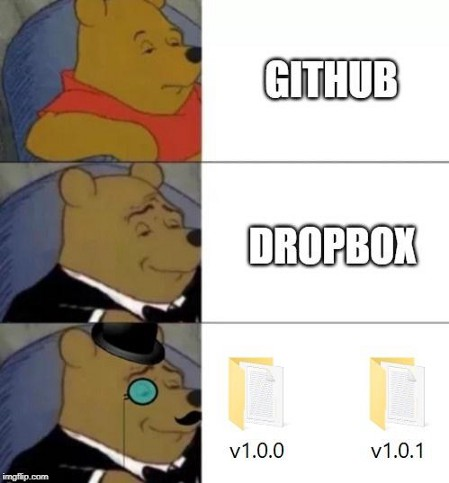
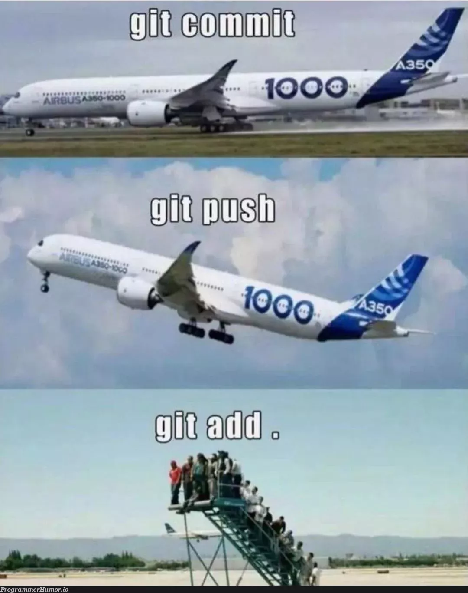
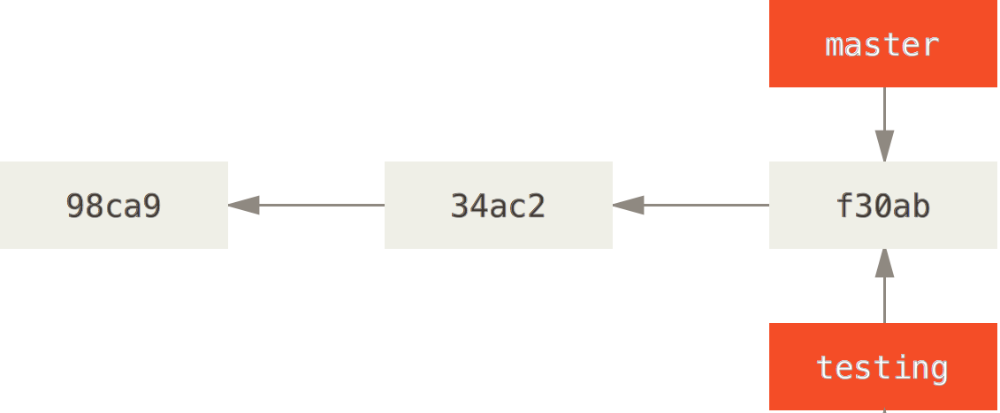
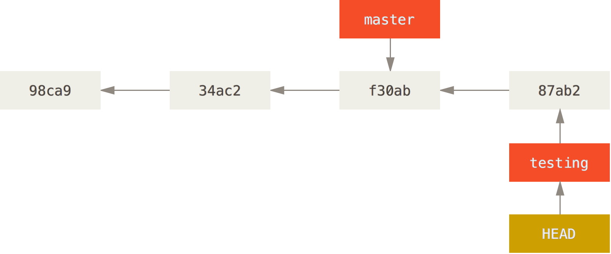
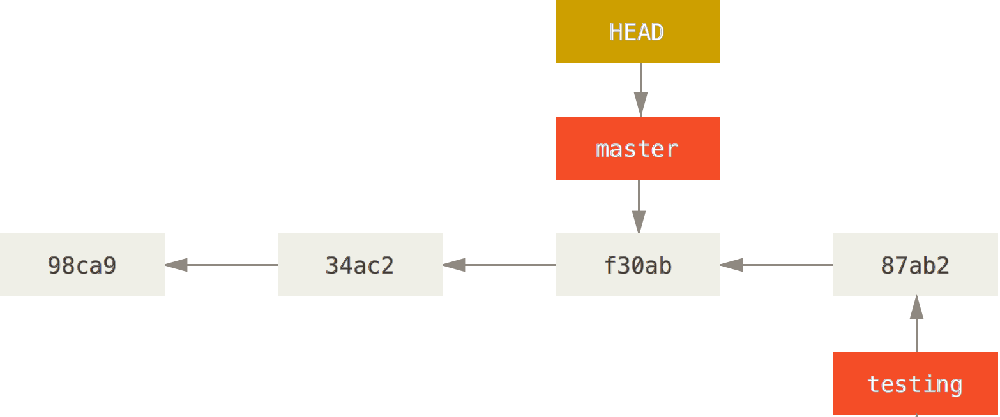
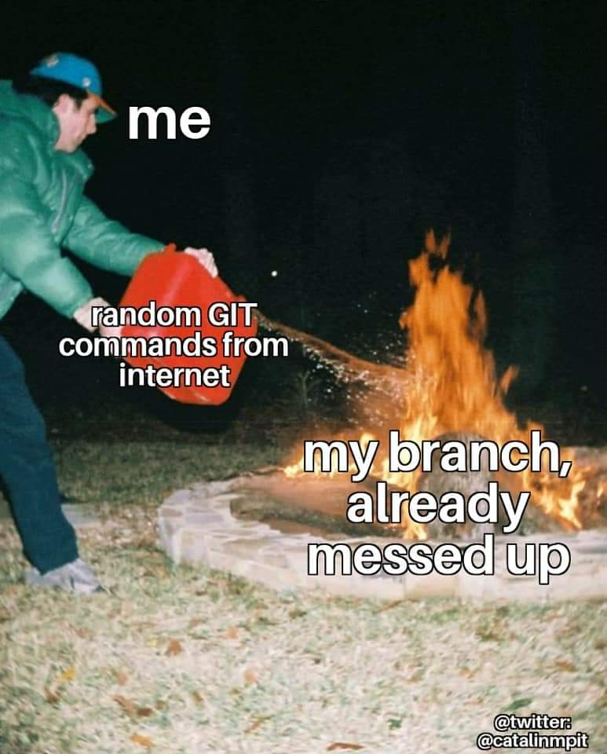
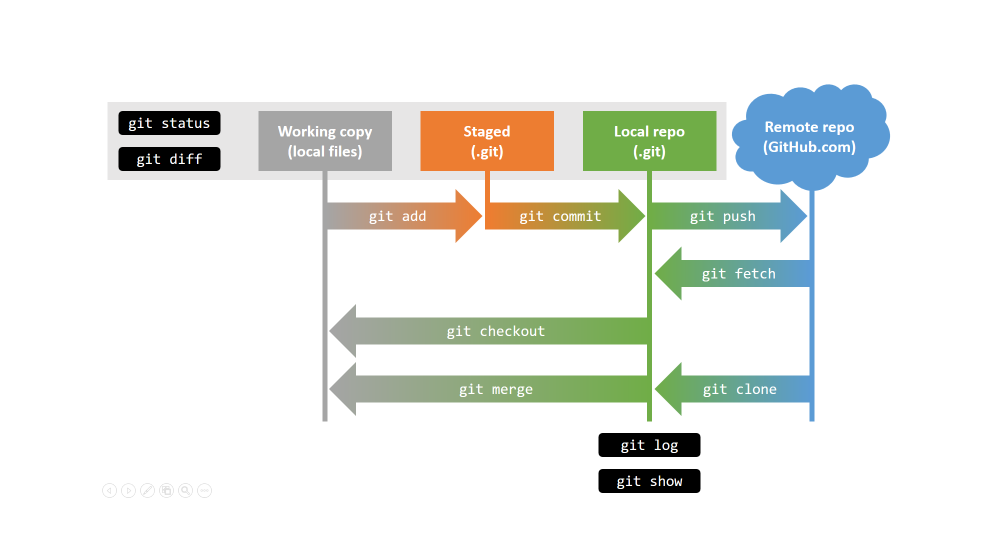

# What it git?

.left-column[
## A collaborative version control system

- Like a **track-changes-on-steroids** for everything you do on a computer

- Any type of file

- A way to store the entire history of changes for a group of files

- Allows to **collaborate on the same code**

- Very practical when you know how to do it,  
very easy to break if you don't think about commands before running them
]
.right-column[

]

---

# Why does a programming class use git?

.left-column60[
- Everything we do in R and python is saved in script files

- This code is changed over time and these changes are often lost

- And what if you have collaborators on these scripts...

### How to keep older versions of code?

- Option 1: Save a gazillion files named:

> -  script_1.R
> -  script_2_modified.R
> -  script_2_final.R
> -  script_3_finalForReal.R
> -  script_4_again_because_3_was_messed_up.R ...

Or...

- Option 2: <3 Use a **version control system** <3
]
.right-column60[

]

---

# The core of version control

.pull-left[
Recording and then recovering a certain  
past version of the file  
("checkout")


]
.pull-left[
Even better: recover all the files from your project  
as they were at a point in time  
("commit")


]

---

# How do I get a git to call my own?

* Download:

  * Linux: [http://git-scm.com/download/linux](http://git-scm.com/download/linux)
```bash
$ sudo apt install git
$ sudo yum install git-all
$ sudo pacman -S git
```

  * Mac: [http://git-scm.com/download/mac](http://git-scm.com/download/mac)
  * Windows: [http://git-scm.com/download/win](http://git-scm.com/download/win)

* Make it your own:
```bash
$ git config --global user.name "Guillaume Falmagne"
$ git config --global user.email g.falmagne@princeton.edu
```

* That is for using it locally... Then you need a **github account** for cloud-like use and collaborations!  
Example: <https://github.com/EEB330/slides>

---

# General concepts in git

- Your whole project, a directory containing multiple files, is called a **repository**

- A version of your whole project directory (multiple files) is called a **commit**

- Repositories can be local, but most often are sync'ed with a **remote**, typically with github (equivalent of the "cloud") 

- Changes are first only in your local **working directory**.   
When you like them enough, you add them in **staging area** = preparatory state for a commit  
When you staged all the needed files, you bunch that in a **commit** = version of your repository  

- A repository can be used in different ways in parallel: those are **branches**  
External (out of the team) users would rather **fork** your directory to use it as they want


---

# Mostly everything you need to know

.left-column60[

]
.right-column60[
Add to this:
- `git status` to check you added everything you want before commiting
- `git log` to check the history of commits
- `git clone` to setup a remote repository on your local machine
- `git branch` to create a new branch in the repositories
- `git merge` when you want to fuse two branches into one
]

---

# First there was... a repository

### Local (only) repository
1. Create a folder for your project
2. Navigate to that folder in your terminal/shell
3. Type:
```bash
$ git init
```
This will create a git repository inside the folder, and all changes in there will be tracked

### Remote repository
1. Create a repository on your github account (website)
2. Copy its url
3. Clone that **remote** repository in a local folder:
```bash
$ git clone https://github.com/EEB330/slides.git
```
This creates a local repository that points to the remote one!

---

# Your day to day in a local repo

.left-column60[
1. Edit a file "script.R" (or several files)
2. In the terminal, add the file to the staging area:
```bash
$ git add script.R other_file.R ...
```
3. Check if everything is correct
```bash
$ git status
```
4. Commit that group of changes
```bash
$ git commit -m "what happens in this commit?"
```
   - Without the `-m`, a text editor will open and ask for a "commit message," which is a description of everything that changed with that commit.
   - Describe what you did VERY accurately, then save the commit message file.
]
.right-column60[

]

---

# After some time... git log 

```
 $ git log --pretty=oneline
d7e09f3de4a7be039da68aad30726aa53ae2890a removing phytools dependency
25bb9f729935a851c828698e544f953cdc5c5c00 names in var.grad
870b858dfb0a5ec856b7b41be64052c7a75e5aa2 bug in extend matrix
8b915c4f9a32cbfbe106108d88087cb5fe7d326c new install instructions
d8c11e029f3cb55d9039a1febba0ebe9f5c156f7 Better comparison of posteriors
d4de5cd277c1977e74146aa2d4eb1a9d0323290a acctualy fast C++ implementation of RS
2f335ed11bee08ecef6ef4a77a426f5f00120e09 More robust Bootstrap
83b595845a9a68c014bd6dffa3d6df1eb421bd1c Trycatch in montecarlo
8413d73b72b44e68b1b32e435328e61aeb083be7 Nem drift test for 2 populations and minor correction in AncestralStates help
...
```

.left-column60[
- We can also see exactly what changed in each version,  
the difference between two versions, recover old versions...
- Everything that was once committed can be recovered!
- Example: wanna know what has changed in a file?
  - between your local version and the repo: `git diff my_file.R`
  - between two commits: `git diff commit1 commit2 -- my_file.R`
]
.right-column60[

]
---

# Version control is for recovering the version you want

- Checkout: extract a certain version of the repository 

- When you want to recover a certain past commit (say with hastag `012abc`) of the whole repo:  

`git checkout 012abc`

- When you want to recover the repository version (at the HEAD) of a file to remove local changes:   

`git checkout file_to_recover.R`

- For later: want to switch on another branch of the repo?

`git checkout my_branch`

---

# How do I interact with the remote?

.pull-left[
- Check what your remote repository is:
```
$ git remote -v
```

- You think your collaborator has done some work that you now need locally?  
```
$ git pull (fetches changes from the remote)
```
git will complain if you have local changes... My trick:
```
$ git stash (sets aside your local changes)
$ git pull
$ git stash pop (add your local change to the pulled version)
```

- You have done great work (one or multiple commits) that you want to push on the cloud?  
```
$ git push (sends changes to the remote)
```
]
--
.pull-right[
.right[]
]

---


# Branches


- Branches: They are "pointers" to specific commits

- The default branch is called "master" or "main" but it could be anything

- Branches allow **different versions of files** in a repository to coexist, and changes can be shared and **"merged"**

- If there is more than one copy of a repository (local and server), each one has its own branches.

---

# Creating a branch

 
```
$ git branch testing
```
---

# Picking a branch

HEAD is who you are actually looking at. (Check what it points to with `git log`)

 

---

# Changing the HEAD with a checkout

 
```
$ git checkout testing
```
---

# Switching branch

 
```
$ vim test.R
$ git commit -a -m 'made a change in the testing branch'
```
---

# Switching to another branch

 
```
$ git checkout master
```

But what happens now if someone does a commit on the `master` branch??

---

# Merging two branches

We can bring together modifications made from branches starting at different points/commits by performing a merge!

 

---

# Merge 

 

---

# Merge 


```
$ git checkout master
$ git merge iss53
``` 

* This will combine the modifications made in commit 4 with those made in commits 3 and 5.

* This is a place where **conflicts** can happen -- and it's a big deal!  
VsCode interface gives quite good guidance to solve them

---

# Git local and on a server

* Servers are copies of the repository (forks) with their own branches.

* We can use the same commands locally and remotely, specifying the server.
```
$ git init
$ git remote add origin git@github.com:gfalmagn/my_first_repo.git
$ git fetch origin master 
$ git merge origin/master 
```

* Or...
```
$ git init
$ git remote add origin git@github.com:gfalmagn/my_first_repo.git
$ git branch --set-upstream=origin/master master
$ git pull (pull = fetch + merge)
```

* And to push my new locally created branch to the remote:
```
$ git branch new_branch
$ git push -u origin new_branch
```


---

# Git is great, but complex, so potentially messy
Take-home message: **do not type anything that you're not sure about!**  
Or it becomes instantly messy and you'd better to start from scratch  
So much more dark magic: `rebase`, `reset`, `fetch`, `fork`, `bisect`, `reflog`, ...

.pull-left[

]
.pull-right[

]

---

# Summary


---

# Precept this week

We will use github classrooms. Please start by:
- Create a github account
- Go to the assignment on github classrooms [here](https://classroom.github.com/a/FcdHQAJn)
- Select your PUID, and accept the assignment
- This creates a special repository for you
- Clone it locally and **create a new branch** (named e.g. `precept1-draft`)
- **Do your changes on this branch**
- When you're done, merge with the `main` branch (via a pull request)
- You'll receive feedback through the feedback branch on github

---

# Further reading

.left-column60[
* GITBOOK! [Read the book, the only book](https://open.spotify.com/track/5j2kGlGnZ2T6nJb2FRG2Jm?si=1a05c46f57d3490a)
  - <https://git-scm.com/book/en/v2>

* Tutorials from github
  - <https://guides.github.com/>

* Git and Rstudio
  - <http://r-pkgs.had.co.nz/git.html>

* Git and vscode
  - <https://code.visualstudio.com/docs/sourcecontrol/intro-to-git>
]
.right-column60[

* [Git purr](https://girliemac.com/blog/2017/12/26/git-purr/)


]