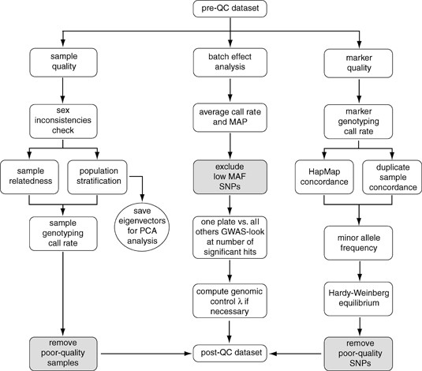
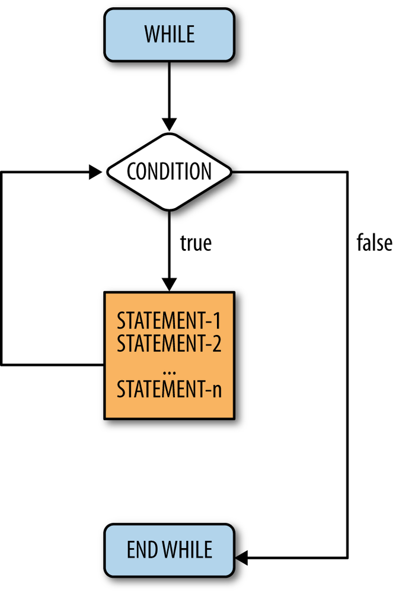
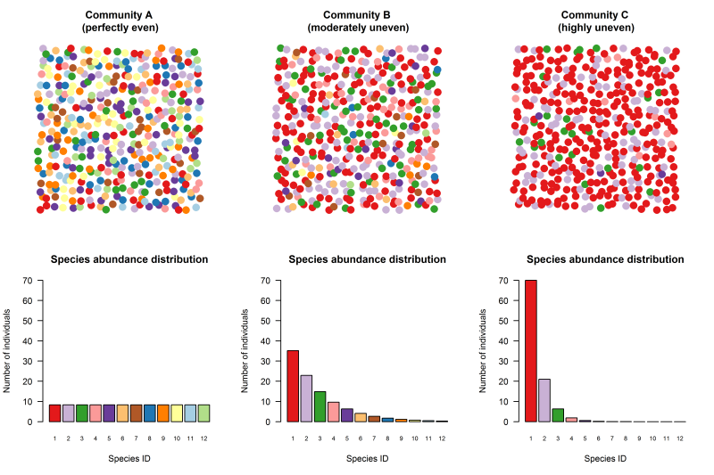

# Recap

.pull-left[
- R is an interpreted language, usually used interactively 

- Objects have different classes: vectors, lists, data.frames...
  - These objects can be numbers (integer and double), strings (characters), logical (boolean), or other objects

- We can store and use these variables by assigning them **names** (`=`, `<-`)

- All objects can be **indexed**, allowing us to access parts of the objects

- Objects can be modified, either by replacing the object with a new value, or modifying only a part of the object

]

--

.pull-right[
### Version control

- Git is a version control program that tracks and stores the changes of the files in a directory

- We use git to have an annotated history of all the changes we did to a script files

- Git can also maintain different "states" of the files in a directory. These are stored in **branches**

- Different versions can be merged, either automatically or manually, and this allows for asynchronous collaboration
]

---

# Lectures can not teach you to draw the owl!

.center[

]

---

# The basic elements of an algorithm

- Variables

  - See the [basic R lecture](slides/02_BasicR.html), but basically storing values in objects to use later:

```{r}
x = 1
y <- 2
x <- x + y
x * 4
```

--

- Logical comparisons

```{r}
x > y
```

--

Coming next:

  - Conditionals

  - Loops

---

# Example high level algorithm



.ref[Turner, S. et al. Quality control procedures for genome-wide association studies. Curr. Protoc. Hum. Genet. Chapter 1, Unit1.19 (2011)]

---

class: inverse, center, middle
# Logical operators

---

# Logical operators

- Logical operators are used to perform comparisons in R.
- They return logical values: `TRUE` or `FALSE`.
- Essential for control structures and data filtering.

---

# Single Logical Operators

## Single Comparison Operators

- `>` : Greater than
- `<` : Less than
- `>=` : Greater than or equal to
- `<=` : Less than or equal to
- `==` : Equal to (doubled because we use `=` for assignment)
- `!=` : Not equal to

```{r}
x <- 5
y <- 7
x > y
```

---

# Comparing Floating-Point Numbers

.pull-left[
1. **Avoid Exact Equality:**

   - Floating-point arithmetic can lead to tiny differences.
   - Instead of `x == y`, use `abs(x - y) < epsilon`.

2. **Specify Tolerance:**

   - Define a small `epsilon` value to handle small differences.

3. **Use Functions:**

   - `all.equal(x, y)` considers small differences.
   - `identical(x, y)` checks for exact equality.
]
.pull-right[

```{r}
x <- 0.1 + 0.2
y <- 0.3
x == y
epsilon <- 1e-10
abs(x - y) < epsilon
all.equal(x, y)
```
]
---

# Double Logical Operators

### Single Operators:

.pull-left[
*  **`&` (AND Operator):**

   The single ampersand `&` operator performs element-wise logical AND between two vectors or scalars. It returns a logical vector of the same length as the inputs, where each element corresponds to the logical AND operation of the corresponding elements in the input vectors.

```{r}
x <- c(TRUE, FALSE, TRUE)
y <- c(TRUE, TRUE, FALSE)
x & y 
```
]
.pull-right[
* **`|` (OR Operator):**

   The single pipe `|` operator performs element-wise logical OR between two vectors or scalars. It returns a logical vector of the same length as the inputs, where each element corresponds to the logical OR operation of the corresponding elements in the input vectors.

```{r}
x <- c(TRUE, FALSE, TRUE)
y <- c(FALSE, TRUE, FALSE)
x | y  
```
]
---

# Short-circuit evaluation

### Double Operators:

.pull-left[
* **`&&` (Double AND Operator):**

   The double `&&` operator performs short-circuit evaluation. It evaluates the left-hand side expression first and only evaluates the right-hand side expression if the left-hand side is `TRUE`. If the left-hand side is `FALSE`, the operator immediately returns `FALSE`.

```{r}
x <- 5
x > 10 && z < 7 # z is undefined!
```
]
.pull-right[
* **`||` (Double OR Operator):**

   The double `||` operator also performs short-circuit evaluation. It evaluates the left-hand side expression first and only evaluates the right-hand side expression if the left-hand side is `FALSE`. If the left-hand side is `TRUE`, the operator immediately returns `TRUE`.

```{r}
x <- 5
y <- 7
x > 2 || y > 10  
```
]
---

# Single vs double operators

In summary:

- Single operators (`&` and `|`) always evaluate both sides of the expressions, producing vectors of logical results. 

- Double operators (`&&` and `||`) perform short-circuit evaluation, meaning they only evaluate the right-hand side if necessary, and return a single logical value. 

Double operators are particularly useful when you want to optimize code execution by avoiding unnecessary evaluations.

---

# Summarizing logical vectors: `any`, `all` and `!`

- Sometimes we need to evaluate vectors of boolean variables. Some combination of `any`, `all` or `!` usually solves the problem.
- `!` is a negation operator, it inverts logical values

```{r}
bool_vec = c(FALSE, TRUE, TRUE)
bool_vec
!bool_vec
```

--

.pull-left[
```{r}
any(bool_vec) # Is any value true?
all(bool_vec) # Are all values true?
```
]
.pull-right[
```{r}
  any(!bool_vec) # Is any value false?
  all(!bool_vec) # Are all values false?
```
]

---

class: inverse, center, middle
# Conditionals

---

# if statements 

.pull-left[
## Basic structure

```r
if (condition) true_action
if (condition) true_action else false_action
```


```{r}
grade <- function(x) {
  if (x > 90) {
    "A"
  } else if (x > 80) {
    "B"
  } else if (x > 70) {
    "C"
  } else {
    "F"
  }
}
grade(74); grade(98)
```
]
.pull-right[
## Common errors

```r
if ("x") 1
#> Error in if ("x") 1: 
#  argument is not interpretable as logical
if (logical()) 1
#> Error in if (logical()) 1:
#  argument is of length zero
if (NA) 1
#> Error in if (NA) 1: 
#  missing value where TRUE/FALSE needed
if (c(TRUE, FALSE)) 1
#> Warning in if (c(TRUE, FALSE)) 1: 
#> the condition has length > 1 and only the
#> first element will be used
## [1] 1
```
]

---

# Vectorized if

### The ifelse function

```r
ifelse(logical_vector, true_action, false_action)
```

```{r}
x <- 1:10
x %% 2
x %% 2 == 0
ifelse(x %% 2 == 0, "even", "odd")
```

---

class: inverse, center, middle
# Loops

---


# Repeated operations

.pull-left[
### Basic structure

```r
for (item in vector) perform_action
```

```{r}
for (i in 1:3) {
  print(i)
}
```
]

---

# Structure of a useful loop

.pull-left[

- Usually we want to keep the results of a calculation stored in a new vector

- It's always a good idea to allocate this vector before the loop and use each iteration to set its elements.

```r
n <- 10 # lenght of results        
results <- numeric(n)
           list(n)
           character(n)
for(i in 1:n){
    results[i] <- work_function(vector[i])
}
```
]
.pull-right[
```{r}
n <- 5
grades <- floor(runif(n, 70, 100))
grades
letter_grades = character(n)
for(g in 1:n){
    letter_grades[g] <- grade(grades[g])
}
letter_grades
```
]

---

# Common mistakes

### Failure to index the `results` object

.pull-left[
```{r}
n <- 5
grades
```
Good:
```{r}
letter_grades = character(n)
for(g in 1:n){
    letter_grades[g] <- grade(grades[g])
}
letter_grades
```
]

.pull-right[


```{r}
n <- 5
grades
```
Bad:
```{r}
letter_grades = character(n)
for(g in 1:n){
    letter_grades <- grade(grades[g]) #<<
}
letter_grades
```
]

---

# Common mistakes
 
### The `1:lenght(x)` pattern

.pull-left[
```{r}
means <- c(1, 50, 20)
out <- vector("list", length(means))
for (i in 1:length(means)) {
  out[[i]] <- rnorm(3, means[[i]])
}
out
```
]

.pull-right[
```{r, eval=FALSE}
means <- c() #<<
out <- vector("list", length(means))
for (i in 1:length(means)) {
  out[[i]] <- rnorm(10, means[[i]])
}
#> Error in rnorm(10, means[[i]]): 
#> invalid arguments
```

```{r}
means <- c()
1:length(means)
```

**Use `seq_along` instead!**

```{r}
for (i in seq_along(means)) {
  out[[i]] <- rnorm(10, means[[i]])
}
```

]

---

# Next and break

- `next` exits the current iteration.
- `break` exits the entire for loop.

```{r}
for (i in 1:10) {
  if (i < 3) 
    next

  print(i)
  
  if (i >= 5)
    break
}
```

---

# Other, less used, loop functions

.pull-left[
```r
# performs action while condition is TRUE.
while(condition) action 
# repeats action forever 
# (i.e. until it encounters break).
repeat(action) 
```

 - You can rewrite any `for` loop to use `while` instead, 
 
 - and you can rewrite any `while` loop to use `repeat`, but the converses are not true. 
 
  ** `while` is more flexible than `for`, and `repeat` is more flexible than `while`** 
  
  - We should strive to use the least-flexible option, so use `for` when you can
]
.pull-right[

]

---


# Example: Diversity metrics in ecology

Diversity consists of two components: 

- Species richness : the number of species in a community
- Evenness: some species in a community are common, and others are rare 

.center[
]

.ref[ Adapted from https://www.davidzeleny.net/anadat-r/doku.php/en:div-ind]

---

# Simpson diversity index

.pull-left[

- Related to the Gini inequality index.

- Defined as **the probability that two individuals sampled from the same population will be from the same species.**

  - Given a list of individuals for each species: $\{n_1, n_2, \dots, n_k\}$

  - First we define the proportion of each species: $p_i =  \frac{n_i}{\sum_{i=1}^k n_i}$

  - The Simpson index is given by:

$$
D = \sum_{i=1}^k p_i^2
$$
]

---

# Shannon diversity index

.pull-left[
- Derived from information theory

- Shannon's entropy is the micro-canonical entropy from statistical mechanics.

- Measures the degree of uniformity in the probabilities of observing each species.

  - Again, using the probabilities of observing each species: $p_i =  \frac{n_i}{\sum_{i=1}^k n_i}$

  - The Shannon index is given by:


$$
H = -\sum_{i=1}^k p_i log(p_i)
$$

]
---

# Example dataset

```{r}
species_n = c(a = 5, b = 1, c = 10, d = 3, e = 9, 
              f = 10, g = 18, h = 22, i = 8, j = 8)
barplot(species_n)
```

---

# Getting the proportions

.pull-left[
Calculate the total number of individuals

```{r}
n_total = 0
for(i in seq_along(species_n)){
  n_total <- n_total + species_n[i]
}
n_total
```

Calculate the proportion of each species:
```{r}
props = species_n / n_total
round(props, 2) # Only print 2 decimal places
```
]
.pull-right[

### Simpson 
$$
D = \sum_{i=1}^k p_i^2
$$

### Shannon
$$
H = -\sum_{i=1}^k p_i log(p_i)
$$

]

---

# Simpson and Shannon

.pull-left[
Simpson index:
 
```{r}
D = 0
names(D) = "Simpson"
for(i in seq_along(props)){
  D = D + props[i]^2
}
D
```
]

.pull-right[
Shannon index:
 
```{r}
H = 0
names(H) = "Shannon"
for(i in seq_along(props)){
  H = H - props[i] * log(props[i])
}
H
```
]
---

# What if there are unobserved species?


```{r}
species_n = c(a = NA, b = 0, c = 10, d = 3, e = 9,
              f = 10, g = 18, h = 22, i = 8, j = 8)
barplot(species_n)
```

---

# NA propagates

```{r}
1 + NA
```

--

```{r}
species_n = c(a = NA, b = 0, c = 10, d = 3, e = 9,
              f = 10, g = 18, h = 22, i = 8, j = 8)
n_total = 0
for(i in seq_along(species_n)){
  n_total <- n_total + species_n[i]
}
n_total
(props = species_n / n_total)
```

---

# Checking for zeros and NAs

```{r}
species_n
species_n == 0
is.na(species_n)
```

--

Removing NAs and zeros:

.pull-left[
```{r}
(species_n <- species_n[!is.na(species_n)])
```
]
.pull-right[
```{r}
(species_n <- species_n[species_n != 0])
```
]

---

# After NA removal, all is well

```{r}
species_n = c(a = NA, b = 0, c = 10, d = 3, e = 9,  
              f = 10, g = 18, h = 22, i = 8, j = 8)
(species_n <- na.omit(species_n)) #<<
n_total = 0
for(i in seq_along(species_n)){
  n_total <- n_total + species_n[i]
}
n_total
```

---

# Summary

- The building blocks of algorithms are variables, conditionals and loops

- Functions can make reusing these blocks easier

- Beware of the missing values! NAs can ruin your day
  - but are a fact of life and one of the great features of R

- Next lecture we will cover functions in detail!