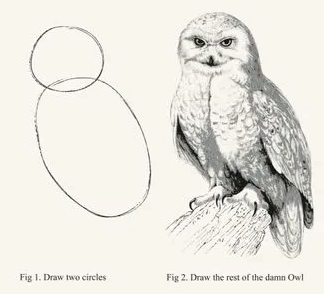

```{r, echo = FALSE}
set.seed(42)
```

# A bit of terminal magic (bash) 
Doing things in the terminal / command line is clearer than with GUI.  
GUI's can do things you have no idea of...

- What directory am I in? `pwd`

- Changing directory:
  - To a certain path: `cd [path_of_directory]`  
  - To one level above: `cd ..`  
  - To two levels above: `cd ../..`  
  - To directory I was in before this one: `cd -`

- Auto-complete a path or a command (**extremely useful!**): tabulation 

- Read directory content: `ls` or `ls -a`

- Copy a file: `cp [path_source] [path_destination]`. Move a file: `mv [source] [destination]`

- Put whatever here: wildcard `*`. Examples: `ls ./my_path/*.py` or `ls ./my_path/basename_*`

- Look for a word in all files of this directory: `grep -rn "your_word"`

---

# Recap

.pull-left[
- R and python are interpreted languages, sometimes used interactively 

- In R, objects have different **classes**: vectors, lists, dataframes... These objects can be numbers, strings, logical, ...
- In python, variables do not need to be assigned a **type**

- We can store and use these variables by assigning them **names** (`=`, or `<-` in R)

- All objects can be **indexed**, allowing us to access parts of the objects

- **Functions** can apply the same code to different arguments without rewriting the code

]

--

.pull-right[
### Version control

- **Git** is a version control program that tracks and stores the changes of all files in a directory

- We use git to have an annotated **history of all the changes** we did to script files

- Git can also maintain different "states" of the files in a directory. These are stored in **branches**

- Different versions can be merged, either automatically or manually, and this allows for **asynchronous collaboration**
]

---

# Lectures can not teach you to draw the owl!

.center[

]

### General tips for precepts

.pull-left[

]
.pull-left[
Also, **read the error and warning messages**!   
More useful than "user terms and conditions"...  
Skim to text that seems to point to what you did wrong
]

---

# The basic elements of an algorithm

- Variables
  - Storing values in objects to use later:

```{r}
x = 1
y <- 2 # only in R, would be y = 2 in Python
y = 2 # Python and R
x <- x + y # only in R, would be x = x + y in Python
x * 4
```

- Logical comparisons

```{r}
x > y
```

Coming next:
  - Conditionals
  - Loops

---

# Examples of high level algorithms

.left-column60[

.ref[Falmagne G., The Bc+ meson in heavy-ion collisions with the CMS detector (2022)]
]
.right-column60[

.ref[Turner, S. et al. Quality control procedures for genome-wide association studies. Curr. Protoc. Hum. Genet. Chapter 1, Unit1.19 (2011)]
]


---

class: inverse, center, middle
# Logical operators

---

# Logical operators, booleans

- Logical operators are used to perform **comparisons**, tests and data selection.

- They return logical values (a.k.a **booleans**): `TRUE` or `FALSE` in R, `True` or `False` in Python.

- Essential for control flow and data filtering.

---

# Single Logical Operators

## Single Comparison Operators

- `>` : Greater than
- `<` : Less than
- `>=` : Greater than or equal to
- `<=` : Less than or equal to
- `==` : Equal to (doubled because we use `=` for assignment)
- `!=` : Not equal to

.pull-left[
  #### R
```{r}
x <- 5
y <- 7
x > y
```
]
.pull-right[
  #### Python
```{python}
x = 5
y = 7
x > y
```
]

---

# Comparing Floating-Point Numbers

.left-column60[
1. **Avoid Exact Equality:**

   - Floating-point arithmetic can lead to tiny differences.
   - Instead of `x == y`, use `abs(x - y) < epsilon`.

2. **Specify Tolerance:**

   - Define a small `epsilon` value to handle small differences.

3. **Use Functions:**

   - `all.equal(x, y)` (R) or `np.is_close(x, y)` (Python) considers small differences.
   - `identical(x, y)` (R) checks for exact equality.
   - `x is y` in Python checks if `x` and `y` point to the same address!

*Lesson*: when you can use integers rather than floating point numbers, these problems disappear!

]

.right-column60[
### Examples in R
```{r}
x <- 0.1 + 0.2
y <- 0.3
x == y
epsilon <- 1e-10
abs(x - y) < epsilon
all.equal(x, y)
```
]


---

# "Eager" operators

### **`|` (OR Operator)**, **`&` (AND Operator)**
   The single-character operators `&` and `|` perform element-wise logical AND/OR between two vectors or scalars.  
   It returns a vector of the same length as the inputs, where each element is the logical AND/OR of pairs of elements at that index in the input vectors.

```{r}
x <- c(TRUE, FALSE, TRUE)
y <- c(TRUE, TRUE, FALSE)
x | y  
x & y  
```

* In Python: same behavior between numpy arrays. But more generally: `&` and `|` are **bitwise operators** (comparing each bit of the objects one-to-one).  

* Eager means that **both sides are always evaluated**, even when unnecessary: `(1 == 2) & (1 == 1)`

---

# Short-circuit evaluation (R)

### **`||` (OR Operator)**, **`&&` (AND Operator)**

The double `&&` and `||` operators performs short-circuit evaluation:  
It evaluates the left-hand side expression first and only evaluates the right-hand side expression if the the information is not sufficient to determine the output. 

.pull-left[
```{r}
x <- 5
x > 10 && z < 7 # z is undefined!

y <- 7
x > 2 || y > 10
```
]
.pull-right[

]

---

# Short-circuit evaluation (Python)

.pull-left[

### `and` and `or` in standard Python
In Python, `and` and `or` do similar short-circuiting, but are more general.  
e.g. `X or Y` evaluates as `if X is False, then Y, else X`  
```{python}
import numpy as np
1 or False
1 and np.array([True])
0 and np.array([True])
```
]
.pull-right[
### `np.logical_and()` in numpy

But for numpy arrays, the best way is `np.logical_and(x, y)` and `np.logical_or(x, y)`  
```{python}
x = np.array([False, True, False])
y = np.array([True, True, False])
np.logical_and(x, y)
np.logical_or(x, y)
```
]

---

# Negation operators

.pull-left[
- **R**: `!` is a negation operator, it inverts logical values

```{r}
bool_vec = c(FALSE, TRUE, TRUE)
bool_vec
!bool_vec
```
.center[]
]

.pull-right[
  - Standard Python: `not` is the negation
```{python}
not True
```
  - `np.logical_not` for numpy arrays
```{python}
bool_vec = np.array([False, True, True])
np.logical_not(bool_vec)
```
]

---

# Logics on boolean vectors: `any`, `all`

- How to evaluate vectors of boolean variables?  
Some combination of `any`, `all` or `!` often suffices

.pull-left[
```{r}
any(bool_vec) # Is any value true?
all(bool_vec) # Are all values true?
```
]
.pull-right[
```{r}
  any(!bool_vec) # Is any value false?
  all(!bool_vec) # Are all values false?
```
]
<br>

- In Python: same with `np.all(x)`, `np.any(x)`, `np.logical_not(x)`

---

class: inverse, center, middle
# Conditionals

---

# if statements (R)

.pull-left[
### Basic structure

```r
if (condition) {true_action}
if (condition) {true_action} else {false_action}
```

Example in function:
```{r}
grade <- function(x) {
  if (x > 90) {
    "A"
  } else if (x > 80) {
    "B"
  } else if (x > 70) {
    "C"
  } else {
    "F"
  }
}
grade(74); grade(98)
```
]
.pull-right[
### Common errors

```r
if ("x") 1
#> Error in if ("x") 1: 
#  argument is not interpretable as logical
if (logical()) 1
#> Error in if (logical()) 1:
#  argument is of length zero
if (NA) 1
#> Error in if (NA) 1: 
#  missing value where TRUE/FALSE needed
if (c(TRUE, FALSE)) 1
#> Warning in if (c(TRUE, FALSE)) 1: 
#> the condition has length > 1 and only the
#> first element will be used
## [1] 1
```
]

---

# if statements (Python)


.pull-left[
### Basic structure
```python
if condition:
  x = 2
elif condition2:
  x = 3
else: 
  x = -1
```


### Example
```{python}
def grade(x):
    if x > 90:
      return "A"
    elif x > 80:
      return "B"
    elif x > 70:
      return "C"
    else:
      return "F"
grade(74); grade(98)
```

]
.pull-right[


The syntax is indentation based!

Also possible in a "one-liner":
```python
true_action if condition else false_action
```


]

---

# Vectorized if

.pull-left[
### R

```r
ifelse(logical_vector, true_object, false_object)
```

```{r}
x <- 1:5
x %% 2
x %% 2 == 0
ifelse(x %% 2 == 0, "even", "odd")
```
]
.pull-right[
### Python

```python
np.where(logical_vector, true_object, false_object)
```

```{python}
x = np.arange(1, 6)
x % 2
x % 2 == 0
np.where(x % 2 == 0, "even", "odd")
```

`where` also gives list of indices where cond is True
```{python}
np.where(x > 3)[0]
```
]

---

class: inverse, center, middle
# Loops

---


# Loop = repeated operations

.pull-left[
### Structure in R

```r
for (item in vector) perform_action
```

```{r}
for (i in 1:3) {
  print(i)
}
```
]
.pull-right[
### Structure in Python

.pull-left[
```python
for item in list:
    perform_action
```

```{python}
for i in range(3):
  print(i+1)
```
]
.pull-right[

]

- Python does **list comprehension** with for loops!
```{python}
double = [2*i for i in range(3)]
double
```
]

---

# Structure of a useful loop


- A typical usage: at each iteration, compute a function on given element, then store the results of a calculation in a new vector

- Good practice: allocate this vector before the loop

.pull-left[
#### Typical usage
```r
n <- 10 # length of results        
results <- numeric(n) # or list() or character(n)
for(i in 1:n){
    results[i] <- some_function(i)
}
```
]
.pull-right[
#### Example
```{r}
n <- 5
grades <- floor(runif(n, 70, 100))
grades
letter_grades = character(n)
for(g in 1:n){
    letter_grades[g] <- grade(grades[g])
}
letter_grades
```
]

---

# Common mistakes

### Not indexing the `results` object


```{r}
n <- 5
grades
```

.pull-left[
**Good**:
```{r}
letter_grades = character(n)
for(g in 1:n){
    letter_grades[g] <- grade(grades[g])
}
letter_grades
```
]

.pull-right[

**Bad**:
```{r}
letter_grades = character(n)
for(g in 1:n){
    letter_grades <- grade(grades[g]) #<<
}
letter_grades
```

Problem: at each iteration, `letter_grades` is fully replaced with a single grade
]

---

# Do you want to access the index or the actual element
 
### The `1:length(x)` pattern

.pull-left[
```{r}
means <- c(1, 50, 20)
out <- vector("list", length(means))
for (i in 1:length(means)) {
  # Double bracket [[i]] is needed to
  # access the list element itself
  out[[i]] <- rnorm(3, means[[i]])
}
out
```
]

.pull-right[
```{r, eval=FALSE}
means <- c() #<<
out <- vector("list", length(means))
for (i in 1:length(means)) {
  out[[i]] <- rnorm(10, means[[i]])
}
#> Error in rnorm(10, means[[i]]): 
#> invalid arguments
```

```{r}
means <- c()
1:length(means)
```

**Use `seq_along` instead!**

```{r}
for (i in seq_along(means)) {
  out[[i]] <- rnorm(10, means[[i]])
}
```
]

```{python}
mylist = ['a', 'b', 'c']
for i, e in enumerate(mylist):
    print('at index', i, 'find element', e)
```
---

# Next and break

- `next` (in R) or `continue` (in Python) exits the current iteration.
- `break` exits the entire loop.

```{r}
for (i in 1:10) {
  if (i < 3) # no '{' is needed when there is only one line of code inside the 'if'
    next # replace by "continue" in Python

  print(i)
  
  if (i >= 5)
    break
}
```

---

# Other, less used, loop functions

.pull-left[
```r
# performs action while condition is TRUE.
while(condition) action 
# repeats action forever 
# (i.e. until it encounters break).
repeat(action) 
```

 - You can rewrite any `for` loop to use `while` instead, 
 
 - and you can rewrite any `while` loop to use `repeat`, but the converses are not true. 
 
  ** `while` is more flexible than `for`, and `repeat` is more flexible than `while`** 
  
  - We should strive to use the least-flexible option, so use `for` when you can

  - `while` can be dangerous: risk of **infinite loops** if `while` condition always stays true
]
.pull-right[

]
