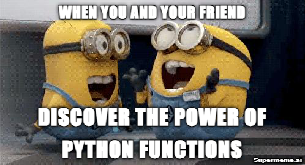
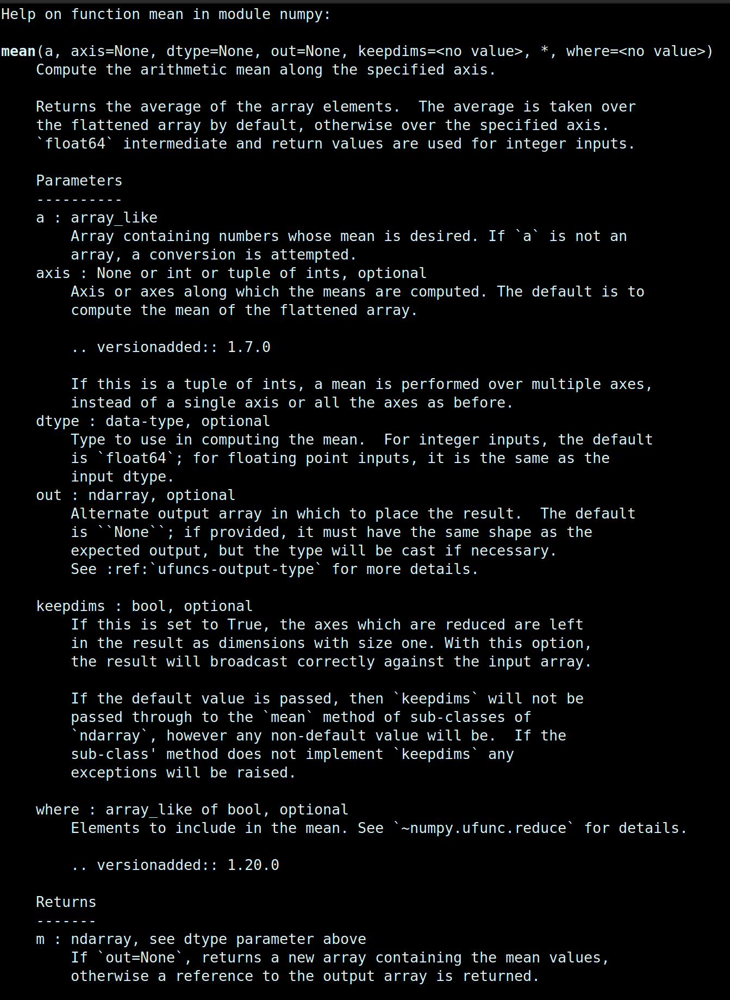
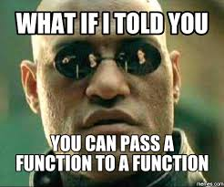

# Not our program?

.center[
]

---

```{r, echo = FALSE}
set.seed(42)
```

# Example: Diversity metrics in ecology

Diversity consists of two components: 

- Species richness : the number of species in a community
- Evenness: some species in a community are common, and others are rare 

.center[
]

.ref[ Adapted from https://www.davidzeleny.net/anadat-r/doku.php/en:div-ind]

---

# Simpson diversity index

.pull-left[

- Related to the Gini inequality index.

- Defined as **the probability that two individuals sampled from the same population will be from the same species.**

  - Given a list of individuals for each species: $\{n_1, n_2, \dots, n_k\}$

  - First we define the proportion of each species: $p_i =  \frac{n_i}{\sum_{i=1}^k n_i}$

  - The Simpson index is given by:

$$
D = \sum_{i=1}^k p_i^2
$$
]

---

# Shannon diversity index

.pull-left[
- Derived from information theory

- Shannon's entropy is the micro-canonical entropy from statistical mechanics.

- Measures the degree of uniformity in the probabilities of observing each species.

  - Again, using the probabilities of observing each species: $p_i =  \frac{n_i}{\sum_{i=1}^k n_i}$

  - The Shannon index is given by:


$$
H = -\sum_{i=1}^k p_i log(p_i)
$$

]
---

# Example dataset
.pull-left[
```{r, out.width = '400px'}
species_n = c(a = 5, b = 1, c = 10, d = 3, 
              e = 9, f = 10, g = 18, 
              h = 22, i = 8, j = 8)
barplot(species_n) #<<
```
]
.pull-right[
```{python, out.width = '300px'}
import numpy as np
import matplotlib.pyplot as plt
species_num = np.array([5, 1, 10, 3, 9, 
                        10, 18, 22, 8, 8])
species_name = ['a', 'b', 'c', 'd', 
                'e', 'f', 'g', 'h', 'i', 'j']
plt.bar(species_name, species_num) #<<
plt.tight_layout()
```
]
---

# Getting the proportions

.pull-left[
### Simpson 
$$
D = \sum_{i=1}^k p_i^2
$$

Calculate the total number of individuals

```{r}
n_total = 0
for(i in seq_along(species_n)){
  n_total <- n_total + species_n[i]
}
n_total
```

```{python, eval=FALSE}
n_total = 0
for number in species_num: # iterating on elements
  n_total += number # += is a practical shortcut
n_total
```
]
.pull-right[
### Shannon
$$
H = -\sum_{i=1}^k p_i log(p_i)
$$

Calculate the proportion of each species:
```{r}
props = species_n / n_total
round(props, 2) # Only print 2 decimal places
```

Same in python with `np.round(props, 2)`
]

---

# Simpson and Shannon

.pull-left[
Simpson index:
 
```{r}
D = 0
names(D) = "Simpson"
for(i in seq_along(props)){
  D = D + props[i]^2
}
D
```

```{python, eval=FALSE}
D = 0
for p in props:
  D += p
```
]

.pull-right[
Shannon index:
 
```{r}
H = 0
names(H) = "Shannon"
for(i in seq_along(props)){
  H = H - props[i] * log(props[i])
}
H
```

```{python, eval=FALSE}
import math
H = 0
for p in props:
  H -= p * math.log(p)
```
]
---

# What if there are unobserved species?

.pull-left[
```{r, out.width = '400px'}
species_n = c(a = NA, b = 1, c = 10, d = 3, #<<
              e = 9, f = 10, g = 18, 
              h = 22, i = 8, j = 8)
barplot(species_n) 
```
]
.pull-right[
```{python, out.width = '350px'}
import pandas as pd
data = {'number': [np.nan, 1, 10, 3, 9, #<<
                   10, 18, 22, 8, 8],
        'name': ['a', 'b', 'c', 'd', 'e', 
                 'f', 'g', 'h', 'i', 'j']}
df = pd.DataFrame(data)
df.plot.bar(x='name', y='number')
```
]
---

# NA propagates

.pull-left[
```{r}
1 + NA
```
]
.pull-right[
```{python}
1 + np.nan
```
]

```{r}
n_total = 0
for(i in seq_along(species_n)){
  n_total <- n_total + species_n[i]
}
n_total
```

---

# Dealing with zeros/NAs/nans

.pull-left[
#### Are there any?
```{r}
head(species_n == 0, 5)
head(is.na(species_n), 5)
```
```{python}
df.isnull()
```
]
.pull-right[
#### How to remove them

```{r}
(species_n <- species_n[!is.na(species_n)])
(species_n <- species_n[species_n != 0])
```
```{python}
df.dropna()
```
]

---

class: inverse, center, middle
# Functions

---

# Good code architecture using functions

Using functions (yours or library ones!) has several advantages:

- **Modularity**: Think about the small steps that compose our solution;

- **Testing**: Test each step **independently**;

- Maintenance: Easier **bug detection** and updates;

- Readability: Clear function **names convey intent**; a lot of repeated/similar code looses the reader

- **Reuse**: good generic functions can be used wherever necessary.

.center[
]

---

# Returning to the Diversity indexes

.pull-left[
Let's shorten and clarify everything by using  
pre-defined functions!

- Old script
```{r}
species_n = c(a = 5, b = 1, c = 10, d = 3, e = 9, f = 10, g = 18, h = 22, i = 8, j = 8)
n_total = 0
for (i in seq_along(species_n)) {
  n_total <- n_total + species_n[i] 
}
props = species_n / n_total
D = 0
names(D) = "Simpson"
for(i in seq_along(props)){
  D = D + props[i]^2
}
D
```
]
.pull-right[
- New script, using functions for each task:
```{r}
Simpson <- function(x){
  n = sum(x)
  p = x/n
  D = sum(p**2)
  return(c(Simpson = D))
}
Simpson(species_n)
```
```{python}
import numpy as np
def Simpson(x):
  n = np.sum(x)
  p = x/n
  D = np.sum(p**2)
  return D
Simpson(species_num)
```
]


---

# Returning to the Diversity indexes

.pull-left[
Let's shorten and clarify everything by using  
pre-defined functions!

- Old script
```{r}
species_n = c(a = 5, b = 1, c = 10, d = 3, e = 9, f = 10, g = 18, h = 22, i = 8, j = 8)
n_total = 0#<<
for (i in seq_along(species_n)) {#<<
  n_total <- n_total + species_n[i] #<<
} #<<
props = species_n / n_total
D = 0
names(D) = "Simpson"
for(i in seq_along(props)){
  D = D + props[i]^2
}
D
```
]
.pull-right[
- New script, using functions for each task:
```{r}
Simpson <- function(x){
  n = sum(x)#<<
  p = x/n
  D = sum(p**2)
  return(c(Simpson = D))
}
Simpson(species_n)
```
```{python}
import numpy as np
def Simpson(x):
  n = np.sum(x)#<<
  p = x/n
  D = np.sum(p**2)
  return D
Simpson(species_num)
```
]

---

# Returning to the Diversity indexes

.pull-left[
Let's shorten and clarify everything by using  
pre-defined functions!

- Old script
```{r}
species_n = c(a = 5, b = 1, c = 10, d = 3, e = 9, f = 10, g = 18, h = 22, i = 8, j = 8)
n_total = 0
for (i in seq_along(species_n)) {
  n_total <- n_total + species_n[i] 
}
props = species_n / n_total#<<
D = 0
names(D) = "Simpson"
for(i in seq_along(props)){
  D = D + props[i]^2
}
D
```
]
.pull-right[
- New script, using functions for each task:
```{r}
Simpson <- function(x){
  n = sum(x)
  p = x/n #<<
  D = sum(p**2)
  return(c(Simpson = D))
}
Simpson(species_n)
```
```{python}
import numpy as np
def Simpson(x):
  n = np.sum(x)
  p = x/n #<<
  D = np.sum(p**2)
  return D
Simpson(species_num)
```
]


---

# Returning to the Diversity indexes

.pull-left[
Let's shorten and clarify everything by using  
pre-defined functions!

- Old script
```{r}
species_n = c(a = 5, b = 1, c = 10, d = 3, e = 9, f = 10, g = 18, h = 22, i = 8, j = 8)
n_total = 0
for (i in seq_along(species_n)) {
  n_total <- n_total + species_n[i] 
}
props = species_n / n_total
D = 0#<<
names(D) = "Simpson"#<<
for(i in seq_along(props)){#<<
  D = D + props[i]^2#<<
} #<<
D
```
]
.pull-right[
- New script, using functions for each task:
```{r}
Simpson <- function(x){
  n = sum(x)
  p = x/n
  D = sum(p**2)#<<
  return(c(Simpson = D))#<<
}
Simpson(species_n)
```
```{python}
import numpy as np
def Simpson(x):
  n = np.sum(x)
  p = x/n
  D = np.sum(p**2)#<<
  return D#<<
Simpson(species_num)
```
]


---

# Returning to the Diversity indexes

.pull-left[
Let's shorten and clarify everything by using  
pre-defined functions!

- Old script
```{r}
species_n = c(a = 5, b = 1, c = 10, d = 3, e = 9, f = 10, g = 18, h = 22, i = 8, j = 8)
n_total = 0
for (i in seq_along(species_n)) {
  n_total <- n_total + species_n[i] 
}
props = species_n / n_total
D = 0
names(D) = "Simpson"
for(i in seq_along(props)){
  D = D + props[i]^2
}
D #<<
```
]
.pull-right[
- New script, using functions for each task:
```{r}
Simpson <- function(x){
  n = sum(x)
  p = x/n
  D = sum(p**2)
  return(c(Simpson = D))
}
Simpson(species_n)#<<
```
```{python}
import numpy as np
def Simpson(x):
  n = np.sum(x)
  p = x/n
  D = np.sum(p**2)
  return D
Simpson(species_num)#<<
```
]

---

# DRY (Don't Repeat Yourself) principle

.pull-left[
```{r}
Simpson <- function(x){
  n = sum(x) #<<
  p = x/n    #<<
  D = sum(p^2)
  return(c(Simpson = D))
}

Shannon <- function(x){
  n = sum(x)  #<<
  p = x/n     #<<
  H = -sum(p*log(p))
  return(c(Shannon = H))
}
```
]

--

.pull-right[
```{r}
getProb = function(x) x/sum(x)  #<<

Simpson <- function(x){
  p = getProb(x)
  D = sum(p^2)
  return(c(Simpson = D))
}

Shannon <- function(x){
  p = getProb(x)
  H = -sum(p*log(p))
  return(c(Shannon = H))
}
```
]

---

# Reading a help page

.pull-left[
```r
?mean
```
  
]
.pull-right[
```python
help(np.mean)
```
  
]

---
# Almost everything in R is a function

Inline operators are functions:

```{r}  
`+`(1, 2) # 1 + 2
`==`(2, "a") # 1 == "a"
`<-`(a, 1) # a <- 1
a
```

Even the index bracket!

```{r}
x = list(1, 2, "b")
`[[`(x, 3) # x[[3]]
```

---
# Almost everything in R is a function


---

# R: Functions as first class objects

Functions can be treated like any other object in R... Mostly no equivalent in Python!

.pull-left[
- Have a function return another function

```{r}
sum_x <- function(x) {
  f <- function(y) y + x
  f
}
sum_4 = sum_x(4)
sum_4(3)
```

- Make lists of functions:

```{r}
fs = list(mean, median, var)
x = 1:10
c(fs[[1]](x), fs[[2]](x), fs[[3]](x))
```
]
.pull-right[
  - Pass a function as an argument to another function:

```{r}
goh <- function(x, g, h){
  h_x <- h(x)
  gh_x <- g(h_x)
  return(gh_x)
}
x = rexp(10)
x
square <- function(x){x**2}
goh(x, mean, square)
```

]

---

# Composing functions

.pull-left[
  - Using intermediate objects:

```{r}
x = rexp(10)
x_square = square(x)
mean(x_square)
```

- Nesting calls:

```{r}
mean(square(x))
```
]

.pull-right[
- Using the pipe operator:

```{r}
x |> square() |> mean()
```
]

---


# R: Parts of a function

A function has three parts:

- The `formals()`, the list of arguments that control how you call the function.

- The `body()`, the code inside the function.

- The `environment()` is similar akin to a **namespace** within which the function finds the names of variables.

- Exceptions: functions that call C code directly (e.g. sum)

.pull-left[
```{r}
f <- function(x, y) {
  # A comment
  x + y
}

formals(f)
```
]
.pull-right[
```{r}
body(f)
environment(f)
```
]
---

# Formals

.pull-left[

- Arguments are called **by name or by position**.

- Argument are matched first by name,  
then by position.

```{r}
x = rcauchy(100)
mean(x)
mean(x, trim = 0.1)
mean(x, 0.1)
mean(trim = 0.1, x)
```
]
--
.pull-right[
- In Python: **cannot use a position argument after a named argument**
```{python, eval=FALSE}
np.sum(axis=0, x) # syntax error
```
]

---

# Default arguments

- In R and python, functions can have default arguments.

- Default arguments are values that are automatically assigned to a function parameter if no value is provided by the user.

```{r}
# Function with multiple default arguments
calculate_area <- function(length = 1, width = 1) {
  length * width
}

# Call the function
calculate_area()  # Uses both defaults
calculate_area(4)  # Overrides length, uses default width
calculate_area(4, 5)  # Overrides both length and width
```

---

# R `...`, and python `*`

.pull-left[
- Special argument that can take **any number of additional arguments**.

- Usually used to pass along arguments to other functions:

```{r}
f <- function(y, z) {
  c(y = y, z = z)
}

g <- function(x, ...) {
  x + mean(f(...))
}

g(x = 1, y = 2, z = 3)
```
]
.pull-right[
- Python equivalent is `*` which unfolds the content of a *tuple* of arguments
```{python}
def f(y,z):
  return [y,z]

def g(x, *p):
  return x + np.mean(f(*p))

g(1, 2, 3)
```
]
---

# Functions and environments

.pull-left[
- Variables defined within the scope/environment of functions exist only inside the function

- You can use the same variable name outside the function scope and it will be a completely different variable (masking), but it's bad practice

```{r, eval=FALSE}
g <- function() {
  x <- 1
  y <- 2
  c(x, y)
}
x # error: undefined variable
```
]

--

.pull-right[
- If a name isn’t defined inside a function, R looks one level up.
```{r}
x <- 2
g <- function() {
  y <- 1
  c(x, y)
}
g()
```

- You can **always use more global variables** (defined outside of the present scope)
]

---

# Further reading

- [Advanced R: Object oriented programming](https://adv-r.hadley.nz/base-types.html)

- [Advanced R: Functions](https://adv-r.hadley.nz/functions.html)

- [Rcpp: Writing (fast) functions in C++](https://adv-r.hadley.nz/rcpp.html)

- [Advanced R: Function factories](https://adv-r.hadley.nz/function-factories.html)

---

# Object-oriented programming in R

- R functions can behave differently depending on the class of the inputs.

- **R has a patchwork mess of several object-oriented programming** (OOP) paradigms: 

  - S3: (or Simple S) is the oldest and most basic form of OOP in R. It lacks formal class definitions and methods, relying on naming conventions. Objects are typically lists with a class attribute. Methods are defined using functions with the class name in their names, e.g., print, summary.

  - S4: is an improved version of S3, providing more formal class definitions and methods. Classes are defined using the setClass function, which allows more control over object structure. Methods are defined using setMethod and related functions. 

  - Reference Classes (R5 or RC): R5 classes provide a more traditional OOP experience similar to languages like Java or C#. Classes are defined using the setRefClass function.

  - R6: is an alternative to S3, S4, and reference classes, introduced through the R6 package. It provides a more modern, stateful, and user-friendly OOP experience. 

Conclusion: **use Python if you want to define classes / use OOP!**

---

# Object-oriented programming: classes in Python

- Classes are **data structures** similar to types, but can get as complex as wanted. They generally contain **attributes** (containing data) and **methods** (things to do on this data)
- Python classes are much easier and versatile than in R:

```{python}
class Person:
  def __init__(self, name, age): # initialize attributes with some input data
    self.name = name # these attributes can be public or private
    self.age = age

  def presentation(self): # the first argument of class methods should be "self"
    print("Hello, my name is " + self.name)

p1 = Person("John", 36) # initialization
p1.presentation() 
```

---

# Python class usage

```{python}
class Person:
  def __init__(self, name, age): # initialize attributes with some input data
    self.name = name # these attributes can be public or private
    self.age = age

  def __str__(self): # what the "print" function will output
    return f"{self.name}({self.age})"

  def presentation(self): # the first argument of class methods should be "self"
    print("Hello, my name is " + self.name)

  def birthday(self):
    self.age += 1
    print("Happy birthday!", self.name, 'is now', self.age, 'y.o.')
```

.pull-left[
```{python}
p1 = Person("John", 36) # initialization
print(p1)
```
]
.pull-right[
```{python}
p1.age = 21 # I though John was older!
p1.birthday()
```
]
---

# Crash-course in S3

Let's make the simplest possible S3 function.

- We need to define 3 functions:
  1. A generic "empty" function with the name we want
  1. A default method code
  2. A method for some class

```{r}
f <- function(x, ...){
  UseMethod("f")
}
f.default <- function(x){
  print(paste("This is the default method. x equals:", x))
}
f.list <- function(x){
  arg = deparse(substitute(x)) 
  print(paste(arg , "is a list."))
}
```
---

# Calling the different methods

```{r} 
num = 17
l1 = list(x = 1)
f(num) 
f(l1)
```
---

# Creating your own methods

You can also add your own methods 

```{r} 
print.my_class <- function(x){
  print("x is a my_class object")
  print.default(num)
}
class(num) <- "my_class"
print(num)
```
---

# Checking the existing methods of a function

```{r} 
methods("mean")
```