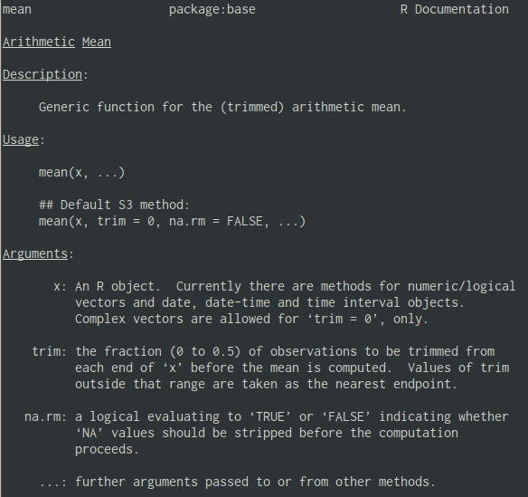
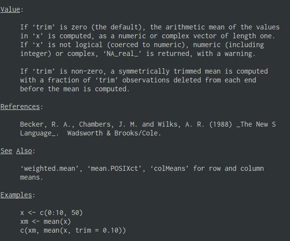

# Functions

.pull-left[
- Functions are small(ish) pieces of code that given a set of arguments produce some output

- Functions allow us to repeat the same procedure several times with different inputs without repeating code

- Packages are mostly just groups of related functions

- The help() function shows the help page for any function

```r
help(apply)
?apply
```
]
.pull-right[
```{r}
f_to_c <- function(f){
  (5/9)*(f-32)
}
f_to_c(60)
```
]

---

# Good code architecture

- Good code is modular and easy to understand 

- Using functions has several advantages:

  - Modularity: Think about the small steps that compose our solution;

  - Testing: Test each step independently;

  - Maintenance: Easier bug detection and updates;

  - Readability: Clear function names convey intent;

  - Reuse: good generic functions can be used wherever necessary.

- This makes understanding code, finding and fixing problems much easier

---

# Returning to the Diversity indexes

- Let's wrap our code from last class in a function:

```{r} 
species_n = c(a = 5, b = 1, c = 10, d = 3, e = 9, 
              f = 10, g = 18, h = 22, i = 8, j = 8)
```

.pull-left[

- Old script
```{r}
n_total = 0
for(i in seq_along(species_n)){
  n_total <- n_total + species_n[i]
}
props = species_n / n_total
D = 0
names(D) = "Simpson"
for(i in seq_along(props)){
  D = D + props[i]^2
}
D
```
]
.pull-right[

- New and improved function
```{r}
Simpson <- function(x){
  n = sum(x)
  p = x/n
  D = sum(p^2)
  return(c(Simpson = D))
}
Simpson(species_n)
```
]

---

# DRY (Don't Repeat Yourself) principle

.pull-left[
```{r}
Simpson <- function(x){
  n = sum(x) #<<
  p = x/n    #<<
  D = sum(p^2)
  return(c(Simpson = D))
}

Shannon <- function(x){
  n = sum(x)  #<<
  p = x/n     #<<
  H = -sum(p*log(p))
  return(c(Shannon = H))
}
```
]

--

.pull-right[
```{r}
getProb = function(x) x/sum(x)

Simpson <- function(x){
  p = getProb(x)
  D = sum(p^2)
  return(c(Simpson = D))
}

Shannon <- function(x){
  p = getProb(x)
  H = -sum(p*log(p))
  return(c(Shannon = H))
}
```
]

---

# Reading a help page
```r
?mean
```
.pull-left[
  
]
.pull-right[
  
]

---

# Almost everything in R is a function

Inline operators are functions:

```{r}  
`+`(1, 2) # 1 + 2
`==`(2, "a") # 1 == "a"
```

```{r} 
`<-`(a, 1) # a <- 1
a
```

Even the index bracket!
```{r}
x = list(1, 2, "b")
`[[`(x, 3) # x[[3]]
```

---

# Functions as first class objects

Functions can be treated like any other object, so you can:

.pull-left[
- Have a function return another function

```{r}
sum_x <- function(x) {
  f <- function(y) y + x
  f
}
sum_4 = sum_x(4)
sum_4(3)
```

- Make lists of functions:

```{r}
fs = list(mean, median, var)
x = 1:10
c(fs[[1]](x), fs[[2]](x), fs[[3]](x))
```
]
.pull-right[
  - Pass a function as an argument to another function:

```{r}
fogoh <- function(x, f, g, h){
  f(g(h(x)))
}
x = rexp(10)
x
fogoh(x, mean, diff, sort)
```
]
---

# Composing functions

.pull-left[
  - Using intermediate objects:

```{r}
x = rexp(10)
sorted_x = sort(x)
diff_x = diff(sorted_x)
mean(diff_x)
```

- Nesting calls:

```{r}
mean(diff(sort(x)))
```
]

--

.pull-right[
- Using the pipe operator:

```{r}
x |> sort() |> diff() |> mean()
# or
library(magrittr)
x %>% sort %>% diff %>% mean
```


]

---


# Parts of a function

A function has three parts:

- The formals(), the list of arguments that control how you call the function.

- The body(), the code inside the function.

- The environment(), the data structure that determines how the function finds the values associated with the names.

- Some exceptions are functions that call C code directly: sum, `[`, and a few others

.pull-left[
```{r}
f <- function(x, y) {
  # A comment
  x + y
}

formals(f)
```
]
.pull-right[
```{r}
body(f)
environment(f)
```
]
---

# Environments 

- Environments associate a set of names to a set of values. 
- You can think of an environment as a bag of names

.center[

]

---

# Functions and environments

.pull-left[
- Functions have their own environments, so the same name can be bound to a different value inside the function

- This is called masking

```{r}
x <- 10
y <- 20
g <- function() {
  x <- 1
  y <- 2
  c(x, y)
}
g()
```
]

--

.pull-right[
- If a name isn’t defined inside a function, R looks one level up.
```{r}
x <- 2
g <- function() {
  y <- 1
  c(x, y)
}
g()

# And this doesn't change 
# the previous value of y
y
```
]

---

# Object-oriented programming

- Functions can behave differently depending on the class of the inputs.

- R has a patchwork mess of several object-oriented programming (OOP) paradigms: 

  - S3: (or Simple S) is the oldest and most basic form of OOP in R. It lacks formal class definitions and methods, relying on naming conventions. Objects are typically lists with a class attribute. Methods are defined using functions with the class name in their names, e.g., print, summary.

  - S4: is an improved version of S3, providing more formal class definitions and methods.Classes are defined using the setClass function, which allows more control over object structure. Methods are defined using setMethod and related functions. Strong typing and formal validation of slots (object attributes) can be enforced. S4 supports multiple inheritance.

  - Reference Classes (R5 or RC): R5 classes provide a more traditional OOP experience similar to languages like Java or C#. Classes are defined using the setRefClass function.

  - R6: is an alternative to S3, S4, and reference classes, introduced through the R6 package. It provides a more modern, stateful, and user-friendly OOP experience. Objects are instances of R6 classes, which have methods and private fields. R6 classes are defined using the R6Class function from the R6 package.
---

# Crash-course in S3


---