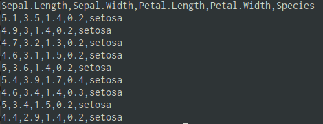
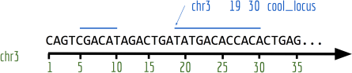
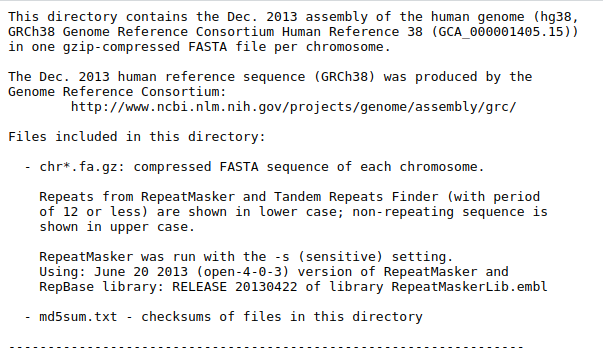
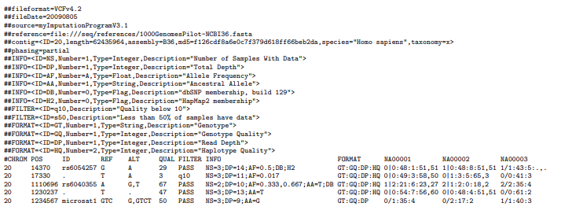

# To analyze the data, you must first be the data

- Almost all projects begin with data going into software

- All of them end with output being extracted

- We have to learn how to read and write from files

---

# Basic data types 

- Tabular

    - Most common type in ecology.
    - Usually goes into a data.frame.
    - Excel files, csv, tsv, fixed width...

- Genomic data

    - Most common in genetics, bioinformatics
    - Usually pretty large, so requires some care and specialized data structures
    - Genotype data, sequence data, aligned sequence data, expression data

- Databases 

    - Relational data that is more complex than a single table

---

# Tabular data

```{r}
head(iris)
```


---


# Reading tabular data

.pull-left[
- Base functions:
    - Output data.frames
    - Names have `.` in them, e.g. read.table, read.csv

- `readr` package
    - Mostly drop-in replacements for the base functions, but with some more (or less) sensible choices
    - ties into the `tidyverse` groups of packages we will see later on
        - there are super popular, so important to know.
    - Names have `_` in them, e.g. read_delim, read_csv

]
.pull-right[

- `data.table` package
    - Notable because it's `fread` function is so blazing fast it is sometimes the only choice for large data

- `rio` package
    - sort of jack of all traits magic package that attempts to figure out the correct way to read your data from the file extension
    - Only has one generic `import` function that mostly get's it right.
]

---


# read.table

.pull-left[
- General purpose table reading function.
- Reads a file in table format and creates a data.frame.

```{r}
# Basic Usage
my_data <- read.table("my_file.tsv", 
                      header = TRUE, 
                      sep = "\t")
head(my_data)
```
]
---

# read.csv & read.csv2

Special cases of read.table designed for CSV files.

- read.csv: assumes field separator is "," and . for decimal point.
- read.csv2: assumes field separator is ";" and , for decimal point (common in European datasets).

```r
data_csv <- read.csv("my_data.csv")

# For European-style CSV
data_csv2 <- read.csv2("my_data_european.csv")
```


---

# readr package

- Outputs a tibble, a kind of modern data.frame with some quirks
    - does some smart figuring-out of column types
    - avoids most conversions to factor

```{r}
# Basic Usage
library(readr)
my_data_tbl <- read_delim("my_file.tsv", 
                           delim = "\t")
```

---

# tibble data.frame

```{r}
my_data_tbl
```

---

# data.table's fread

- data.table is a very fast package to deal with tabular data
- Has its own very particular syntax
- Can deal with datasets above 100GB easily

```{r}
library(data.table)
data_dt <- fread("my_file.csv")
data_dt
```
---

# Reading data of the interwebs

```{r} 
input <- if (file.exists("flights14.csv")) {
   "flights14.csv"
} else {
  "https://raw.githubusercontent.com/Rdatatable/data.table/master/vignettes/flights14.csv"
}
flights <- fread(input)
flights
```
---


# Genomics data

- FASTA - Simple collections of named DNA/protein sequences

- FASTQ - Extension of FASTA format, contains additional quality information. Widely used for storing unaligned sequencing reads

- SAM/BAM - Alignments of sequencing reads to a reference genome

- BED - Region-based genome annotation information (e.g. a list of
genes and their genomic locations). Used for visualization or simple
enumeration

- GFF/GTF - gene-centric annotations

- (big)WIG - continuous signal representation

- VCF - variant call format, to store information about genomic variants

---

# Reference genome as a set of coordinates

Most genomics data formats have some sort of coordinate information

.center[
    
]

---


# DNA Sequence data

.pull-left[
### FASTA

- A sequence in FASTA format consists of:
 - One line starting with a ">" sign, followed by a sequence identification code.

 - One or more lines containing the sequence itself.
```
        A --> adenosine           M --> A C (amino)
        C --> cytidine            S --> G C (strong)
        G --> guanine             W --> A T (weak)
        T --> thymidine           B --> G T C
        U --> uridine             D --> G A T
        R --> G A (purine)        H --> A C T
        Y --> T C (pyrimidine)    V --> G C A
        K --> G T (keto)          N --> A G C T (any)
                                  -  gap of indeterminate length
```
]
.pull-right[
### Human genome

[GRCh38 Genome Reference Consortium Human Reference 38](https://hgdownload.cse.ucsc.edu/goldenPath/hg38/chromosomes/)

]

---


# Genotyping data

[The Variant Call Format (VCF)](https://samtools.github.io/hts-specs/VCFv4.2.pdf)



---

# Gene expression data (RNAseq)

---


# Parsing generic data

---

# Human genome

[GRCh38 Genome Reference Consortium Human Reference 38](https://hgdownload.cse.ucsc.edu/goldenPath/hg38/chromosomes/)


---