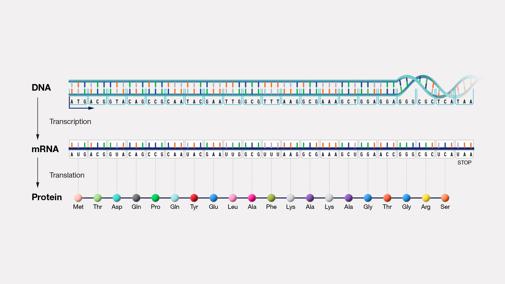

class: inverse, center, middle
# To analyze the data, you must first be the data

---

# Basic data types 

- Tabular

    - Most common type in ecology.
    - Usually goes into a data.frame.
    - Excel files, csv, tsv, fixed width...

- Genomic data

    - Most common in genetics, bioinformatics
    - Usually pretty large, so requires some care and specialized data structures
    - Genotype data, sequence data, aligned sequence data, expression data

- Databases 

    - Relational data that is more complex than a single table

---

# Tabular data

```{r}
head(iris)
```


---


# Reading tabular data

.pull-left[
- Base functions:
    - Output data.frames
    - Names have `.` in them, e.g. read.table, read.csv

- `readr` package
    - Mostly drop-in replacements for the base functions, but with some more (or less) sensible choices
    - ties into the `tidyverse` groups of packages we will see later on
        - there are super popular, so important to know.
    - Names have `_` in them, e.g. read_delim, read_csv

]
.pull-right[

- `data.table` package
    - Notable because it's `fread` function is so blazing fast it is sometimes the only choice for large data

- `rio` package
    - sort of jack of all traits magic package that attempts to figure out the correct way to read your data from the file extension
    - Only has one generic `import` function that mostly get's it right.
]

---

# read.table

.pull-left[
- General purpose table reading function.
- Reads a file in table format and creates a data.frame.

```{r}
# Basic Usage
my_data <- read.table("data/my_file.tsv", 
                      header = TRUE, 
                      sep = "\t")
head(my_data)
```
]
---

# read.csv & read.csv2

Special cases of `read.table` designed for CSV files.

- `read.csv`: assumes field separator is "," and . for decimal point.
- `read.csv2`: assumes field separator is ";" and , for decimal point (common in European datasets).

```r
data_csv <- read.csv("my_data.csv")

# For European-style CSV
data_csv2 <- read.csv2("my_data_european.csv")
```


---

# readr package

- Outputs a tibble, a kind of modern data.frame with some quirks
    - does some smart figuring-out of column types
    - avoids most conversions to factor

```{r}
# Basic Usage
library(readr)
my_data_tbl <- read_delim("data/my_file.tsv", 
                           delim = "\t")
```

---

# tibble data.frame

```{r}
my_data_tbl
```

---

# data.table's fread

- data.table is a very fast package to deal with tabular data
- Has its own very particular syntax
- Can deal with datasets above 100GB easily

```{r}
library(data.table)
data_dt <- fread("data/my_file.csv")
data_dt
```
---

# Reading data of the interwebs

```{r} 
input <- if (file.exists("flights14.csv")) {
   "flights14.csv"
} else {
  "https://raw.githubusercontent.com/Rdatatable/data.table/master/vignettes/flights14.csv"
}
flights <- fread(input)
flights
```
---

# Reasing generic data files

```{r}
# Using the scan() function
my_generic_file <- scan("data/my_file.csv", character())

# Using the readLines() function
my_generic_file <- readLines("data/my_file.csv")
my_generic_file
```

---

# Saving R objects

.pull-left[
- R has a generic `.Rds` file extension for saving compressed R objects in
- Good if you only need to use the data in R

- Both the rio package `export` or the base `saveRDS` funtions can save any R object

```r
saveRDS(object, file = "output_file.Rds")

library(rio)
export(object, file = "output_file.Rds")
```
]
--
.pull-right[
For tabular data, we can use:

- Base R: `write.table` function
- `rio` package: `export` function, which guesses the format from the output file extension
- `readr` package: `write_csv`, `write_delim`

```r
export(df_object, file = "my_df.csv")
```
]

---

class: inverse, center, middle
# Genomics data

---

# Types of genomics data files

- FASTA - Simple collections of named DNA/protein sequences

- FASTQ - Extension of FASTA format, contains additional quality information. Widely used for storing unaligned sequencing reads

- SAM/BAM - Alignments of sequencing reads to a reference genome

- BED - Region-based genome annotation information (e.g. a list of
genes and their genomic locations). Used for visualization or simple
enumeration

- GFF/GTF - gene-centric annotations

- (big)WIG - continuous signal representation

- VCF - variant call format, to store information about genomic variants

---

# Reference genome as a set of coordinates

.center[

]

---


# DNA Sequence data

.pull-left[
### FASTA

- A sequence in FASTA format consists of:
 - One line starting with a ">" sign, followed by a sequence identification code.

 - One or more lines containing the sequence itself.
```
        A --> adenosine           M --> A C (amino)
        C --> cytidine            S --> G C (strong)
        G --> guanine             W --> A T (weak)
        T --> thymidine           B --> G T C
        U --> uridine             D --> G A T
        R --> G A (purine)        H --> A C T
        Y --> T C (pyrimidine)    V --> G C A
        K --> G T (keto)          N --> A G C T (any)
                                  -  gap of indeterminate length
```
]
.pull-right[
### Human genome

[GRCh38 Genome Reference Consortium Human Reference 38](https://hgdownload.cse.ucsc.edu/goldenPath/hg38/chromosomes/)

]

---

# Next Generaton Sequencing scheme

.center[

]

.ref[https://info.abmgood.com/next-generation-sequencing-ngs-data-analysis]

---

# Next Generaton Sequencing scheme


.ref[https://irepertoire.com/ngs-overview-from-sample-to-sequencer-to-results/]

---


# Short read data - FASTQ

- An intermediate filetype that is used for downstream analysis
- Usually we just pipe it to allignment software and never look at it

.ref[https://knowledge.illumina.com/software/general/software-general-reference_material-list/000002211]

### General structure

- `@` line with an alphanumeric ID
- Base pair sequence
- `+` 
- Quality score for each read position

```
	@SIM:1:FCX:1:15:6329:1045 1:N:0:2
	TCGCACTCAACGCCCTGCATATGACAAGACAGAATC
	+
	<>;##=><9=AAAAAAAAAA9#:<#<;<<<????#=
```

This is the quality score rank:

```
!"#$%&'()*+,-./0123456789:;<=>?@ABCDEFGHIJKLMNOPQRSTUVWXYZ[\]^_`abcdefghijklmnopqrstuvwxyz{|}~
```

---

# Single or pair-end reads

.center[

]

---

# Read depth and coverage

.center[

]

.ref[https://journals.sagepub.com/doi/10.1177/1099800417750746]
---

# Shotgun assemmbly

.center[

]
.ref[https://www.differencebetween.com/difference-between-clone-by-clone-sequencing-and-shotgun-sequencing/]

# Alignments - SAM and BAM

---

# Some sequencing methods

.center[

]
.ref[Lou, R. N., Jacobs, A., Wilder, A. P. & Therkildsen, N. O. A beginner’s guide to low-coverage whole genome sequencing for population genomics. Mol. Ecol. 30, 5966–5993 (2021) [10.1111/mec.16077](https://onlinelibrary-wiley-com.ezproxy.princeton.edu/share/YHRVMJNPQCIA9BPMKSJU?target=10.1111/mec.16077)]

---

# Genotyping data

[The Variant Call Format (VCF)](https://samtools.github.io/hts-specs/VCFv4.2.pdf)


 
---

# Common VCF formats

```
##INFO=<ID=AF,Number=A,Type=Float,Description="Estimated Allele Frequencies">
##INFO=<ID=AR2,Number=1,Type=Float,Description="Allelic R-Squared: estimated correlation between most probable ALT dose and true ALT dose">
##INFO=<ID=DR2,Number=1,Type=Float,Description="Dosage R-Squared: estimated correlation between estimated ALT dose [P(RA) + 2*P(AA)] and true ALT dose">
##FORMAT=<ID=GT,Number=1,Type=String,Description="Genotype">
##FORMAT=<ID=DS,Number=1,Type=Float,Description="estimated ALT dose [P(RA) + P(AA)]">
##FORMAT=<ID=GP,Number=G,Type=Float,Description="Estimated Genotype Probability">
```

```
#CHROM	POS	ID	REF	ALT	QUAL	FILTER	INFO	FORMAT	127 ...
1	5385887	AX-168417668	C	G	.	PASS	AR2=1;DR2=1;AF=0.165	GT:DS:GP	0|0:0:1,0,0	...
```

---

# Reading VCFs in R

.pull-left[
```{r}
library(vcfR)
vcf = read.vcfR("data/sample.vcf")
```
]

---

# Reading VCFs in R
```{r}
str(vcf)
```

---

# Using fread

```{r}
df_vcf = fread(file='data/sample.vcf', sep='\t', header = TRUE, skip = '#CHROM')
df_vcf
```

---

# Gene expression

.center[

]
---

# Gene expression

.center[

]
---

# Gene expression



---

# Gene expression data (RNAseq)

.pull-left[

.ref[https://www.nature.com/articles/nrg2484]
]

.pull-right[
- Alligned RNA reads that map to genes are contributed

- The counts are proportional to RNA expression

```{r}
counts <- read.delim("https://raw.githubusercontent.com/ucdavis-bioinformatics-training/2018-June-RNA-Seq-Workshop/master/thursday/all_counts.txt")
counts[1:10, 1:7]
```
]


