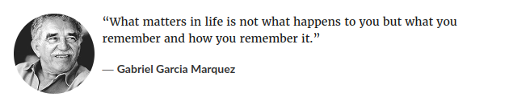
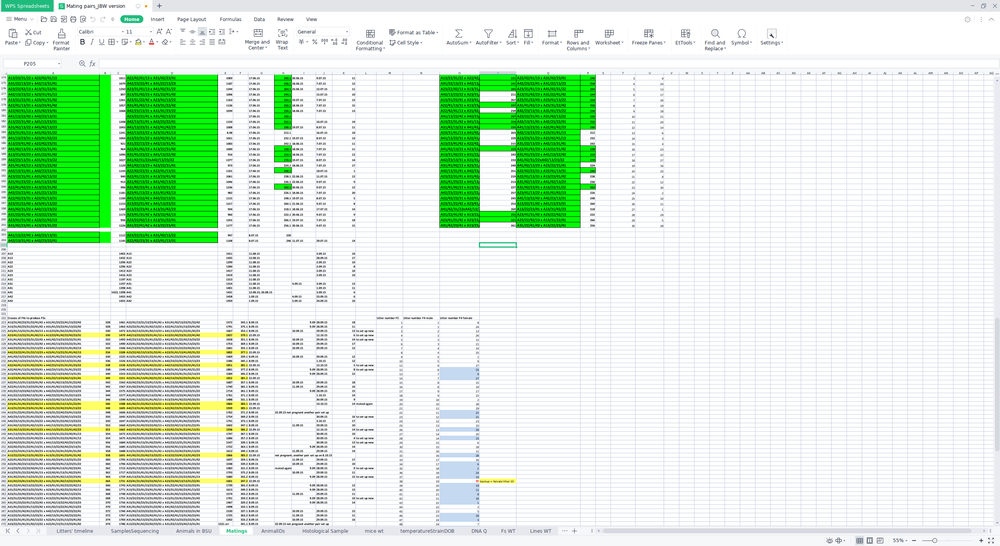
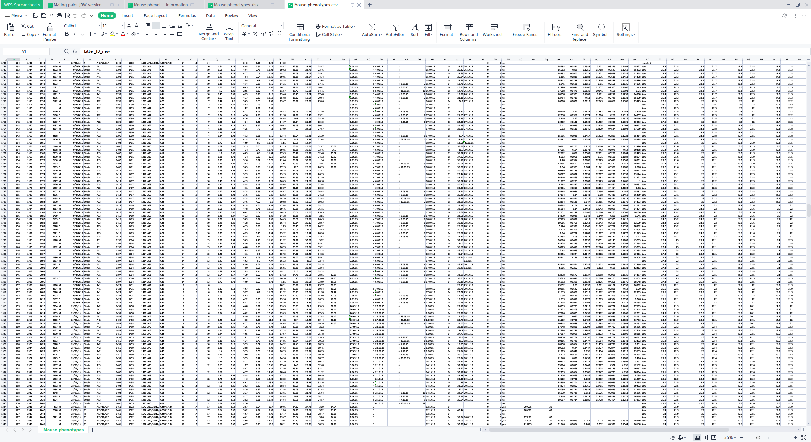
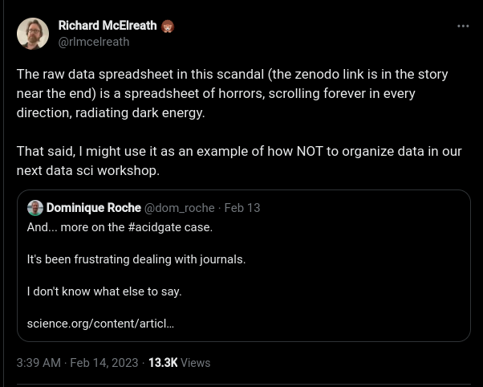
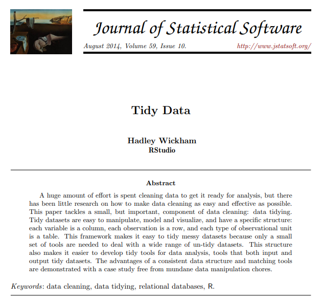

class: left, top
background-image: url(figures/toomuchinfo.jpg)
background-position: center right
background-size:  40%


# Recap

- **Assigning** variables
  - vectors, matrices, arrays (R) or numpy arrays (python): all elements of same type
  - lists: can be of different types
  - `data.frames` (R) or `DataFrame` (python): flexible lists of vectors of the same type

--
- **Modifying** variables
  - indexing to modify parts of an object

--
- **Logical** comparisons
  - indexing with logical vectors

--

- **Conditionals**
  - do something based on the value of a boolean
  - `if`, `else if`/`elif`, `else` patterns

--

- **Loops**: repeat an operation given some criteria
  - `for` loops iterate over a vector or list 
  - `while` loops repeat while a condition is `TRUE`


.pull-right[

]

---

# Recap

.pull-left[

  - less repetition, more modularity
  - **vast** array of useful R packages in CRAN, Bioconductor and github. 
  - To use a R package (e.g. `tidyverse`):
```r
install.packages("tidyverse") #or
pak::pkg_install("tidyverse")
library(tidyverse)
```

- To use a python module (mostly: `numpy`, `scipy`, `math`, `pandas`, `matplotlib`):
```
pip install numpy ### in your terminal
```
```{python}
import numpy as np # in python
```
]
--

.pull-right[
  - Regular expressions
    - super advanced find
    - Can be used to modify, parse, validade, or generally work with strings

- Reading tabular data
  - R: `rio` package is your friend
  - be mindful of **file paths** and **separators**
  - python: `pandas` is your friend. `.npy` good for arrays


]

---

class: inverse, center, middle
# Messy data is a fact of life 

---

# Human data vs Computer data 



---

# Human data vs Computer data 



---

# What not to do

.center[

]
[Journal declines to retract fish research paper despite fraud finding](https://www.science.org/content/article/journal-declines-retract-fish-research-paper-despite-fraud-finding#.Y-rB0HBL_Yo.twitter)

[The humanity!](https://zenodo.org/record/6565204)

[Tweet](https://twitter.com/rlmcelreath/status/1625414337232883712)

---


# Base R vs **The tidyverse**

.pull-left[
- Most of the operations we will see can be done using just the stuff we already know, in R:

  - Indexing with `[]` and `$`
  - Using logical comparisons `==`, `>`, ...
  - Creating new columns with `$`
  - `with` and `within` functions

- The [tidyverse](https://www.tidyverse.org/) gives us access to a consistent set of wrangling functions, which are well documented and fast

- Cool interface that allows us to use column names without quotes

- They also play nice with the great plotting library `ggplot2`

- Same principles apply to `DataFrame`s in python, despite some syntax differences

]
.pull-right[

]
---

# The tidy data principles


.pull-left[
.content-box-yellow[
1. Each variable forms a column.

2. Each observation forms a row.

3. Each type of observational unit forms a table
]

### Things to solve:
- Column headers are values, not variable names.
- Multiple variables are stored in one column.
- Variables are stored in both rows and columns.
- Multiple types of observational units are stored in the same table.
- A single observational unit is stored in multiple tables

.ref[[Tidy data paper](https://www.jstatsoft.org/article/view/v059i10)]
]
.pull-right[

]

---

# What should columns be?

.pull-left[
```{r}
library(tibble)
classroom <- tribble(
  ~name,    ~quiz1, ~quiz2, ~test1,
  "Billy",  NA,     "D",    "C",
  "Suzy",   "F",    NA,     NA,
  "Lionel", "B",    "C",    "B",
  "Jenny",  "A",    "A",    "B"
  )
classroom
```
]
--
.pull-right[
```{r}
tribble(
  ~assessment, ~Billy, ~Suzy, ~Lionel, ~Jenny,
  "quiz1",     NA,     "F",   "B",     "A",
  "quiz2",     "D",    NA,    "C",     "A",
  "test1",     "C",    NA,    "B",     "B"
  )
```
```{python}
import pandas as pd
import numpy as np
pd.DataFrame({
    'assessment': ['quiz1', 'quiz2', 'test1'],
    'Billy': [np.nan, 'D', 'C'],
    'Suzy': ['F', np.nan, np.nan],
    'Lionel': ['B', 'C', 'B'],
    'Jenny': ['A', 'A', 'B']})
```
]

---

class: left, top
background-image: url(figures/tidy.png)
background-position: center right
background-size:  60%

# Tidy it up!

```{r}
library(tidyverse)
classroom2 <- classroom %>%  # %>% is a piping operator
  # sends columns (quiz1, quiz2, test1) into one column "assessment"
  pivot_longer(cols = c(quiz1, quiz2, test1), names_to = "assessment", values_to = "grade") %>% 
  arrange(name, assessment) # sort first by name, then by assessment
classroom2
```


---

# Data Wrangling Cheat sheet

.center[

]

https://www.rstudio.com/wp-content/uploads/2015/02/data-wrangling-cheatsheet.pdf

---

# Pivot: long and wide data

```{r}
relig_income
```

---

# pivot_longer


### Basic syntax:

```r
pivot_longer(data.frame, columns_to_join, names_to =  "names", values_to = "values")
```


### Equivalent calls:

```{r}
names(relig_income)
```
```r
relig_income %>% pivot_longer(-religion , names_to = "income", values_to = "frequency")

pivot_longer(relig_income, 2:11, names_to = "income", values_to = "frequency")

relig_income |> pivot_longer("<$10k":"Don't know/refused", names_to = "income", values_to = "frequency")

pivot_longer(relig_income, `<$10k`:`Don't know/refused`, names_to = "income", values_to = "frequency")
```

---


# tb dataset 

```{r}
who
```
---

# First, pivot longer
 
```{r}
tb2 <- who %>% 
  pivot_longer(
    !c(country, iso2, iso3, year), 
    names_to = "demography", 
    values_to = "n", 
    values_drop_na = TRUE
  )
tb2
```

---

# Now, separate the demography col

- The `demography` column is holding too many variables

- We need to get the species, sex and age variables into their own columns!

```r
separate(tb2, col = demography, into = c("species", "sex", "age"), ...)
```
```{r}
unique(tb2$demography)
```

--

```{r}
tb2 %>% separate(demography, c("sp", "sex", "age"), c(7,8)) # 3 columns with 2 points of separation
```


---

# Regular expressions come back!
```r
tb3 = who %>% pivot_longer(
  !c(country, iso2, iso3, year), 
  names_to = c("sp", "sex", "age"), 
  names_pattern = "(something) (something) (regex)"
  values_to = "n", 
  values_drop_na = TRUE)
tb3
```


---

# Regular expressions come back!
```{r}
tb3 = who %>% pivot_longer(
  !c(country, iso2, iso3, year), 
  names_to = c("sp", "sex", "age"), 
  names_pattern = "new_?(.{2,3})_(.)(.+)", # can´t believe I got this right...
  values_to = "n", 
  values_drop_na = TRUE)
tb3
```

---
# Same with python?

- Can convert R datasets into python using `rpy2`. Then make it a pandas DataFrame `df`. Let's recreate a similar DataFrame instead:
```{python}
import pandas as pd
df = pd.DataFrame({'country':['Afg','usa','fra'], 'iso':['AF','US','FR'], 'year':[1980,1984,1986], 'new_sp_m2534':[2,10,3], 'newrel_m4554':[56,848,3], 'new_ep_f65':[49,2,345]})  ; df
```

- The equivalent of `pivot_longer` is `melt` (`pd.wide_to_long` is less flexible):
  - Can also use `value_vars` to list the row-ified variables rather than `id_vars` that list the kept variables
```{python}
df2 = pd.melt(df, id_vars=['country','iso', 'year'], var_name='demography', value_name='n')              ; df2
```

---
# Same with python?

- Now use regex and the pandas version of `findall`, to separate our `demography` into 3 columns
  - str.split also works but gives additional empty columns
```{python}
split_demo = df2['demography'].str.findall('new_?(.{2,3})_(.)(.+)')     ; split_demo.head(5)
```

```{python, echo=T, results='hide'}
df2['sp'], df2['s'], df2['age'] = split_demo.str[0].str # transforming list of tuples into columns
```
```{python}
df2.drop('demography',axis=1)  ; df2 # remove the now-useless column
```


---


# More pivots

- Sometimes two columns are stored in the same one and must be separated

- This dataset has both problems!

```{r}
w_data = 'https://raw.githubusercontent.com/YonatanRA/-weather-project-data-cleaning-SQL-/master/weather-raw.csv'
weather <- as_tibble(read.csv(w_data, stringsAsFactors = FALSE))
weather
```

---

# Get the days in a column

```{r} 
weather2 <- weather %>% 
  pivot_longer(
    d1:d31, 
    names_to = "day", 
    values_to = "value", 
    values_drop_na = TRUE # Missing values are implicit in the long format
  ) 
weather2
```

---

# Pivot the `element` column wider

.pull-left[
```{r}
weather2
```
]
.pull-right[
```{r}
weather2 %>% 
  pivot_wider(names_from = element, 
              values_from = value)
```
]
---

# python again?
```{python}
w_data = 'https://raw.githubusercontent.com/YonatanRA/-weather-project-data-cleaning-SQL-/master/weather-raw.csv'
weather = pd.read_csv(w_data)
# same as before
weather2 = pd.melt(weather, id_vars=['id','year','month','element'], var_name='day', value_name='value')
weather2.dropna(inplace=True) ; weather2.head(5)
```
--
```{python}
# pivot works for pivot_wider AND pivot_longer
weather3 = weather2.pivot(index=['id','year','month','day'], columns='element', values='value')
weather3.reset_index(inplace=True) # just flattening the (hierarchical) columns names
weather3
```

---

# Example data set

The infamous `flights` dataset in the `nycflights13` package

```{r}
library(tidyverse) # pak::pkg_install("nycflights13")
library(nycflights13)
flights
```
---

# One table per observational unit??

.center[

]
---


class: inverse, center, middle
# The verbs of working with dataframes

---

# Selecting rows using `filter`

.pull-left[
`filter()` allows you to subset observations based on their values

```{r}
filter(flights, month == 1 & day == 2)
```
]
.pull-right[
In pandas: simply indexing with condition!
```{python,eval=F}
flights = flights[ (flights.month == 1) 
                 & (fligths.day == 2) ]
```
]

---

# Filter and the `%in%` operator

```{r}
sep_oct <- filter(flights, month %in% c(9, 10))
sep_oct
```

- In python: just `flights[ flights.month.isin([9, 10]) ]`

---

# Selecting columns using `select`

.pull-left[
- `filter` extracts rows
- `select` extracts columns

```{r}
select(flights, year, month, day)
```
] 
.pull-right[
- Can match column names

```{r}
select(flights, year, month, contains("delay"))
```
]

- In pandas: `flights[['year', 'month', 'day']]`

---

# Column ranges and `select`

.pull-left[
- we can pass several ranges

```{r}
select(flights, year:day, dest:hour)
```
] 
--
.pull-right[
- Or exclude columns and ranges

```{r}
select(flights, -year, -(dest:hour))
```
]
---

# `select()` helper functions

There are a number of helper functions you can use within `select()`:

- `starts_with("abc")`: matches names that begin with “abc”.

- `ends_with("xyz")`: matches names that end with “xyz”.

- `contains("ijk")`: matches names that contain “ijk”.

- `matches("(.)\\1")`: selects variables that match a regular expression. 

- `num_range("x", 1:3)`: matches x1, x2 and x3.

In pandas: use the generic function `df.filter(regex='^abc')`

---

# Changing columns using `mutate`
.pull-left[
- `mutate()` can add or modify the columns in a data.frame

```{r}
flights %>%
  mutate(
    gain = dep_delay - arr_delay,
    speed = distance / air_time * 60
  ) %>% 
  select(year:day, gain, speed)
```
]
.pull-right[
- pandas are more wordy there:
```{python,eval=F}
flights['gain'] = flight['dep_delay'] 
                - flight['arr_delay']
flights['speed'] = flight['distance'] 
                 / flight['air_time'] * 60
flights = flights['year', 'month', 'day', 
                  'gain', 'speed']
```
]


---

# Some convenient but secondary functions

- `rename()` can change the name of a column

```{r}
flights |> 
  rename(airline = carrier) |>
  names()
```
--

- `relocate()` can change the order of the columns

```r
# This will put `hour` and `distance` on the left:
flights |> 
  relocate(hour, distance)
```
- You can also use the `.before` and `.after` arguments to move columns

```r
flights |> 
  relocate(year:dep_time, .after = time_hour)
flights |> 
  relocate(starts_with("arr"), .before = dep_time)

```
---

class: inverse, center, middle
# Next: Combining verbs to process data
