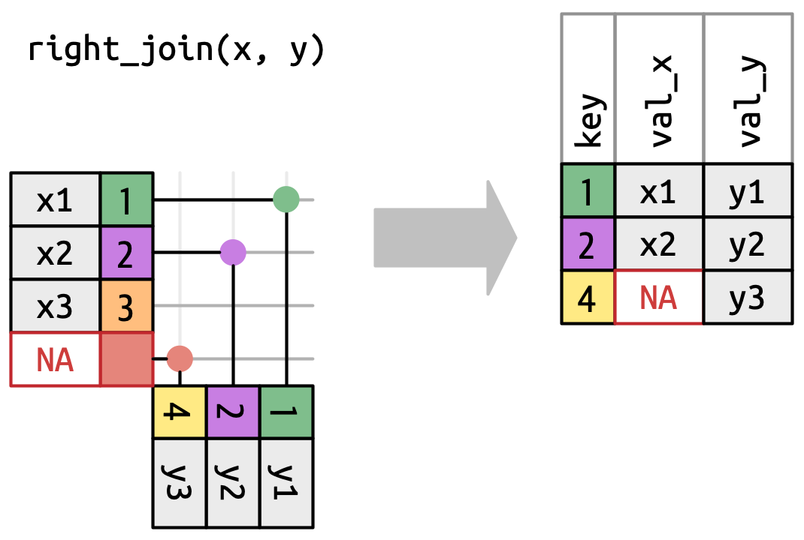

# Cheat sheets galore

.pull-left[
.font150[
[Posit/Rstudio Cheatsheets](https://rstudio.github.io/cheatsheets/)

[Pandas data wrangling cheatsheet](https://github.com/pandas-dev/pandas/blob/main/doc/cheatsheet/Pandas_Cheat_Sheet.pdf)]
]

.pull-right[
.font150[
]
]

---

class: inverse, center, middle
# Processing data sets 

---


# Counting along a column

- Example processing: `count` the number of rows in a column that share the same value 
- Also gives you the unique values in a column (as does the base function `unique`)

.pull-left[
```{r}
#pak::pkg_install("nycflights13")
library(nycflights13)
library(tidyverse)
flights %>% 
  count(carrier)
```
]
.pull-right[
- pandas equivalent: `flights.value_counts(carrier)`
]

---

# Grouping using `group_by`

- We can also separate our processing using some grouping variable
- All sensible operations happen inside groups in a grouped data.frame
 
.pull-left[
```{r}
flights %>%
  group_by(carrier) %>%
  count(origin)
```
]
.pull-right[
- Also exists in pandas (very flexible!): `flights.groupby('carrier')`
]

---

# Summarizing values using `summarize`

.pull-left[
- `summarize` can be used to perform operations in the columns

```{r}
flights %>%
  summarise(mean_delay = mean(arr_delay, 
                              na.rm = TRUE))
```
]


---

# Summarizing values using `summarize`

.pull-left[
- `summarize` can be used to perform operations in the columns

```{r}
flights %>%
  summarise(mean_delay = mean(arr_delay, 
                              na.rm = TRUE))
```
]
.pull-right[
- With `group_by`, this is a powerful function:

```{r}
flights %>%
  group_by(carrier) %>%
  summarize(delay = mean(arr_delay, 
                         na.rm = TRUE)) %>%
  print(n = 9)
```

---

# Summarizing values using `summarize`

.pull-left[
- `summarize` can be used to perform operations in the columns

```{r}
flights %>%
  summarise(mean_delay = mean(arr_delay, 
                              na.rm = TRUE))
```
- Even easier in pandas:

`flights.groupby('carrier').mean()`

(NaNs are automatically ignored)
]
.pull-right[
- With `group_by`, this is a powerful function:

```{r}
flights %>%
  group_by(carrier) %>%
  summarize(delay = mean(arr_delay, 
                         na.rm = TRUE)) %>%
  print(n = 9)
```
]

---

# Summarize across multiple columns

 - the `across` function can apply a summary function across multiple variables:

 ```{r}
 iris |> 
  summarize(across(1:4, mean))
 ```

- In python: 

`iris.iloc[:, 0:4].mean()`
---

# Adding columns using conditionals

- `if_else` function plays nice with tidyverse

```{r}
library(covidcast)
data(state_census)
head(state_census[1:6])
```

```{r}
state_census %>%
  mutate(Size = if_else(POPESTIMATE2019 > mean(POPESTIMATE2019), "Large", "Small")) %>%
  select(NAME, Size)
```


---

# Multiple case conditions

.pull-left[
- `case_when()` is a multi-case `if_else()`

```{r}
starwars |>
  mutate(type = case_when(
    height > 200 | mass > 200 ~ "large",
    species == "Droid" ~ "robot",
    TRUE ~ "other"
  )) %>%
  select(name, type) %>% print(n = 7)

```
]
.pull-right[
  - In pandas:
```{python,eval=F}
starwars['type'] = 'other'
starwars['type'].case_when([
(starwars['height'] > 200 
    |    starwars['mass'] > 200, "large")  
(starwars['species'] == 'Droid', "robot")  
])
```
]
---

# Combining operations is key!

- The power of the `tidyverse` tools comes from combining the operations:

- Finding fast flights to Houston:

.pull-left[
```{r}
flights |> 
  filter(dest == "IAH") |> 
  mutate(speed = distance / air_time * 60) |> 
  select(year:day, dep_time, 
         carrier, flight, speed) |> 
  arrange(desc(speed)) |> 
  print(n = 3)
```
]
.pull-right[
  - In pandas:
```{python,eval=F}
flights[flights['dest'] == 'IAH'].fcn1().fcn2()
```
]

---


# No pipes?

- Nested calls
```{r, eval = FALSE}
arrange(
  select(
    mutate(
      filter(
        flights, 
        dest == "IAH"
      ),
      speed = distance / air_time * 60
    ),
    year:day, dep_time, carrier, flight, speed
  ),
  desc(speed)
)
```
--

- Intermediate objects
```{r, eval = F}
flights1 <- filter(flights, dest == "IAH")
flights2 <- mutate(flights1, speed = distance / air_time * 60)
flights3 <- select(flights2, year:day, dep_time, carrier, flight, speed)
arrange(flights3, desc(speed))
```

---

class: left, top
background-image: url(figures/famousforcleaning.jpg)
background-position: center middle
background-size:  70%

# Everyone still there?

---

class: inverse, center, middle
# Merging multiple datasets

---

# Combining data sets by rows

- Sometimes the information we want is split across two data.frames

- If the columns are all the same, we can just glue them together:

.pull-left[
```{r}
(df_1 = data.frame(x = 1:3, y = rnorm(3)))
(df_2 = data.frame(x = 4:6, y = rnorm(3)))
```
]
--

.pull-right[
```{r}
bind_rows(df_1, df_2) 
```
- For many data.frames, we can put them in a list:
```r
dfs = list(df_1, df_2, df_1) 
bind_rows(dfs)
```
- pandas equivalent: `pd.concat([df1, df2])`
]

---

# Two dataframes with the same keys

.pull-left[
```{r}
n_flights = flights %>% 
  count(carrier)
n_flights
```
]
.pull-right[

```{r}
airlines
```
]

---

# Combine by columns: match

.pull-left[
- `match` makes sure the keys coincide
```{r}
airline_rows = match(n_flights$carrier, airlines$carrier)
n_flights$name = airlines$name[airline_rows]
n_flights
```
]
.pull-right[
- This works well if all the keys in the first data.frame are in the second data.frames

- in pandas:

`n_flights.merge(airlines, on=['carrier'])`
]

---

class: left, top
background-image: url(figures/venn.png)
background-position: center middle
background-size:  90%

# What if the keys don't match? Joins!

Help on join in R: [https://r4ds.hadley.nz/joins.html](https://r4ds.hadley.nz/joins.html)

---

# Example data set
.center[
  
]

---

# Possible relations between keys
.center[

]

---

# Inner join, only common keys are kept
.center[

]

pandas: 

`pd.merge(df1, df2, how='inner', on='x')`

---

class: left, top
background-image: url(figures/Join_Forces_meme.png)
background-position: center middle
background-size:  70%

# R and python can do the same things...

---

# Left join, all keys of x are kept
.center[

]

pandas: 

`pd.merge(df1, df2, how='left', on='x')`

---

# Right join, all keys of y are kept
.center[

]

pandas: 

`pd.merge(df1, df2, how='right', on='x')`

---

# Full/outer join, all keys are kept
.center[

]

pandas: 

`pd.merge(df1, df2, how='outer', on='x')`

---

# Our example

```{r}
n_flights = flights %>% count(carrier)

inner_join(n_flights, airlines, by = "carrier") %>% 
  arrange(desc(n))
```

---

# I can never remember any of this!! 


.center[
.font170[**Use the cheat sheet!**]
]


https://rstudio.github.io/cheatsheets/html/data-transformation.html

https://github.com/pandas-dev/pandas/blob/main/doc/cheatsheet/Pandas_Cheat_Sheet.pdf
