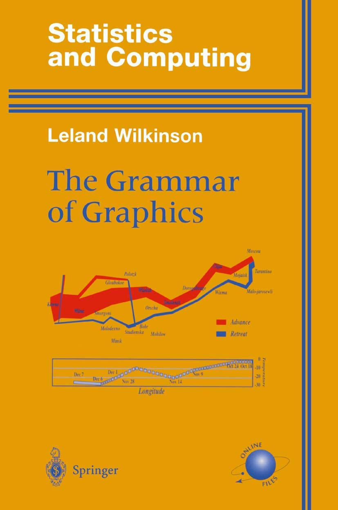

class: inverse, center, middle
# Probably our most useful topic

---

# Grammar or Graphics

.pull-left[
- The main idea is to create a general framework to represent plots, instead of having many single use functions

- ggplot2 is an implementation of the grammar of graphics:
  - [https://ggplot2-book.org/](https://ggplot2-book.org/)
  - [https://ggplot2.tidyverse.org/reference/](https://ggplot2.tidyverse.org/reference/)
]
.pull-right[
  
]

---

class: left, top
background-image: url(figures/gg_layers_described.png)
background-position: center middle
background-size:  100%

# Layers

---

class: left, top
background-image: url(figures/grammar-of-graphics.png)
background-position: center middle
background-size:  90%

# Conceptual mapping

---

# Normal plots vs GG plots

.pull-left[

### Base plots

- Literal description of the graphical elements
- Manual choice of:
  - colors, shapes, legends ...

```{r, eval = FALSE}
n = 60
x = rnorm(n)
z = sample(c(0, 1), n, replace = TRUE)
y = 1 + x + 2 * z + rnorm(n, sd = 0.5)

# Main plot:
plot(x, y, pch = 19)
# The red points:
points(x[z == 1], y[z == 1], 
       col = "red", pch = 19)
# The legend
legend(max(x)-0.5, min(y)+0.5,
       legend = c("z==0", "z==1"), 
       col = c("black", "red"), 
       pch = 19)
```

]
.pull-right[

### GG plots

- Instead of describing the graphical elements, we describe the mapping of variables and graphical elements

```{r, eval = FALSE}
library(ggplot2)
df = data.frame(x, y, z = factor(z))
ggplot(df, aes(x, y, color = z)) + 
  geom_point()
```

### matplotlib
```{python, eval = FALSE}
import matplotlib.pyplot as plt
# where z and y are numpy arrays
plt.scatter(x, y, 
            c=np.where(z == 0, 'black', 'red'), 
            label='z')
plt.legend()
```
]

---

# Data layer

.pull-left[
- Contains the actual information displayed in the plot

- Always assigned to the `data` argument on the ggplot2 functions

- Always a data.frame

- Fits well in the tidy data principles

- Requires all the wrangling we saw in the previous lectures
]
.pull-right[
```r
ggplot(data = mpg) + ...

# or

ggplot(mpg) + ...

# or

ggplot() + 
  geom_something(data = mpg)
```
]

### pandas can "replace" matplotlib for simple plotting (less flexible)
```{python, eval = FALSE}
x = np.linspace(0, 10, 100)
y = np.random.normal(0, 1, 100)
df = pd.DataFrame({'x': x, 'y': y})
df.plot.scatter(x='x', y='y', c='blue') # directly use dataframe columns as arguments
```


---

# Mapping (aesthetics layer)

.pull-left[
- Aesthetic mapping: Link variables in data to graphical properties in the geometry
  - mapping argument = always an `aes()` function call
  - arguments of `aes()` must dataframe columns

- Golden ggplot rule:
    - things that **vary** with the data are set _inside_ `aes`
    - things that **don't vary** with the data are set _outside_ `aes`

]
.pull-right[
```r
ggplot(data = mpg, 
       mapping = aes(x = displ, y = hwy)) + ...

# or
ggplot(mpg, 
       aes(x = displ, y = hwy)) + ...

# or
ggplot(mpg) + 
  geom_something(aes(x = displ, y = hwy))

# or
ggplot() + 
  geom_something(data = mpg,
                 aes(x = displ, y = hwy))

```
]

---

# Scales

.pull-left[
- Scales translate data into actual visual things
  - Categories → Color, fill, shape, linetype, ...
  - Numbers → Position, color, fill, size, ...
  -  ...

-  Imply a specific interpretation of values:
  - discrete, continuous, etc.
  - if the variable properties are incompatible with the scale, you get an error
```r
ggplot(data = mpg, 
       mapping = aes(x = displ, y = hwy,
                     color = year, 
                     shape = drv)) + ...
```
]
.pull-right[
### matplotlib

Pass arguments like `color=`, `size=`, `marker=`, `alpha=`, `label=`,  

in functions like `plt.scatter()`, `plt.plot()`, `plt.bar()`, `plt.hist()`, etc.

```{python, eval = FALSE}
plt.scatter(mpg['displ'], mpg['hwy'], 
            # c is short for color
            c=mpg['year'],
            # cmap is the color map = color scale
            cmap='viridis',
            marker='o')
```
]

---

# Geometries

.pull-left[
- What graphical representations for the input aesthetics?
  - a number of points, `geom_point
  - a line, `geom_line`
  - a single polygon, `geom_polygon`
  - or something else entirely? `geom_raster`

**Minimal ggplot**: data, mapping, geometry.  
(Everything else has default values)

### matplotlib
`plt.scatter()`  
`plt.plot()`  
`plt.bar()`  
`plt.hist()`  
2D heat maps: `plt.pcolor()`, `plt.pcolormesh()`, `plt.imshow()`
]

.pull-right[
```{r,  out.width="75%"}
library(ggplot2)
ggplot(mpg, 
       aes(x = displ, y = hwy, shape = drv)) + 
  geom_point()
```
]
---

# Geometries

- Some geoms only need a single mapping and will calculate the rest for you

.pull-left[
```{r,  out.width="70%"}
ggplot(faithful) + 
  geom_histogram(aes(x = eruptions))
```
]
.pull-right[
  </br>
  </br>
  </br>
  </br>
  </br>
### matplotlib
```{python, eval = FALSE}
import matplotlib.pyplot as plt
plt.hist(faithful['eruptions'])
```
]

---

# Statistics

.pull-left[
- Even though data is tidy, it might need treatment/transformation before displaying, e.g.:
  - **bar chart or histogram**: Count number of observations in each
category or bin
  - **boxplot**: Calculate summary statistics
- Is implicit in many plot-types but can often be done explicitly
  - Check the help file!

### seaborn
```{python, eval = FALSE}
import seaborn as sns
sns.boxplot(x='drv', y='hwy', data=mpg)
```
]
.pull-right[
```{r}
ggplot(data = mpg, aes(x = drv, y = hwy)) + 
  geom_boxplot()
```
]

---

# Default stats
.pull-left[
- Each `stat_` has an associated `geom_`
- Each `geom_` has an associated `stat_`  
This is why new data (`count`) can appear when using 
`geom_bar()`.

### matplotlib
The equivalent of `stat_` would usually be to collect output of the plotting function
```{python, eval = FALSE}
counts, bins, patches = 
    plt.hist(faithful['eruptions'])
```
]
.pull-right[
```{r,  out.width="95%"}
ggplot(mpg) + 
  geom_bar(aes(x = class))
```
]

---

# Pre calculating stats

- The stat can be overwritten.
- If we have precomputed count we do not want any additional computations to perform and we use the `identity` stat to leave the  data alone

.pull-left[
```{r, eval  = FALSE}
library(dplyr)
mpg_counted <- mpg %>% 
  count(class, name = 'count')
ggplot(mpg_counted) + 
  geom_bar(aes(x = class, y = count), 
           stat = 'identity')
```
]
.pull-right[
```{r, echo = FALSE,  out.width="90%"}
library(dplyr)
mpg_counted <- mpg %>% 
  count(class, name = 'count')
ggplot(mpg_counted) + 
  geom_bar(aes(x = class, y = count), 
           stat = 'identity')
```
]
---

# Pre calculating stats 

- Most obvious geom+stat combinations have a dedicated geom constructor.
- The alias for the one in the previous slide is `geom_col()`

```{r,  out.width="35%"}
ggplot(mpg_counted) + 
  geom_col(aes(x = class, y = count))
```

---

# Accessing calculated stats with `after_stat` 

- Values calculated by the stat is available with the `after_stat()` function 
inside `aes()`. 
- You can do all sorts of computations inside that.

.pull-left[
```{r, eval  = FALSE}
ggplot(mpg) + 
  geom_bar(
    aes(x = class, 
        y = after_stat(100 * count / sum(count))
       ))
```

### matplotlib
```{python, eval = FALSE}
import seaborn as sns
sns.barplot(
  data=100* mpg['class'].value_counts(normalize=True), 
  x='class', y='percentage')
```
]
.pull-right[
```{r, echo = FALSE,  out.width="90%"}
ggplot(mpg) + 
  geom_bar(aes(x = class, y = after_stat(100 * count / sum(count))))
```
]
---


# Facets

.pull-left[
- Define the number of panels with equal
logic and split data among them…
- Small multiples
- Allows you to look at small subsets of
your data in separate plots
- Panel layout may carry meaning
- `facet_wrap()`

- seaborn equivalent: `sns.FacetGrid()`
```{python, eval = FALSE}
import seaborn as sns
g = sns.FacetGrid(mpg, col="cyl")
g.map(sns.boxplot, "drv", "hwy")
```
]
.pull-right[
```{r}
ggplot(mpg, aes(x = drv, y = hwy)) + 
  geom_boxplot() + facet_wrap(~cyl)
```
]

---

# Facets

.pull-left[
- Define the number of panels with equal
logic and split data among them…
- Small multiples
- Allows you to look at small subsets of
your data in separate plots
- Panel layout may carry meaning
- Could have used it in the midterm...

</br>
- seaborn
```{python, eval = FALSE}
g = sns.FacetGrid(mpg, col="cyl", row="year")
g.map(sns.boxplot, "drv", "hwy")
```
]
.pull-right[
```{r}
ggplot(mpg, aes(x = displ, y = hwy)) + 
  geom_point() + facet_grid(year~cyl) 
```
]

---

# Coordinates

.pull-left[
- Positional aesthetics are special.
  1. Variables are mapped, scaled, applied
to a geometry
  2. But in the end, the position values are
interpreted by a coordinate system
- Defines the physical mapping of the
aesthetics to the paper

- Transformations can be applied to the coordinates to produce different plots
  - log scales
  - polar coordinates
  - map coordinates
]
.pull-right[
```r
ggplot(diamonds, aes(carat, price)) + 
  geom_point() + 
  # coord_cartesian(xlim = c(0, 1))
  # coord_fixed() # fixed ratio
  # coord_flip()
  # coord_trans(y = "log")

ggplot(mpg, aes(x = class)) + geom_bar + 
  coord_cartesian(ylim = c(0, 40))

ggplot(mpg, aes(x = class)) + geom_bar() + 
  coord_polar(theta = "y") + 
  expand_limits(y = 70) # guarantees that a value is present
```

### matplotlib
```{python, eval=F}
plt.xticks(rotation=90)
plt.xlim() # or ylim
ax.set_xlim([min,max]) # same but on axis

```
]

---

# Combining plots

We have two good options for creating panels with several plots:

- [`cowplot`](https://cran.r-project.org/web/packages/cowplot/vignettes/introduction.html) package
  - has the plot_grid() function which has good defaults
  - can take lists of plots
  - can set plot labels

```r
library(cowplot)
p1 <- ggplot() + ...
p2 <- ggplot() + ...
plot_grid(p1, p2)
```

.pull-left[
- [`patchwork`](https://patchwork.data-imaginist.com/) package, allows:
  - plot composition using math notation
  - complex composition using string guides

```r
library(patchwork)
p1 <- ggplot() + ...
p2 <- ggplot() + ...
p1 + p2 # horizontal
p1 / p2 # vertical
```
]
.pull-right[
### matplotlib
```{python, eval = FALSE}
fig, axs = plt.subplots(3, 2) # (n_x, n_y)
axs[0, 0].plot(x, y)
```
- then tools for spacing, common axes, etc.
]
---

# Adding more than one geometry

.pull-left[

```{r, out.width="90%"}
ggplot(faithful,
 aes(x = eruptions, y = waiting)) +
 geom_density_2d() + # Order matters! 
 geom_point() # This puts points on top of lines
```
]
.pull-right[
### matplotlib
```{python, eval = FALSE}
plt.scatter(x, y) # points
plt.plot(x, y) # lines
```
]
---


# Themes

.pull-left[
  - Everything related to the look of the plot

    - Font sizes
    - Background
    - Axis lines
    - ...

]

.pull-right[
- Many pre-baked solutions
    - [`ggthemes`](https://yutannihilation.github.io/allYourFigureAreBelongToUs/ggthemes/) package
    - [`cowplot`](https://cran.r-project.org/web/packages/cowplot/vignettes/introduction.html) package

]
```{r, eval = F}
library(ggplot2)
library(cowplot)
library(ggthemes)
p = ggplot(mpg, aes(x = displ, y = hwy, color = drv)) + 
  geom_point(size = 2) 
plot_grid(p + theme_cowplot(16), p + theme_excel(), p + theme_tufte(), p + theme_wsj())
```

### matplotlib
```{python, eval = FALSE}
plt.xlabel('x axis title', fontsize=12)
plt.legend(fontsize=12)
...
```

---

# Exercise - changing points

1. Modify the code below to make the points larger squares and slightly transparent.

  - Hint 1: transparency is controlled with `alpha`, and shape with `shape`
  - Hint 2: remember the difference between mapping and setting aesthetics

2. Add a line that separates the two point distributions. See `?geom_abline` for 
how to draw straight lines from a slope and intercept.

```{r, eval = FALSE}
ggplot(faithful) + 
  geom_point(aes(x = eruptions, y = waiting))
```
---

# Exercises - using `stat_`

- While most people use `geom_*()` when adding layers, it is just as valid to add 
a `stat_*()` with an attached geom. Look at `geom_bar()` and figure out which
stat it uses as default. Then modify the code to use the stat directly instead
(i.e. adding `stat_*()` instead of `geom_bar()`)

```{r, eval = FALSE}
ggplot(mpg) + 
  geom_bar(aes(x = class))
```

- Use `stat_summary()` to add a red dot at the mean `hwy` for each group
   - Hint: You will need to change the default geom of `stat_summary()`

```{r, eval = FALSE}
ggplot(mpg, aes(x = class, y = hwy)) + 
  geom_jitter(width = 0.2)
```

