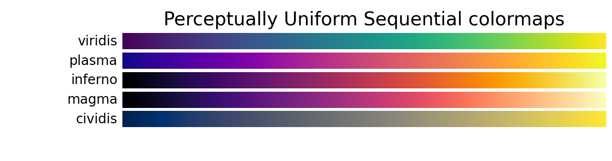

class: inverse, center, middle
# Customizing plots

---

# Modifying scales

- Scales define how the mapping you specify inside `aes()` should happen. All 
mappings have an associated scale even if not specified.
- [Scale guides](https://ggplot2-book.org/scales-guides.html)

```{r, eval = FALSE}
ggplot(mpg) + 
  geom_point(aes(x = displ, y = hwy, color = class)) 
```

 - We can add one explicitly. All scales follow the same naming conventions.

```{r, eval = FALSE}
ggplot(mpg) + 
  geom_point(aes(x = displ, y = hwy, color = class)) + 
  scale_color_brewer(type = 'qual')
```

- Positional mappings (x and y) also have associated scales.

```{r, eval = FALSE}
ggplot(mpg) + 
  geom_point(aes(x = displ, y = hwy)) + 
  scale_x_continuous(breaks = c(3, 5, 6)) + # Change x-axis ticks
  scale_y_continuous(trans = 'log10')       # Log scale on y-axis
```

---

# No python equivalent for `scales`

- No need for scales in Python, as `matplotlib` is not as modular as `ggplot2`
- Usually just arguments of main plotting function, or later modifications of `plt.`

```{python, echo = FALSE}
import matplotlib.pyplot as plt
import seaborn as sns
import numpy as np
import pandas as pd
```

```{python, results='hide', out.width="27%"}
mpg = sns.load_dataset("mpg")
sns.scatterplot(data=mpg, x="displacement", y="acceleration", hue="cylinders")
# or
plt.scatter(mpg.displacement, mpg.acceleration, c=mpg.cylinders)

plt.xticks([3, 5, 6])  # Change x-axis ticks
plt.yscale('log')      # Log scale on y-axis
```

---

# Color palettes

- There are a large number of custom color palette availabe in R:

  - [The R Color Brewer package](https://r-graph-gallery.com/38-rcolorbrewers-palettes.html)
  - [The viridis package](https://cran.r-project.org/web/packages/viridis/vignettes/intro-to-viridis.html) ([Viridis explained](https://youtu.be/xAoljeRJ3lU))
  - [The wes anderson package](https://github.com/karthik/wesanderson)
  - [Met Brewer](https://github.com/BlakeRMills/MetBrewer), [MoMa colors](https://github.com/BlakeRMills/MoMAColors)
  - [paletteer: a meta package with many, many palettes](https://emilhvitfeldt.github.io/paletteer/)

- Python: the base matplotlib choices of palttes is usually sufficient. See [list of colormaps](https://matplotlib.org/stable/users/explain/colors/colormaps.html).
- [palettable](https://jiffyclub.github.io/palettable/) is more extensive
- Use **perceptually uniform** color palettes as a go-to (for continuous data)

```{r, echo=F, results='hide', out.width="40%"}
library(viridis); library(paletteer); library(wesanderson); library(RColorBrewer)
```
---

# Changing color palettes

- In R, most of the customization is going to be done using a `scale_` function

```{r, results='hide', out.width="30%"}
#library(viridis); library(paletteer); library(wesanderson); library(RColorBrewer)
p = ggplot(data.frame(x = rnorm(10000), y = rnorm(10000)), aes(x = x, y = y)) +
  geom_hex() + coord_fixed() + theme_cowplot() 
# p + scale_fill_viridis()
# p + scale_fill_viridis(option = "plasma")
# p + scale_fill_paletteer_c("viridis::plasma") # get plasma from the viridis package
p + scale_fill_gradientn(colors = wes_palette("Zissou1", 100, type = "continuous"))
```

---

# Changing color palettes

- In python, mostly use the `cmap` argument of the plotting function

```{python, echo=F, results='hide'}
import matplotlib.pyplot as plt
import numpy as np
```

```{python, results='hide', out.width="40%"}
x, y = np.random.normal(size=(2, 10000))
plt.hexbin(x, y, gridsize=50, cmap='plasma',
           mincnt=1e-5) # do not display empty (less than 1e-5) bins # can be cmin in other function
plt.colorbar(label='Count') # need to explicitly add a colorbar
```

---

# Difference between fill and color

- `ggplot` has two common scales for color
  - `color` (or `colour`) referring to point and line color, including outlines
  - `fill` referring to the inner color of graphical elements

.pull-left[
```{r, out.width="50%"}
ggplot(mpg) + 
  geom_boxplot(aes(x = manufacturer,
                   y = hwy, fill = class), 
               color = "tomato3", 
               linewidth = 1) + 
  scale_fill_brewer(type = 'qual')
```
]
.pull-right[
```{r, out.width="50%"}
ggplot(mpg) + 
  geom_point(aes(x = displ, 
                 y = hwy, 
                 color = class), 
             size = 4) + 
  scale_color_brewer(type = 'qual')
```
]

---

# Changing colors of different objects in python

- **color** (default for points and lines) vs **face** vs **edge** vs marker

```{python, eval=F}
plt.plot(x, y, color="darkblue")
plt.bar(x, height, facecolor="lightblue") # 'face' is the filled areas
plt.hist(x, edgecolor="black", linewidth=2) # edgecolor is the color of the bars' edges
plt.plot(x, y, marker="o", markerfacecolor="orange", markeredgecolor="blue")
```
- Can also change the **transparency** of the colors with the `alpha` argument
```{python, eval=F} 
plt.plot(x, y, alpha=0.5, # 0 is transparent, 1 is opaque
         markersize=2) # changing the size of the markers
```

---

# Creating color palettes

- The `colorRampPalette` function can create color palettes by interpolating between colors

.pull-left[
```{r, eval = FALSE}
pal <- colorRampPalette(c("red", "blue"))
# 15 colors between red and blue
my_palette = pal(15) 
ggplot(mpg, aes(x = displ, y = hwy, 
                color = manufacturer)) + 
  geom_point() +
  scale_color_manual(values = my_palette) + #<<
  theme_cowplot() + background_grid()
```

</br>
- **matplotlib**: use `LinearSegmentedColormap.from_list`
]
.pull-right[
```{r, echo = F, out.width='70%'}
suppressPackageStartupMessages(library(cowplot))
pal <- colorRampPalette(c("red", "blue"))
# 15 colors between red and blue
my_palette = pal(15) 
ggplot(mpg, aes(x = displ, y = hwy, 
                color = manufacturer)) + 
  geom_point() +
  scale_color_manual(values = my_palette) +
  theme_cowplot(16) + background_grid()
```
]

```{python, eval=F}
from matplotlib.colors import LinearSegmentedColormap
pal = LinearSegmentedColormap.from_list("red_blue", ["red", "blue"], N=15)
scatter = plt.plot(x, y, cmap=pal)
```

---

# Choosing color palettes

.pull-left[
- There are basically three different types of palettes:
  - Discrete: for categorical/qualitative data (e.g. `wes_palette("Darjeeling1")`  )
  - Continuous sequential: for continuous data (e.g. `viridis`)
  - Divergent: for data with a clear *center* (e.g. `display.brewer.pal(11,"RdBu")`)
- `scale_color_brewer` has argument `type` that takes one of:
    "seq" (sequential), "div" (diverging) or "qual" (qualitative)

- Significant overlap of available palettes between R and [matplotlib](https://matplotlib.org/stable/users/explain/colors/colormaps.html)
```{python, eval=F}
# categorical cmap with tab10 (10 discrete cols)
plt.bar(categories, values, 
        c=plt.cm.get_cmap("tab10", n_categs))
```
]
.pull-right[
```{r, out.width='80%'}
par(mfrow = c(1, 3)) # this function sets global graphical parameters in base R plots
wes_palette("Darjeeling1")
scales::show_col(viridis(25), labels = FALSE, ncol = 25)
display.brewer.pal(11,"RdBu")
```
]
---

# Other scales: `shapes`

- The shape scale maps categorical variables to point shapes. See [scale_shape](https://ggplot2.tidyverse.org/reference/scale_shape.html)
- Often **important to repeat visual information both in color and in marker or line style!**

.pull-left[
```{r, eval = FALSE}
df_shapes <- data.frame(shape = 0:24)
ggplot(df_shapes, aes(0, 0, shape = shape)) +
  geom_point(aes(shape = shape), 
             size = 5, fill = 2) +
  scale_shape_identity() +
  facet_wrap(~shape) +
  theme_void()
```

- No equivalent in python, but can set shape manually with a list of marker styles
```{python, eval=F}
plt.scatter(x, y, 
            marker=["o", ".", "v", "p", 
                    "8", "s", ....]
            # or integers from 0 to 11
            )
```
]
.pull-right[
```{r, echo = F}
df_shapes <- data.frame(shape = 0:24)
ggplot(df_shapes, aes(0, 0, shape = shape)) +
  geom_point(aes(shape = shape), 
             size = 6, fill = 2) + # 2 is color "#DF536B"
  scale_shape_identity() +
  facet_wrap(~shape) +
  theme_void() 
```
]

---

# Other scales: `linetype` (`linestyle` in python)

- The linetype scale maps categorical variables to line types
- Some options: "solid", "longdash", "dashed", "dotted", ...
- [scale_linetype](https://ggplot2.tidyverse.org/reference/scale_linetype.html)

.pull-left[
```{r, eval = FALSE}
ggplot(economics_long, aes(date, value01)) + 
  geom_line(aes(linetype = variable)) +
  theme_cowplot()
```

- Need to set line styles manually in python:
```{python, eval=F}
plt.plot(x, y, linestyle='dashed') 
# or 'solid', 'dotted', 'dashdot'
```
- or just use `sns.lineplot()` with `style` argument:
```{python, eval=F} 
sns.lineplot(data=mpg, 
             x="weight", y="acceleration", 
             hue="cylinders", style="cylinders", 
             palette="Set1")
```
]
.pull-right[
```{r, echo = F, out.width="90%"}
suppressPackageStartupMessages(library(cowplot))
ggplot(economics_long, aes(date, value01)) + 
  geom_line(aes(linetype = variable)) + theme_cowplot()
```
]

---


# Manually setting scales

- Most scales have a `_manual` version
- This allows for direct mapping variables to scale levels

.pull-left[
```{r, eval = FALSE}
ggplot(mtcars, aes(mpg, wt)) +
  geom_point(aes(colour = factor(cyl)), 
             size = 4) + 
  scale_colour_manual(values = c("red", 
                                 "blue",
                                 "green"),
                      labels = c("four", 
                                 "six",
                                 "eight"),
                      name = "Cylinders") +
  theme_cowplot()
```

- In seaborn:  
`palette={"4":"red", "6":"blue", "8":"green"}`
- In matplotlib:  
`c=mpg.cylinders.map({4:"red", 6:"blue", 8:"green"})`
]
.pull-right[
```{r, echo = F, out.width="90%"}
ggplot(mtcars, aes(mpg, wt)) +
  geom_point(aes(colour = factor(cyl)), 
             size = 4) + 
  scale_colour_manual(values = c("red", 
                                 "blue",
                                 "green"),
                      labels = c("four", 
                                 "six",
                                 "eight"),
                      name = "Cylinders") +
  theme_cowplot()
```
]
---

class: inverse, center, middle
# Dealing with text

---

# Text point labels

- Text labels on points are useful, but can be hard to place

.pull-left[
```{r, eval = FALSE}
p = ggplot(mtcars, aes(wt, mpg, 
                       label = rownames(mtcars))) +
  geom_text() + #<<
  geom_point(color = 2, size = 2) +
  theme_cowplot(16)
stamp_bad(p)
```

- In python, use `annotate`
```{python, eval=F}
ax.scatter(mpg["weight"], mpg["acceleration"])
for i, txt in enumerate(mpg["name"]):
    ax.annotate(txt, # text
                # x position
                (mpg["weight"].iloc[i], 
                # y position
                mpg["acceleration"].iloc[i])) 
```
]
.pull-right[
```{r, echo = F, out.width='90%'}
p = ggplot(mtcars, aes(wt, mpg, label = rownames(mtcars))) +
  geom_text() +
  geom_point(color = 2, size = 2) +
  theme_cowplot(16)
stamp_bad(p)
```
]


---

# `ggrepel` and text point labels

- [ggrepel](https://ggrepel.slowkow.com/) is a ggplot2 extension that makes adding point labels much easier
- [Lots of examples](https://ggrepel.slowkow.com/articles/examples.html)

.pull-left[
```{r, eval = FALSE}
library(ggrepel)
p = ggplot(mtcars, aes(wt, mpg,
                       label = rownames(mtcars))) +
  geom_text_repel() + #<<
  geom_point(color = 2, size = 2) +
  theme_cowplot(16)
stamp_good(p)
```

- In python, use `annotate` with `xytext` and `textcoords` arguments
- Or use `adjust_text()` from `adjustText` package
]
.pull-right[
```{r, echo = F, out.width='90%'}
library(ggrepel)
p = ggplot(mtcars, aes(wt, mpg, label = rownames(mtcars))) +
  geom_text_repel() +
  geom_point(color = 2, size = 2) +
  theme_cowplot(16)
stamp_good(p)
```
]


---

# `ggfittext` for adding text in random places

- [ggfittext](https://github.com/wilkox/ggfittext) for fitting text into boxes.

.pull-left[
```{r, eval = FALSE}
library(ggfittext)
ggplot(beverages, 
       aes(beverage, proportion, 
           label = ingredient,
           fill = ingredient)) +
  geom_col(position = "stack") +
  geom_bar_text(position = "stack", #<<
                reflow = TRUE) +
  theme_cowplot()
```

- A possible equivalent in matplotlib: `bar_label`
```{python, eval=F}
bars = ax.bar(x, height)
ax.bar_label(bars, label_type='center')
```
]
.pull-right[
```{r, echo = F, out.width='90%'}
library(ggfittext)
ggplot(beverages, aes(x = beverage, y = proportion, label = ingredient,
                    fill = ingredient)) +
  geom_col(position = "stack") +
  geom_bar_text(position = "stack", reflow = TRUE)+
  theme_cowplot()
```
]


---

# `annotate` for text plot annotations

.pull-left[
```{r, eval = FALSE}
p = ggplot(faithful, 
           aes(x = eruptions, 
               y = waiting,
               color = eruptions > 3)) +
  geom_point() + 
  scale_color_manual(values = c("DarkOrange", 
                                "DarkBlue")) +

p +
  annotate("text", x = 3, y = 48, 
           label = "Group 1", 
           size = 10, color = "DarkOrange") +
  annotate("text", x = 4.5, y = 66, 
           label = "Group 2",
           size = 10, color = "DarkBlue")
```

- In python, `plt.annotate()` or `plt.text()`:
```{python, eval=F}
plt.text(x, y, "this is the x,y point", 
         fontsize=12, 
         ha='left', va='center') #alignement
```

]
.pull-right[
```{r, echo = F, out.width='90%'}
p = ggplot(faithful, aes(x = eruptions, y = waiting, color = eruptions > 3)) +
  geom_point() + scale_color_manual(values = c("DarkOrange", "DarkBlue")) +
  theme_minimal_grid(16)

p +
  annotate("text", x = 3, y = 48, 
           label = "Group 1", 
           size = 10, color = "DarkOrange") +
  annotate("text", x = 4.5, y = 66, 
           label = "Group 2",
           size = 10, color = "DarkBlue")
```
]

---

# `annotate` for non-text plot annotations


.pull-left[
```{r, eval = FALSE}
p + annotate("rect", xmin = 3, xmax = 5.2, 
             ymin = 62, ymax = 100,
             alpha = .4, fill = "tomato3", 
             color = "black") + 
    annotate("rect", xmin = 1, xmax = 3, 
             ymin = 42, ymax = 73,
             alpha = .4, fill = "gray",
             color = "black") + 
    annotate("segment", x = 2, xend = 3.5, 
             y = 80, yend = 55,
             colour = "purple", linewidth = 3) + 
    annotate("segment", 
             x = 3.45, xend = 2.3, 
             y = 87.5, yend = 95,
             arrow = arrow(ends = "first", 
                      length = unit(.2,"cm"))) + 
    annotate("text", x = 2.3, y = 95,  
             label = "Good point", hjust = 1)     
```
]
.pull-right[
```{r, echo = F, out.width='90%'}
p + annotate("rect", xmin = 3, xmax = 5.2, 
             ymin = 62, ymax = 100,
             alpha = .4, fill = "tomato3", color = "black") + 
    annotate("rect", xmin = 1, xmax = 3, 
             ymin = 42, ymax = 73,
             alpha = .4, fill = "gray", color = "black") + 
    annotate("segment", x = 2, xend = 3.5, y = 80, yend = 55,
             colour = "purple", linewidth = 3)  + 
    annotate("segment", x = 3.45, xend = 2.3, y = 87.5, yend = 95,
           arrow = arrow(ends = "first", length = unit(.2,"cm"))) + 
    annotate("text", x = 2.3, y = 95,  label = "Good point", hjust = 1)     
```
]

- matplotlib: `plt.plot(x1, y1, x2, y2, color='purple', linewidth=3)` for segments  
or `plt.Rectangle((x1, y1), width, height, fill=False, edgecolor='purple', linewidth=3)` for rectangles
or `plt.arrow(x1, y1, dx, dy)`

---

# `labs` function 

.pull-left[
- For changing: title, subtitle, axis titles, captions, tags, legend titles...

```{r, eval = FALSE}
p <- ggplot(mtcars, aes(mpg, wt, color = cyl)) + 
     geom_point() + theme_cowplot(16) 
p + labs(color = "Cylinders", 
         title = "Heavy cars are less efficient", 
         subtitle = "Buy a small car",
         x = "Miles per galon",
         y = "Weight (1000 lbs)",
         caption = "Data from the mtcars object.", 
         tag = "A.")
```
]
.pull-right[
```{r, echo = F, out.width='68%'}
p <- ggplot(mtcars, 
            aes(mpg, wt, 
            color = cyl)) + 
     geom_point() + 
        theme_cowplot(16) 
p + labs(color = "Cylinders", 
         title = "Heavy cars are less efficient", 
         subtitle = "Buy a small car",
         x = "Miles per galon",
         y = "Weight (1000 lbs)", 
         caption = "Data from the mtcars object.",
         tag = "A.")
```
]

- matplotlib: individual functions for each element
```{python, eval=F}
plt.plot(mpg["weight"], mpg["acceleration"], 
         label='Data from the mtcars object')
plt.title("Heavy cars are less efficient", fontsize=16)
plt.xlabel("Miles per gallon", fontsize=12)
plt.ylabel("Weight (1000 lbs)", fontsize=12)
plt.legend()
```

---

class: inverse, center, middle
#  Changing themes

---

# `theme` controls many, many aspects of the plot

- Axis lines and ticks
- Panel grids

- All text:
  - Axis labels
  - Axis titles
  - All fonts and font sizes

- Legend:
  - size
  - position and direction
  - alignment 
  - ...


- Most arguments for theme are function calls
  - `element_` family of functions
  - `element_line`, `element_text`, `element_blank`, `element_rect`, ...

---

# The `theme` function 

- Stylistic changes to the plot not related to data
- Can both apply complete themes or modify
elements directly
- Theming is hierarchical


.pull-left[
```{r, eval = FALSE}
ggplot(mpg) + geom_bar(aes(y = class)) +
 facet_wrap(~year) +
 labs(title = "Number of car models per class",
      caption = "source: http://fueleconomy.gov/",
      x = NULL,
      y = NULL) +
 scale_x_continuous(expand = c(0, NA)) +
 theme_minimal() +
 theme(
  text = element_text('Skolar Sans'),
  strip.text = element_text(face = 'bold',
  hjust = 0),
  plot.caption = element_text(face = 'italic'),
  panel.grid.major = element_line('white',
  size = 0.5),
  panel.grid.minor = element_blank(),
  panel.grid.major.y = element_blank(),
  panel.ontop = TRUE)
```
]
.pull-right[
```{r, echo = F, out.width='85%'}
ggplot(mpg) + geom_bar(aes(y = class)) +
 facet_wrap(~year) +
 labs(title = "Number of car models per class",
      caption = "source: http://fueleconomy.gov",
      x = NULL,
      y = NULL) +
 scale_x_continuous(expand = c(0, NA)) +
 theme_minimal() + # baked themes go before theme()
 theme(
  text = element_text('Skolar Sans'),
  strip.text = element_text(face = 'bold',
  hjust = 0),
  plot.caption = element_text(face = 'italic'),
  panel.grid.major = element_line('white',
  linewidth = 0.5),
  panel.grid.minor = element_blank(),
  panel.grid.major.y = element_blank(),
  panel.ontop = TRUE)
```
]

---

# No `theme` in python: only individual elements

```{python, eval=F}
import matplotlib as mpl

# Theme customization
mpl.rcParams.update({
    'axes.titlesize': 16,
    'axes.titleweight': 'bold',
    'grid.color': 'gray',
    'grid.alpha': 0.5,
})

# or
plt.grid(color='gray', alpha=0.5)
plt.title("Your Title", fontsize=16, fontweight='bold')
plt.legend(loc='upper right', fontsize=12)
```

