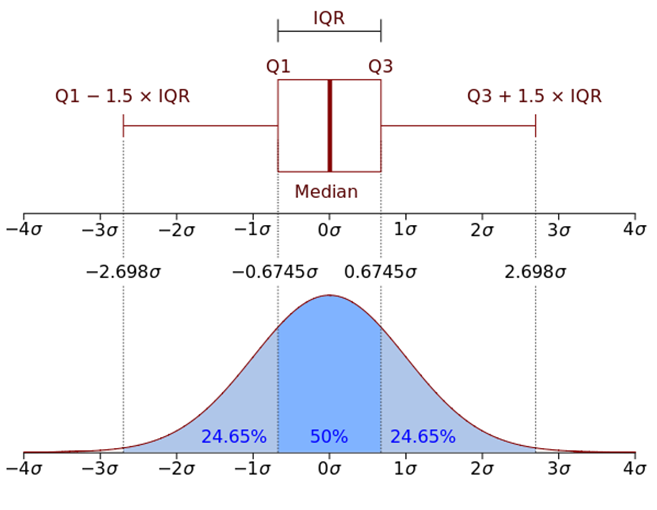

# Chosing plot types

.pull-left[
- A big part of data visualization is choosing the correct type of plot to represent the data you have

- This is largely based on astetics and trial and error, but there are some general patterns
]
.pull-right[

]

---

# Lineplots

- Implies continuity between data points
- Ideal for time-series data
- Can be combined with points to highlight individual observations

.pull-left[
```{r, eval = FALSE}
library(tidyverse)

# Load dataset from github
data <- read.table("https://raw.githubusercontent.com/holtzy/data_to_viz/master/Example_dataset/3_TwoNumOrdered.csv", header=T)
data$date <- as.Date(data$date)

data |>
  ggplot(aes(x=date, y=value)) +
    geom_line(color="#69b3a2") + #<<
    ylim(0,22000) +
    annotate(geom="text", x=as.Date("2017-01-01"), y=20089, 
             label="Bitcoin price reached $20k \nat the end of 2017") +
    annotate(geom="point", x=as.Date("2017-12-17"), y=20089, size=10, shape=21, fill="transparent") +
    geom_hline(yintercept=5000, color="orange", linewidth=1) + theme_minimal_grid()  
```
]
.pull-right[
```{r, echo = F, out.width='90%'}
# Libraries
library(ggplot2)
library(dplyr)


# Load dataset from github
data <- read.table("https://raw.githubusercontent.com/holtzy/data_to_viz/master/Example_dataset/3_TwoNumOrdered.csv", header=T)
data$date <- as.Date(data$date)

# plot
data %>% 
  ggplot( aes(x=date, y=value)) +
    geom_line(color="#69b3a2") + 
    ylim(0,22000) +
    annotate(geom="text", x=as.Date("2017-01-01"), y=20089, 
             label="Bitcoin price reached $20k \nat the end of 2017") +
    annotate(geom="point", x=as.Date("2017-12-17"), y=20089, size=10, shape=21, fill="transparent") +
    geom_hline(yintercept=5000, color="orange", linewidth=1) + theme_minimal_grid() 
```
]

---

# Scatter plots

- Displays the relation between two continuous variables
- Works well for reasonably sized data sets

.pull-left[
```{r, eval = FALSE}
library(cowplot)
ggplot(iris, aes(Sepal.Width, Sepal.Length, 
                 color = Species)) + 
    geom_point(size = 3) + #<<
    theme_cowplot() + 
    theme(legend.position = "bottom")
```
]
.pull-right[
```{r, echo = F, out.width='90%'}
library(cowplot)
ggplot(iris, aes(Sepal.Width, Sepal.Length, 
                 color = Species)) + 
    geom_point(size = 3) + 
    theme_cowplot() + 
    theme(legend.position = "bottom")
```
]


---

# Ellipses can be added to highlight groups

- `stat_ellipse` can add confidence ellipses to aid group identities

.pull-left[
```{r, eval = FALSE}
library(cowplot)
ggplot(iris, aes(Sepal.Width, Sepal.Length, 
                 color = Species, 
                 fill = Species)) + 
    stat_ellipse(linewidth = 1) + #<<
    geom_point(size = 3, shape = 21, 
               color = "black") +
    theme_cowplot() + 
    theme(legend.position = "bottom")
```
]
.pull-right[
```{r, echo = F, out.width='90%'}
library(cowplot)
ggplot(iris, aes(Sepal.Width, Sepal.Length, 
                 color = Species, fill = Species)) + 
    stat_ellipse(linewidth = 1) +
    geom_point(size = 3, shape = 21, color = "black") +
    theme_cowplot() + 
    theme(legend.position = "bottom")
```
]


---

# Trend lines with `geom_smooth`

- By default, geom_smooth uses a **loess** curve, a very simple mean trend estimator
    - [**loess**](https://en.wikipedia.org/wiki/Local_regression) = locally estimated scatterplot smoothing

.pull-left[
```{r, eval = FALSE}
ggplot(iris, 
       aes(Sepal.Width, Sepal.Length, 
           color = Species, 
           fill = Species)) + 
    geom_point(size = 3, 
               shape = 21, 
               color = "black") +
    geom_smooth(aes(group = Species)) + #<<
    theme_cowplot() + 
    theme(legend.position = "bottom")
```
]
.pull-right[
```{r, echo = F, out.width='90%', message = FALSE}
ggplot(iris, aes(Sepal.Width, Sepal.Length, 
                 color = Species, fill = Species)) + 
    geom_point(size = 3, shape = 21, color = "black") +
    geom_smooth(aes(group = Species)) +
    theme_cowplot() + 
    theme(legend.position = "bottom")
```
]

---

# Trend lines with `geom_smooth`

- By default, geom_smooth uses a **loess** curve, a very simple mean trend estimator
    - [**loess**](https://en.wikipedia.org/wiki/Local_regression) = locally estimated scatterplot smoothing
- We can add a linear trend line by changing the `method` argument in `geom_smooth`

.pull-left[
```{r, eval = FALSE}
ggplot(iris, 
       aes(Sepal.Width, Sepal.Length, 
           color = Species, 
           fill = Species)) + 
    geom_point(size = 3, 
               shape = 21, 
               color = "black") +
    geom_smooth(aes(group = Species),
                method = "lm") + #<<
    theme_cowplot() + 
    theme(legend.position = "bottom")
```
]
.pull-right[
```{r, echo = F, out.width='90%', message = FALSE}
ggplot(iris, aes(Sepal.Width, Sepal.Length, 
                 color = Species, fill = Species)) + 
    geom_point(size = 3, shape = 21, color = "black") +
    geom_smooth(aes(group = Species),
                method = "lm") +
    theme_cowplot() + 
    theme(legend.position = "bottom")
```
]

---

# Distributions - histograms

- Measurements from continuous distributions usually have more or less probable values
- We can represent this using histograms or density plots

.pull-left[
```{r, eval = FALSE}
x = rnorm(1000, mean = 5, sd = 1)
data.frame(x) |>
    ggplot(aes(x)) + 
    geom_histogram(fill = "black") + 
    geom_vline(xintercept = mean(x), 
               color = 2, 
               linewidth = 2) +
    theme_minimal_grid() 
```
]
.pull-right[
```{r, echo = F, out.width='90%'}
x = rnorm(1000, mean = 5, sd = 1)
data.frame(x) |>
    ggplot(aes(x)) + 
    geom_histogram(fill = "black", bins = 30) + 
    geom_vline(xintercept = mean(x), color = 2, linewidth = 2) +
    theme_minimal_grid(16) 
```
]


---

# Distributions - density

- Measurements from continuous distributions usually have more or less probable values
- We can represent this using histograms or density plots

.pull-left[
```{r, eval = FALSE}
data.frame(x) |>
    ggplot(aes(x)) + 
    geom_density(color = "black", 
                 fill = "gray70",
                 alpha = 0.3) + 
    geom_vline(xintercept = mean(x), 
               color = 2, 
               linewidth = 2) +
    theme_minimal_grid() 
```
]
.pull-right[
```{r, echo = F, out.width='90%'}
data.frame(x) |>
    ggplot(aes(x)) + 
    geom_density(color = "black", fill = "gray70", alpha = 0.3) + 
    geom_vline(xintercept = mean(x), color = 2, linewidth = 2) +
    theme_minimal_grid(16) 
```
]


---

# Distributions - histogram and density

- Measurements from continuous distributions usually have more or less probable values
- We can represent this using histograms or density plots

.pull-left[
```{r, eval = FALSE}
data.frame(x) |>
    ggplot(aes(x)) + 
    geom_histogram(aes(y = after_stat(density)),
                   fill = "lightblue", 
                   bins = 30) + 
    geom_density(color = "black", 
                 fill = "gray70", 
                 alpha = 0.3, linewidth=2) + 
    geom_vline(xintercept = mean(x), 
               color = 2, linewidth = 2) +
    theme_minimal_grid() 
```
]
.pull-right[
```{r, echo = F, out.width='90%'}
data.frame(x) |>
    ggplot(aes(x)) + 
    geom_histogram(aes(y = after_stat(density)),fill = "lightblue", bins = 30) + 
    geom_density(color = "black", fill = "gray70", alpha = 0.3, linewidth=2) + 
    geom_vline(xintercept = mean(x), color = 2, linewidth = 2) +
    theme_minimal_grid(16) 
```
]


---


# Ridge plots with `ggridges`

- Links distributions with some categorical variable

.pull-left[
```{r, eval = FALSE}
library(ggridges); library(viridis)
library(hrbrthemes)

ggplot(lincoln_weather, 
       aes(x = `Mean Temperature [F]`, 
           y = `Month`, 
           fill = after_stat(x))) +
  geom_density_ridges_gradient(scale = 3,
                               rel_min_height = 0.01) +
  scale_fill_viridis(name = "Temp. [F]", 
                     option = "C") +
  labs(title = 'Temperatures in Lincoln NE in 2016') +
  theme_ipsum() +
    theme(
      legend.position="none",
      panel.spacing = unit(0.1, "lines"),
      strip.text.x = element_text(size = 8)
    )
```
]
.pull-right[
```{r, echo = F, out.width='90%', warning = FALSE, message = FALSE, }
library(ggridges); library(viridis)
library(hrbrthemes)

ggplot(lincoln_weather, 
       aes(x = `Mean Temperature [F]`, 
           y = `Month`, 
           fill = after_stat(x))) +
  geom_density_ridges_gradient(scale = 3,
                               rel_min_height = 0.01) +
  scale_fill_viridis(name = "Temp. [F]", 
                     option = "C") +
  labs(title = 'Temperatures in Lincoln NE in 2016') +
  theme_ipsum() +
    theme(
      legend.position="none",
      panel.spacing = unit(0.1, "lines"),
      strip.text.x = element_text(size = 8)
    )
```
]

---

# Boxplots

.center[
    
]

---

# Boxplots

- Relates continuous and categorical variables, and allows for quick comparisons of main quantiles across groups


.pull-left[
```{r, eval = FALSE}
ggplot(ToothGrowth, aes(x=factor(dose), y=len)) + 
  geom_boxplot(fill = 2) +
  labs(x = "Dose", y = "Length") +
  theme_cowplot()
```
]
.pull-right[
```{r, echo = F, out.width='90%'}
ggplot(ToothGrowth, aes(x=factor(dose), y=len)) + 
  geom_boxplot(fill = 2) +
  labs(x = "Dose", y = "Length") +
  theme_cowplot()
```
]


---


# Jitter plots

.pull-left[
```{r, eval = FALSE}
ggplot(ToothGrowth, aes(x=factor(dose), y=len)) + 
  geom_point() +
  labs(x = "Dose", y = "Length") +
  theme_cowplot()
```
]
.pull-right[
```{r, echo = F, out.width='90%'}
ggplot(ToothGrowth, aes(x=factor(dose), y=len)) + 
  geom_point() +
  labs(x = "Dose", y = "Length") +
  theme_cowplot()
```
]

---

# Jitter plots

.pull-left[
```{r, eval = FALSE}
ggplot(ToothGrowth, aes(x=factor(dose), y=len)) + 
  geom_jitter(width = 0.1, height = 0) + #<<
  labs(x = "Dose", y = "Length") +
  theme_cowplot()
```
]
.pull-right[
```{r, echo = F, out.width='90%'}
ggplot(ToothGrowth, aes(x=factor(dose), y=len)) + 
  geom_jitter(width = 0.1, height = 0) +
  labs(x = "Dose", y = "Length") +
  theme_cowplot()
```
]

---


# Jitter plots and boxplots

.pull-left[
```{r, eval = FALSE}
ggplot(ToothGrowth, aes(x=factor(dose), y=len)) + 
  geom_boxplot(fill = 2, outlier.alpha = 0) +
  geom_jitter(width = 0.1, height = 0, size = 2) + 
  labs(x = "Dose", y = "Length") +
  theme_cowplot()
```
]
.pull-right[
```{r, echo = F, out.width='90%'}
ggplot(ToothGrowth, aes(x=factor(dose), y=len)) + 
  geom_boxplot(fill = 2, outlier.alpha = 0) +
  geom_jitter(width = 0.1, height = 0, size = 2) +
  labs(x = "Dose", y = "Length") +
  theme_cowplot()
```
]

---


# Barplots 

- Relates mean measurements with categorical values
- Should probably be used only when zero is a value of interest
- Broadly overused in molecular biology


.pull-left[
```{r, eval = FALSE}
iris |>
  select(Species, Sepal.Length) |>
  group_by(Species) |>
  summarise(n=n(), mean=mean(Sepal.Length), 
            sd=sd(Sepal.Length)
  ) |>
  mutate( se=sd/sqrt(n)) |>
  ggplot( aes(x=Species, y=mean)) +
    geom_bar(stat="identity", fill="forestgreen", 
             alpha=0.5) +
    geom_errorbar(aes(ymin=mean-se, ymax=mean+se),
                      width=0.4, colour="gray30", 
                      alpha=0.9, linewidth=1.5) +
    scale_y_continuous
        (expand = expansion(mult = c(0, 0.05))) +
    labs(caption = "Using standard error") + 
    theme_cowplot()
```
]
.pull-right[
```{r, echo = F, out.width='90%'}
library(dplyr)
iris |>
  select(Species, Sepal.Length) |>
  group_by(Species) |>
  summarise( 
    n=n(),
    mean=mean(Sepal.Length),
    sd=sd(Sepal.Length)
  ) |>
  mutate( se=sd/sqrt(n)) |>
  ggplot( aes(x=Species, y=mean)) +
    geom_bar(stat="identity", fill="forestgreen", alpha=0.5) +
    geom_errorbar(aes(ymin=mean-se, ymax=mean+se), width=0.4, colour="gray30", alpha=0.9, linewidth=1.5) +
    scale_y_continuous(expand = expansion(mult = c(0, 0.05))) +
    labs(title = "Using standard error") + theme_cowplot()
```
]


---

# Point range plots

- Great alterative to barplots when zero is not special


.pull-left[
```{r, eval = FALSE}
iris |>
  select(Species, Sepal.Length) |>
  group_by(Species) |>
  summarise(n=n(), mean=mean(Sepal.Length), 
            sd=sd(Sepal.Length)
  ) |>
  mutate( se=sd/sqrt(n)) |>
  ggplot( aes(x=Species, y=mean)) +
    geom_point() +
    geom_errorbar(aes(ymin=mean-se, ymax=mean+se),
                      width=0.1, colour="gray30", 
                      alpha=0.9, linewidth=1.5) +
    labs(title = "Using standard error") + 
    theme_cowplot()
```
]
.pull-right[
```{r, echo = F, out.width='90%'}
iris |>
  select(Species, Sepal.Length) |>
  group_by(Species) |>
  summarise(n=n(), mean=mean(Sepal.Length), 
            sd=sd(Sepal.Length)
  ) |>
  mutate( se=sd/sqrt(n)) |>
  ggplot( aes(x=Species, y=mean)) +
    geom_point() +
    geom_errorbar(aes(ymin=mean-se, ymax=mean+se),
                      width=0.1, colour="gray30", 
                      alpha=0.9, linewidth=1.5) +
    labs(title = "Using standard error")  +
    theme_cowplot()
```
]


---

# Barplots vs point range

.pull-left[
```{r, echo = F, out.width='90%'}
library(dplyr)
iris |>
  select(Species, Sepal.Length) |>
  group_by(Species) |>
  summarise( 
    n=n(),
    mean=mean(Sepal.Length),
    sd=sd(Sepal.Length)
  ) |>
  mutate( se=sd/sqrt(n)) |>
  ggplot( aes(x=Species, y=mean)) +
    geom_bar(stat="identity", fill="forestgreen", alpha=0.5) +
    geom_errorbar(aes(ymin=mean-se, ymax=mean+se), width=0.4, colour="gray30", alpha=0.9, linewidth=1.5) +
    scale_y_continuous(expand = expansion(mult = c(0, 0.05))) +
    theme_cowplot()
```
]
.pull-right[
```{r, echo = F, out.width='90%'}
iris |>
  select(Species, Sepal.Length) |>
  group_by(Species) |>
  summarise(n=n(), mean=mean(Sepal.Length), 
            sd=sd(Sepal.Length)
  ) |>
  mutate( se=sd/sqrt(n)) |>
  ggplot( aes(x=Species, y=mean)) +
    geom_point() +
    geom_errorbar(aes(ymin=mean-se, ymax=mean+se),
                      width=0.1, colour="gray30", 
                      alpha=0.9, linewidth=1.5) +
    theme_cowplot()
```
]

---

# Reaction norms - lines and point ranges

.pull-left[
```{r, eval = FALSE}
time <- c("t1","t1","t1","t1","t1","t1",
          "t2","t2","t2","t2","t2","t2")
species <- c(1,1,1,2,2,2,1,1,1,2,2,2)
value <- c(1,2,3,11,12,13,4,5,6,11,12,13)

df <- data.frame(time, species,value)
df$time <- as.factor(df$time)
df$species <- as.factor(df$species)

ggplot(df, 
       aes(x=time, y=value, 
           color = species,
           group = species)) + 
    geom_point() + 
    stat_summary(fun=mean) + 
    stat_summary(geom="errorbar", 
                 fun.data= mean_cl_boot,
                 width = 0.1) + 
    stat_summary(aes(group = species), 
                geom = "line", fun = mean) +
    labs(y = "Fitness", x = "Condition") + 
    theme_minimal_hgrid()
```
]
.pull-right[
```{r, echo = F, out.width='90%'}
time <- c("t1","t1","t1","t1","t1","t1",
          "t2","t2","t2","t2","t2","t2")
species <- c(1,1,1,2,2,2,1,1,1,2,2,2)
value <- c(1,2,3,11,12,13,4,5,6,11,12,13)

df <- data.frame(time, species,value)
df$time <- as.factor(df$time)
df$species <- as.factor(df$species)

ggplot(df, 
       aes(x=time, y=value, 
           color = species,
           group = species)) + 
    geom_point() + 
    stat_summary(fun=mean) + 
    stat_summary(geom="errorbar", 
                 fun.data= mean_cl_boot,
                 width = 0.1) + 
    stat_summary(aes(group = species), 
                geom = "line", fun = mean) +
    labs(y = "Fitness", x = "Condition") + 
    theme_minimal_hgrid()
```
]

---

# Heatmaps

- Used for representing correlation and covariance matrices
- Also common for showing all points across some condition (RNAseq, microarray...)

- Canned package: [`ggheatmap`](https://github.com/XiaoLuo-boy/ggheatmap)

.pull-left[
```{r, eval = FALSE}
cor_matrix = cor(iris[,-5])
diag(cor_matrix) = 0
melted_cormat = reshape2::melt(cor_matrix)
ggplot(melted_cormat, 
       aes(x=Var1, y=Var2, fill=value)) +
    geom_tile() +
    labs(x = NULL, y = NULL, 
         fill = "Correlation") + 
    scale_fill_distiller(type="div", 
                         palette="RdBu", 
                         limits = c(-1, 1)) +
    theme_minimal(16) +
    theme(legend.position = "bottom",
          legend.key.width= unit(3, 'cm'))
```
]
.pull-right[
```{r, echo = F, out.width='85%'}
cor_matrix = cor(iris[,-5])
diag(cor_matrix) = 0
melted_cormat = reshape2::melt(cor_matrix)
ggplot(melted_cormat, 
       aes(x=Var1, y=Var2, fill=value)) +
    geom_tile() +
    labs(x = NULL, y = NULL, 
         fill = "Correlation") + 
    scale_fill_distiller(type="div", 
                         palette="RdBu", 
                         limits = c(-1, 1)) +
    theme_minimal(16) +
    theme(legend.position = "bottom",
          legend.key.width= unit(3, 'cm'))
```
]


---

# 2d density plots

---

class:  left, top
background-image: url(figures/ggplot_ext.png)
background-position: center right
background-size: 100%

# [ggplot2 extension gallery](https://exts.ggplot2.tidyverse.org/gallery/)
