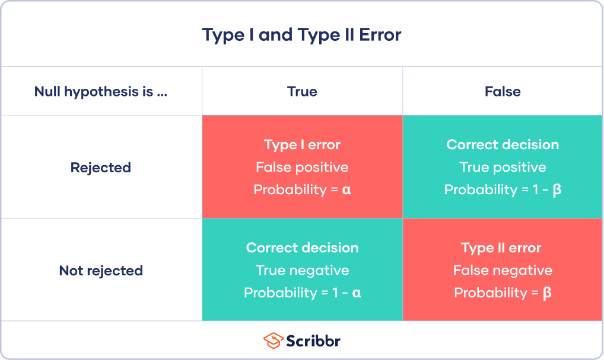

# Python's Philosophy

.pull-left[
Python has several core guiding principles:

- **Beautiful:** Code should be aesthetically pleasing and follow the conventions of the community.

- **Explicit:** Clarity is key, avoid being implicit.

- **Simple:** Favor simple, compact and pre-existing solutions.

- **Readability:** Write code that others can easily read and understand.
]
.pull-right[

]

---
# Code Quality!

### Code Formatters
- **Black**: A *highly* opinionated automatic formatter following a consistent style.
- **autopep8**: Automatically formats code following the PEP 8 style guide (*recommended*). 
- **isort**: Sorts imports alphabetically and automatically separated into sections and by type.

### Linters
They detect code formatting + bad coding practices and styles
- **Flake8**: formatter checking style and quality, good help for clean code.
- **Pylint**: A comprehensive tool to analyze code for errors and enforcing a coding standard (*recommended*).

---

# Python Applications

.left-column60[
- Web Development (Django, Flask)
- Data Analysis (**Pandas**, **NumPy**)
- Machine Learning (PyTorch, TensorFlow, **scikit-learn**)
- Automation and Scripting
- Scientific Computing
- Data Visualization (**Matplotlib**, **Seaborn**, Plotly)
]
.right-column60[

]


---

# Google Colab
Google's cloud-based Jupyter notebook environment: [Google Colab](https://colab.research.google.com/)

- Free access to **GPUs**: Useful for machine learning tasks.
- **No setup** required: Write and execute code directly.
- Easy **sharing**: Just like Google Docs, you can share your Colab notebooks with others.
- Can get much **slower** than on your local machine...


- Just click "new notebook" and start coding!
- `Shift + Enter` to run a cell, as in Jupyter notebooks.


---

class: inverse, center, middle
# Python reminders

---

# Reminders: data types
Types are explicit mostly only in numpy

- **int**: Integer numbers
- **float**: Floating-point numbers
- **str**: Strings
- **bool**: Boolean values (True/False) 

```{python, eval=F}
a = np.array([1, 2, 3], dtype=np.int8) # 8 is the precision
b = np.array([1.0, 2.0, 3.0], dtype=np.float32) # 32 is the precision
c = np.array(['a', 'b', 'c'], dtype='str')
d = np.array([True, False, True], dtype=np.bool)
```

---
# Reminders: data structures

- **Lists**: Ordered and mutable (similar to R lists).  
*Note*: to make a numpy array of lists, need to use `dtype=np.object`, so that elements can be of different types and lengths
```{python, eval=F}
a = np.empty(3, dtype=np.object) # but loose most of numpy speed with dtype=object
a[0] = [1, 2, 3]
a[1] = [4, 5]
a[2] = [6, 7, 8, 9]
```

- **Tuples**: Ordered and immutable collection.  
*Note*: tuples are often used to collect arguments or return values
```{python, eval=F}
counts, bins = np.histogram(x) # can also use '_' for unused elements
plt.stairs(counts, bins) # equivalent to plt.hist(h)
```

- **Dictionaries**: Unordered collection of key-value pairs (similar to R lists with named elements).
- **Sets**: Unordered collection of unique (immutable) elements.
```{python, eval=F}
myset = {1, 2, 2, 3, 3} # will contain {1, 2, 3} only
```

---
# Reminders: indexing and control flow

- 0-based indexing + easy slicing:  
`a[0]`, `a[1:3]`,   
`a[a>1]`, `a[~(a>1)]`,  
`a[-1]` (last element),  
`a[::-1]` (reverse order),  
`a[::2]` (every 2nd element) 

- **Control flow**: `if`, `elif`, `else`, `for`, `while`, `break`, `continue`, `pass`

- lambda functions:  
`df.apply(lambda x: x**2) # applies square function to all elements of df`

---
# Reminders: pandas
- Very easy reading:  
`pd.read_csv()`, `pd.read_sql()`, `pd.read_json()`, `pd.read_html()`,  
`pd.read_pickle()` (binary file storing any python object),  
`pd.read_stata()`, ...

Filtering essentials:
- **Columns:** `df['col']` or `df[['col1', 'col2']]`
- **Rows by Position:** `df.iloc[0]` or `df.iloc[:5]`
- **Rows by Label:** `df.loc['index']`
- **Condition:** `df[df['col'] > value]`
- **Combine Rows & Columns:** `df.loc[rows, ['col1', 'col2']]`
- **Scalar Value:** `df.at['row', 'col']` or `df.iat[0, 1]`
- **Query:** `df.query('col1' > 0 & 'col2' < 0)`

Then all the data wrangling: `groupby`, `merge`, `split`, `melt`, `concat`, ...

---
# python cheatsheets

- [numpy cheatsheet](https://s3.amazonaws.com/assets.datacamp.com/blog_assets/Numpy_Python_Cheat_Sheet.pdf)
- [pandas cheatsheet](https://pandas.pydata.org/Pandas_Cheat_Sheet.pdf)
- [matplotlib many cheatsheets](https://matplotlib.org/cheatsheets/)
- [Seaborne cheatsheet](https://images.datacamp.com/image/upload/v1676302629/Marketing/Blog/Seaborn_Cheat_Sheet.pdf)


---

class: inverse, center, middle
# Statistics essentials

---
# Basic statistics
- nth moment of a distribution: $\mu_n = \frac{1}{N} \sum (x_i - c)^n$
    - $n=1$: **mean**, with $c=0$
    - $n=2$: **variance**, with $c=\bar{x}$. Standard deviation ( $\sqrt{\text{Var}}$) can be approx. by **RMS** (root-mean-square)  
    *Note*: variances (of uncorrelated samples) are **additive**, not standard deviations!
    - $n=3$: **skewness** = difference between extent of the two 'tails'
    - $n=4$: **kurtosis** = how 'fat' both tails are compared to a normal distribution

- Quantities related to ranking:
    - **median**: middle value of a sorted list (percentile 50)
    - **mode**: most frequent value ( = peak of histogram)
    - **percentiles**: quantiles that divide the data into 100 parts of equal size

- Covariance: $\text{Cov}(X, Y) = \frac{1}{N} \sum (x_i - \bar{x})(y_i - \bar{y})$.  
Divide by the product of standard deviations of $X$ and $Y$ to get the correlation coefficient (`df.corr()`).

- numpy functions: `np.mean(x)`, `np.var(x)`, `np.std(x)`, `np.median(x)`,   
`np.percentile(x, [2.5, 25, 50, 75, 97.5])`, ... 

---
# Profiled statistics with `binned_statistic`

.negspace20[
One can transform 2D data, into the statistic of one variable versus the binned other variable
]

.negspace20[
```{python, echo=F}
import pandas as pd
import matplotlib.pyplot as plt
import seaborn as sns
```

.pull-left[
```{python, echo=F}
df = pd.read_csv("data/sharedprosperity.csv", 
                 skiprows=22) # https://visualizingenergy.org/is-shared-prosperity-connected-to-per-capita-energy-use/
df = df.groupby(df.columns[0]).first()
# remove outliers
df = df[df['Annualized growth of energy use per capita (%)'] < 5]

energy = df['Annualized growth of energy use per capita (%)']
income = df['Annualized growth in mean consumption or income per capita bottom 40']
continent = df['Continent']
```
```{python, eval=F}
df = pd.read_csv("data/sharedprosperity.csv", 
                 skiprows=22) # https://visualizingenergy.org/is-shared-prosperity-connected-to-per-capita-energy-use/
df = df.groupby(df.columns[0]).first()
energy = df['Annualized growth of energy use per capita (%)']
income = df['Annualized growth in mean consumption or income per capita bottom 40']
continent = df['Continent']
sns.scatterplot(x=energy, y=income, 
                hue=continent)
```

```{python, echo=F, out.width='70%'}
fig, ax = plt.subplots()
sns.scatterplot(x=energy, y=income, hue=continent)
plt.xlabel("Growth rate of energy per capita (%)")
plt.ylabel("Growth rate of income per capita for poorest 40% (%)")
plt.show()
```
]
.pull-right[
```{python, eval=F}
from scipy.stats import binned_statistic
_,xedges,yedges,_ = plt.hist2d(energy, income, 
                               bins=13, cmin=1e-2)
bin_means,_,_ = binned_statistic(energy, income, 
                                 statistic='mean', 
                                 bins=xedges)
plt.plot(bin_centers, bin_means, c='red', lw=2)
```
```{python, echo=F, results='hide', out.width='75%'}
from scipy.stats import binned_statistic
fig, ax = plt.subplots()

_, xedges, yedges, _ = plt.hist2d(energy, income, bins=13, cmin=1e-2)
bin_means, _, _ = binned_statistic(energy, income, statistic='mean', bins=xedges)
bin_centers = xedges[1:] - (xedges[1] - xedges[0])/2
plt.xlabel("Growth rate of energy per capita (%)")
plt.ylabel("Growth rate of income per capita for poorest 40% (%)")
plt.plot(bin_centers, bin_means, c='red', lw=2)
plt.show()
```
]
]

---
# z-score

.negspace20[

]

.negspace20[
- z-score = **1** standard deviation: **68%** of the data
- z-score = **2** standard deviation: **95% **of the data
- These numbers change when only one side of the distribution is considered  
e.g. $3\sigma$ is **99.9%** (and not **99.7%**) of the data if the null hypothesis is at 0

]

---

# Uncertainties and confidence intervals

.negspace10[
- Conventions for "how wide" the uncertainty bars should be differ a lot between fields!  
**Always say what your uncertainties/confidence intervals are in the caption.**

- Uncertainty ("error") bars are **confidence intervals** that are often set at 95% (2$\sigma$) or 68% (1$\sigma$) confidence level. 
This is the probability that, **if we were to repeat the experiment, the true value would fall within this interval.**

- This is the "**frequentist**" view where the "truth" is the base, and data is distributed around it.  
The "**Bayesian**" considers the data as true, and the model as uncertain.
]

.negspace20[
.left-column60[
```{python, eval=F}
bin_means, _, _ = binned_statistic(energy, 
                                   income, 
                                statistic='mean', bins=13)
bin_stds, _, _ = binned_statistic(energy, 
                                  income, 
                                statistic='std', bins=13)
bin_centers = xedges[1:] - (xedges[1] - xedges[0]) / 2
plt.errorbar(bin_centers, bin_means, 
             yerr=bin_stds, 
             fmt='o', color='red', capsize=5, 
             label='Binned Mean ± 1 SD')
```
]
.right-column60[
```{python, echo=F, results='hide', out.width='85%'}
import numpy as np
plt.figure()
_, xedges = np.histogram(energy, bins=13)
bin_means, _, _ = binned_statistic(energy, income, statistic='mean', bins=13)
bin_stds, _, _ = binned_statistic(energy, income, statistic='std', bins=13)
bin_centers = xedges[1:] - (xedges[1] - xedges[0]) / 2
plt.errorbar(bin_centers, bin_means, yerr=bin_stds, fmt='o', color='red', capsize=5, label='Binned Mean ± 1 SD')

plt.xlabel("Growth rate of energy per capita (%)")
plt.ylabel("Growth rate of income per capita for poorest 40% (%)")
plt.legend()
plt.show()
```
]
]

---
# Systematic vs statistical uncertainties

- Statistical uncertainties are due to the truly random nature of the data.  
    - **Only these errors are actually Gaussian-distributed and follow the confidence intervals conventions.** 

- **Systematic uncertainties** come from another "truth" element that is **not or wrongly modelled**.  
    - Can come from instruments, human error, or things in the environment that are ignored in the model
    - Often not gaussian-distributed because there is a non-random/systematic process causing them. 
    - But the confidence interval framework is still often used for lack of better understanding of their cause

- **MonteCarlo** (MC) simulation or **sensitivity analysis** can help to estimate systematic uncertainties:
    - E.g. vary an important hyperparameter of your model (e.g. what function you use for regression) and check how your final measurements variables
    - If you know (or have a good guess of) the distribution of this uncertain parameter, you can propagate it:
        - Draw a parameter value from this distribution
        - Run your model with this parameter, get the measurements
        - Repeat this for many ( $n>100-1000$) parameter values
        - Draw the distribution of resulting measurements and use its standard deviation as uncertainty

---

# Hypothesis testing

- Determines if there is enough evidence to say *"this hypothesis is true for our sampled population"*  
    -- this is what **most papers** try to do!

- **Null Hypothesis** ( $H_0$ ): the default or "no effect" assumption.  
Example: "This drug has no effect on this health indicator."

- **Alternative Hypothesis** ( $H_1$ ): the effect or difference we hope to observe  
Example: "This drug improves this health indicator."

- Process:
    - Formulate hypotheses,  
    - then choose a statistical test and a significance level (e.g. 0.05),  
    - then calculate the test statistic and p-value,
    - finally, reject $H_0$ if p-value < significance level

- Rigourously: **"How likely is it that we would observe this data if the null hypothesis were true?"**

---
# p-value

- **p-value**: The probability of observing a **test statistic as extreme as that of your data**,  
assuming that the null hypothesis is true.
.center[

]

---
# p-value

- **p-value**: The probability of observing a **test statistic as extreme as that of your data**,  
assuming that the null hypothesis is true.

- Beware:
    - p-value is not the probability of the null hypothesis being true
    - **If you test 20 different things, you will probably end up with one p-value<5%  
    even if all null hypotheses are true!**  
    - Important to decide on your hypotheses **before** looking at the data

- In particle physics, the p-value threshold is set to $10^{-7}$ (z-score = 5) and the **global** significance (considering all tests that were made) is often used
- In biology and social sciences, the threshold is often set to 0.05 (z-score = 1.96)

- But what test statistic to use?

---
# Test statistics
- Multiple test statistics can be used:
    - z-test: $\frac{\bar{x} - \mu}{\sigma/\sqrt{n}}$ for comparing the mean of a large population to an expected value
    - When **comparing two scalar values with uncertainties**, very simple formula:  
    **z-score** = $\frac{x_1 - x_2}{\sqrt{\sigma_1^2 + \sigma_2^2}}$  
    - **Chi-square** test: $\chi^2 = \sum \frac{(Obs-Exp)^2}{Exp}$, to be compared to a $\chi^2$ distribution with the number of degrees of freedom of the data: `scipy.stats.chi2.pdf(x, n_dof)`  
    That is generally used in the simplest linear regressions.
    - **t-test**: Is there a significant difference between the means of two groups? Works for small groups. E.g. the same population before and after a treatment.  
    `scipy.stats.ttest_ind(a, b, equal_var=False)` (for unequal variances)
    - **F-test/ANOVA**: Are the means of multiple groups different?
    `f_oneway(group1, group2, group3)`
    - **Kolmogorov-Smirnov test**: Are two samples drawn from the same distribution? `scipy.stats.ks_2samp(a, b)`

- Important intuition to check if the formula for your test makes sense:  
the **standard deviation is proportional to $\sqrt{n}$** (for normal distributions)


---
# Type I and Type II errors in hypothesis testing

.left-column[
.center[



]
]
.right-column[
Choosing an acceptance threshold is always a **trade-off between false positives and false negatives**!

**Power** of a test = $1-\beta$. Probability of rejecting the null hypothesis when it is actually false.
]

---
# Correlation vs causation

[Spurious correlations by Tyler Vigen](https://www.tylervigen.com/spurious-correlations)


- Correlations are useful indicators but no proof of causality. 
- In general, need to check against many possible **confounding variables** that might influence the focal variable/measurement (typical multi-linear regression) 