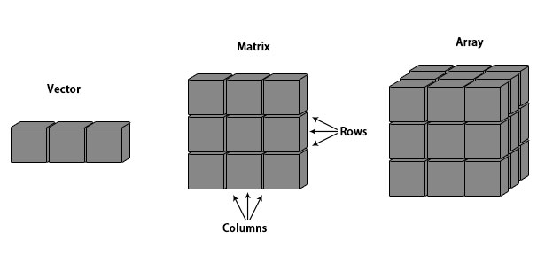

class: inverse, center, middle
# Loops are slow in R

---

class: left, top
background-image: url(figures/splitApplyCombine.png)
background-position: center middle
background-size:  70%

# Split-apply-combine scheme

---

# The apply family of functions

- Meant to make using functions along object easy

- Several types, depending on the input and output type

    - `apply`: along dimensions of an array
    - `lapply`: along the elements of a vector or list, returns a list
    - `sapply`: along the elements of a vector or list, returns a vector (if possible)
    - `tapply`: along the elements of a vector, grouped by a factor vector

- These differ in how the "split" part of Split-Apply-Combine is represented

- These are not always "type stable": the output format can change depending on the function we use

---
# apply in vectors and array

- General strucure: 
```r
apply(X = array or matrix, 
          MARGIN = dimension that is kept, 
          FUN = function that is used)
```
.center[

]
---

# apply in vectors and array

- General strucure: 
```r
apply(X = array or matrix, 
          MARGIN = dimension that is kept, 
          FUN = function that is used)
```

```{r}
data(iris)
# Extract the numeric values as a matrix
iris_num = as.matrix(iris[,1:4])

# calculate colun means
apply(iris_num, 2, mean)

# This is so common there is a fast dedicated function:
colMeans(iris_num)
```

---

# At least one array during this course...

- The `iris3` dataset has the same data as in the `iris` dataframe, but in an array format

- It has 3 dimensions
    - Dim 1, rows, indexed individuals
    - Dim 2, columns, indexes traits
    - Dim 3, that lacks a common name, holds species

```{r}
dim(iris3)
```
--

- To calculate the variance per trait per species

```{r}
apply(iris3, c(2, 3), var)
```
---

# `tapply`, old school `group_by`

- General strucure: 
```r
tapply(X = vector,
          MARGIN = grouping_vector, 
          FUN = function that is used)
```

```{r}
sepal_means = tapply(iris$Petal.Length, iris$Species, mean)
sepal_means
```
--

```{r, eval = F}
# Can be used to calculate residuals from the correct mean
residuals = iris$Petal.Length - sepal_means[iris$Species]
plot(iris$Petal.Length[iris$Species == unique(iris$Species)[1]], ylim = c(-1, 8), pch = 19)
points(iris$Petal.Length[iris$Species == unique(iris$Species)[2]], ylim = c(-1, 8), col = 2, pch = 19)
points(iris$Petal.Length[iris$Species == unique(iris$Species)[3]], ylim = c(-1, 8), col = 3, pch = 19)

for(s in unique(iris$Species)){
  points(residuals[iris$Species == s], ylim = c(-1, 8), col = 4, pch = 18)
}
```

---

# `lapply`, the super useful generic function for lists


- General strucure: 
```r
lapply(X = vector or list,
           FUN = function that is used)
```

```{r}
# List all the csv files in the current folder
my_csvs = dir(pattern = "\\.csv$")

# Apply the read.csv function to each file
input_dfs = lapply(my_csvs, read.csv)

# Check out the dimensions of the imputed data.frames
lapply(input_dfs, dim)
```


---

class: inverse, center, middle
# Modern Alternatives to apply functions

---

# The evolution of the apply family: `plyr`

- The `plyr` package is an early tidyverse precursor that provides more intuitive, type stable, replacements for the apply family of functions.

- Functions have a generic naming scheme: `..ply()`

.pull-left[
  - The first letter defines the input format:
    - `l.ply()` - receives a list
    - `d.ply()` - receives a data.frame
    - `a.ply()` - receives an array
] 
--
.pull-right[
  - The second letter defines the output format:
    - `.lply()` - outputs a list
    - `.dply()` - outputs a data.frame
    - `.aply()` - outputs an array
] 
--
```{r}
library(plyr)
adply(iris3, 3, colMeans) # Array to data.frame
```
---

# `l.ply`

- Lists are naturaly segregated, so we only need to pass an input list and a function

```{r} 
library(plyr)
simple_list <- list('zero' = rnorm(5), 
                    'five' = rnorm(5, 5), 
                    'ten' = rnorm(5, 10))
simple_list
laply(simple_list, mean)
```

---

# Type conversions using `plyr`

- The plyr functions are convenient for converting objects:
- To convert out list to a data.frame, use `ldply`:
```{r}
ldply(simple_list)
```

- Or to an array, using `laply`:

```{r}
laply(simple_list, identity) # for arrays we need the identity() function
```

---

# `a.ply` functions

- Arrays lack a natural division, so we need to specify the dimensions to apply the functions using the second argument

- aaply is NOT a drop-in replacement for apply, can you spot why?
```{r}
aaply(iris3, 3, colMeans)
```

---

# `d.ply` is mostly obsolete

- Any time you feel the urge to use plyr to work on a data.frame, you should probably use the tidyverse functions we saw last week

- `dplyr`, the tidyverse package that holds all the data.frame manipulation functions is a more modern version of `ddply`

- If you do need to use `d.ply`, there are some pitfals.

- This command fails, because ddply does not ignore the grouping variable when passing the remaining columns to the function:

```r
ddply(iris, "Species", colMeans
Error in .fun(piece, ...) : 'x' must be numeric
```
--
- We can solve this by creating a single-use function that uses the correct columns:

```r
ddply(iris, "Species", function(x) colMeans(x[,-5]))
```


---

# Parallel computing for the masses

- `plyr` is old, but it is the easy way to run parallel code in R

- The parallel interface in `plyr` is dead simple

1. Just load a parallel computation package, 
2. tell it how many threads you want to use, 
3. and use the `plyr` functions with the `.parallel = TRUE` argument


```{r}
library(doMC)
registerDoMC(8)

system.time(x <- llply(1:10000, function(x) rnorm(10), .parallel = FALSE))
system.time(x <- llply(1:10000, function(x) rnorm(10), .parallel = TRUE))
```

---

# Running a parallel bootstrap

```{r}
runGLM <- function(arg){
  x <- iris[which(iris[,5] != "setosa"), c(1,5)]
  ind <- sample(100, 100, replace=TRUE)
  result1 <- glm(x[ind,2]~x[ind,1], family=binomial(logit))
  coefficients(result1)
}
```

- This computation is complex enough that it  is worth it to spin-up all the extra cores

```{r}
system.time(x <- llply(1:1000, runGLM, .parallel = FALSE))
system.time(x <- llply(1:1000, runGLM, .parallel = TRUE))
```

---

class: inverse, center, middle
# Post-Modern Alternatives to apply functions

---


# Back into the tidyverse with `purrr`

- Functions for applying a function over a vector

- Great error messages

- Basic function is `map`

.pull-left[

```{r}
triple <- function(x) x * 3
map(1:3, triple)
```
]
.pull-right[
  
]

---

background-image: url(figures/map.png)
background-position: middle center
background-size:  50%
# Visualizing `map`

---


background-image: url(figures/map-arg.png)
background-position: middle center
background-size:  50%
# Additional arguments get repeated

---


background-image: url(figures/map-arg-recycle.png)
background-position: middle center
background-size:  50%
# Additional arguments get repeated 

- Even vectors get repeated

---

background-image: url(figures/map2.png)
background-position: middle center
background-size:  50%
# If you have two lists of arguments, `map2`

---

background-image: url(figures/pmap-3.png)
background-position: middle center
background-size:  50%
# After that, `pmap`

- For `pmap`, the inputs should be wrapped in a list

---

background-image: url(figures/pmap-arg.png)
background-position: middle center
background-size:  50%
# All these functions allow common arguments

---

# Type stable functions

- You usually know the type of the output you expect

- There are some functions that guarantee that outcome:

  - `map_int`: returns a `int` vector

  - `map_dbl`: returns a `numeric` vector

  - `map_lgl`: returns a `logical` vector

  - `map_vec`: returns a vector of the simplest possible type

- These throw great comprehensible errors when the output type is unexpected

- [Purrr Cheat Sheet](https://rstudio.github.io/cheatsheets/purrr.pdf)

- [Functional programming](https://adv-r.hadley.nz/functionals.html)

---

# `purrr` in the tidyverse

```{r}
library(purrr)

mtcars |> 
  split(mtcars$cyl) |>  # from base R
  map(\(df) lm(mpg ~ wt, data = df)) |> 
  map(summary) %>%
  map_dbl("r.squared")

```

---

background-image: url(figures/reduce.png)
background-position: middle center
background-size:  50%
# Reduce


---

background-image: url(figures/walk.png)
background-position: middle center
background-size:  35%
# `walk` and `walk2`, for the side effects

- Side effects are things that happen in a program that do not alter any object.
  - Showing a plot 
  - Outputing a file (`export`, `write_csv`)
  - Printing to the console (`cat`, `print`)

---

background-image: url(figures/walk2.png)
background-position: middle center
background-size:  40%
# `walk` and `walk2`, for the side effects

- Side effects are things that happen in a program that do not alter any object.
  - Showing a plot 
  - Outputing a file (`export`, `write_csv`)
  - Printing to the console (`cat`, `print`)

---

# walk2 for outputing files

```r
# Split the iris data.set into 3 parts
iris_list = split(iris, iris$Species)

# Create the appropriate file names:
iris_out_files = paste0("iris-", names(iris_list), ".csv")

# Use the walk2 function to write the files
walk2(iris_list, iris_out_files, write_csv)

# Check that the files were created
dir(pattern = "iris")
```