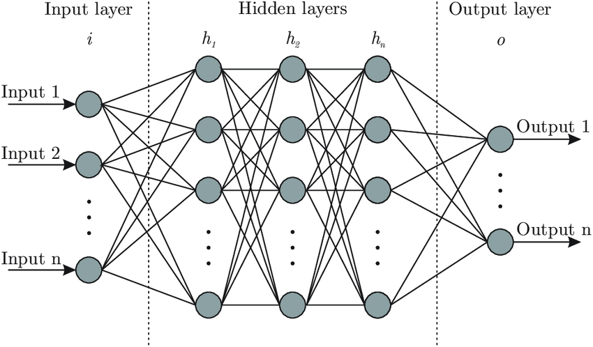

# Statistics: a love-hate relationship?

.pull-left[
- Statistics is the science of learning from data. You don't need to like it, but you need to know it enough to do good science on the topics that you actually like...

- Sometimes the topic cannot even be separated from the data and its stats (bioinformatics).
]
.pull-right[
  
]


---

# Some references

.pull-left[
- Next semester: EEB 355 Statistics for Biology (Spring)
    - Companion course of EEB 330

]
.pull-right[
  
]

---

# Some references

.pull-left[
- Next semester: EEB 355 Statistics for Biology (Spring)
    - Companion course of EEB 330

- A very advisable introduction to statistics:
    - [Statistical Rethinking](https://xcelab.net/rm/statistical-rethinking/) by Richard McElreath
    - [Full course on YouTube](https://www.youtube.com/watch?v=FdnMWdICdRs&list=PLDcUM9US4XdPz-KxHM4XHt7uUVGWWVSus&ab_channel=RichardMcElreath)
]
.pull-right[
  
]
---

# Some references

.pull-left[
- Next semester: EEB 355 Statistics for Biology (Spring)
    - Companion course of EEB 330

- A very advisable introduction to statistics:
    - [Statistical Rethinking](https://xcelab.net/rm/statistical-rethinking/) by Richard McElreath
    - [Full course on YouTube](https://www.youtube.com/watch?v=FdnMWdICdRs&list=PLDcUM9US4XdPz-KxHM4XHt7uUVGWWVSus&ab_channel=RichardMcElreath)

- The second book to read (quite technical):
  - [Bayesian Data Analysis](http://www.stat.columbia.edu/~gelman/book/) by Andrew Gelman et al.
  - And companion software: [Stan](https://mc-stan.org/)

]
.pull-right[
  
]
---

# Some references

.pull-left[
- Next semester: EEB 355 Statistics for Biology (Spring)
    - Companion course of EEB 330

- A very advisable introduction to statistics:
    - [Statistical Rethinking](https://xcelab.net/rm/statistical-rethinking/) by Richard McElreath
    - [Full course on YouTube](https://www.youtube.com/watch?v=FdnMWdICdRs&list=PLDcUM9US4XdPz-KxHM4XHt7uUVGWWVSus&ab_channel=RichardMcElreath)

- The second book to read (quite technical):
  - [Bayesian Data Analysis](http://www.stat.columbia.edu/~gelman/book/) by Andrew Gelman et al.
  - And companion software: [Stan](https://mc-stan.org/)

- Cool short (but still somewhat complete) book
  - [Computer Age Statistical Inference](https://hastie.su.domains/CASI/) 
  by [Bradley Efron](https://statistics.stanford.edu/people/bradley-efron) and [Trevor Hastie](https://web.stanford.edu/~hastie/)
]
.pull-right[
  
]

---

# Honorable mentions

.pull-left[
  
]
.pull-right[
  
]

---

# Statistical Inference

## What is Statistical Inference?

- Statistical inference is the process of drawing conclusions on a population based on partial samples of it.

## Objectives of Statistical Inference

- Objectives of statistical inference:

  1. **Estimation**: mean (e.g. of a trait value), variance, proportion (e.g. of a certain phenotype), ...
  2. **Hypothesis Testing**: prove claims about the population (e.g. "Does noise pollution affect whales?").
  3. **Decision making** (e.g. "Should we use this treatment?")
  4. **Causal inference** (e.g. "What gene is responsible for a certain phenotype?")
  5. **Prediction** (e.g. "Will this population survive under current conditions?")

- Multiplicity of **methods to achieve each objective**. Need to **choose** the one that fits, considering:
    - The data (continuous, discrete, independence of variables, sample size, ...)
    - The question (causality? prediction? comparison?) 
    - The context (e.g. ease of use, computational cost, interpretability, ...)

---

# Statistics in the old days

.center[

]

---

# Linear models are great

```{r, eval=F}
x <- rnorm(100)
y <- 1 + 2*x + rnorm(100)
m1 = lm(y ~ x)
```

.negspace30[
.center[
    
]
]

---

# The bootstrap method

- The Bootstrap Method is a resampling technique: it repeatedly resamples from the observed data to estimate the sampling distribution. It is used to estimate the distribution of a statistic (e.g. mean or variance).

- Another resampling technique uses **simple permutations for comparing groups**:

```{r}
# Example data
savana <- c(120, 107, 110, 116, 114, 111, 113, 117, 114, 112)
forest <- c(110, 111, 107, 108, 110, 105, 107, 106, 111, 111)
sapling_height <- c(savana, forest)
location <- factor(rep(c("savana", "forest"), 
                   each=10))
sap_data = data.frame(height = sapling_height, 
                      location = location)
head(sap_data)
```

---

# The logic of a permutation test

.pull-left[
1. Determine a statistc of interest
2. Calculate the statistic for the observed data
3. Randomly permute the data
4. Calculate the statistic for the permuted data
5. Repeat steps 3 and 4 many times
6. Compare the distribution of permuted statistics to the observed statistic

### Is there a difference in the mean height across locations?
]

--

.pull-right[

```{r}
library(tidyverse)
# Calculate the observed difference in means
obs_diff <- sap_data %>% 
  group_by(location) %>%
  summarise(m = mean(height)) %>%
  summarise(diff = diff(m)) %>%
  pull(diff)
obs_diff

# Randomly permute the data
# Calculate the permuted difference in means
sap_data %>% 
  mutate(location_perm = 
          sample(sap_data$location)) %>%
  group_by(location_perm) %>%
  summarise(m = mean(height)) %>%
  summarise(diff = diff(m)) %>%
  pull(diff)
```
]

---

# The logic of a permutation test

.pull-left[
1. Determine a statistic of interest
2. Calculate the statistic for the observed data
3. Randomly permute the data
4. Calculate the statistic for the permuted data
5. Repeat steps 3 and 4 many times
6. Compare the distribution of permuted statistics to the observed statistic

### Is there a difference in the mean height across locations?
]

.pull-right[
```{r, echo = F}
set.seed(42)
```
```{r}
# Repeat steps 3 and 4 many times
perm_diffs <- map_dbl(1:1000, 
    function(x)
      sap_data %>% 
        mutate(location_perm = 
                sample(sap_data$location)) %>%
        group_by(location_perm) %>%
        summarise(m = mean(height)) %>%
        summarise(diff = diff(m)) %>%
        pull(diff))
summary(perm_diffs)
```
]

---

# The logic of a permutation test

## Compare the distribution of permuted to the observed statistic

.pull-left[
```{r, eval = FALSE}
hist(perm_diffs)
abline(v = obs_diff, col = "red", lwd = 2)
```

- What proportion of the permuted differences are larger than the observed difference?
```{r}

sum(obs_diff < perm_diffs)/length(perm_diffs)
```
]
.pull-right[
```{r, echo = F, out.width='90%'}
hist(perm_diffs)
abline(v = obs_diff, col = 2, lwd = 2)
```
]
---

# Same thing in lm()

.pull-left[
```{r}
# Fit model
m2 = lm(height ~ location, data = sap_data)
summary(m2)
```
]
.pull-right[
```{r, echo=FALSE, out.width='90%', messages = F}
library(cowplot)
sap_data$dummy_loc = as.numeric(as.factor(sap_data$location)) - 1
ggplot(sap_data, aes(x = dummy_loc, 
                     y = height)) +
  geom_jitter(width = 0.01) + geom_smooth(method = "lm") + 
  scale_x_continuous(breaks = c(0, 1), 
                     labels = c("Forest", "Savana")) +
  labs(x = "Location", y = "Height (mm)") + 
  theme_cowplot(16)
```
]

---

# Systematic errors

.pull-left[
- Statistical tests are right only with perfect data and model...

- Many sources of systematic errors:
    - **Model selection**: when you fit a wrong model to the data. Need **sensitivity analysis** to test the robustness of the results.

    - **Selection bias**: when the sample is not representative of the population

    - **Confounding variables**: when the effect of a variable is mixed with that of another

    - **Publication bias**: when only significant results are published

    - **P-hacking** and **Multiple testing**: do the analysis until a significant result is found??
]
.pull-right[

]
---

# more complex models... = machine learning

.pull-left[
- Machine learning is just **more complex (and less understandable/interpretable...)** statistical models

- Reminder: avoid **overfitting** by separating test and train samples (and use **cross-validation** for determining hyper-parameters)
]
.pull-right[
.center[

]]


---
# Sophisticated machine learning in biology
Berman et al., *Mapping the stereotyped behaviour of freely moving fruit flies*, JRSI 11, 99, (2014)

.center[

]

- Aligning and rescaling *billions* of frames of fruits flies

- Reducing data of static postures to **50-dimensional time series** with **PCA**

- Extract pseudo-behaviors (postures evolving in time) from the "power" of certain postures

- Apply **t-SNE clustering** on the (1250-dimensional) pseudo-behaviors: true behaviors emerge!

- In a following paper: they predict the lifetime of a fruit fly from its behavior in the first day of life...

---
# Neural networks, deep learning
Neural networks is the main tool of deep learning, a subset of ML:
- typically uses **more numerous but more basic** (less expert-manipulated) input features

- used for image recognition, speech recognition, recommendation systems, ...

.pull-left[
- networks are composed of **layers of "neurons"** that fire above a threshold on input weights (or other transformation of the weight).

- the output of one layer is the input of the next layer. Final layer = result

- network **architecture** = number of layers, number of neurons per layer, activation function, ...

- CNN, RNN, LSTM, GAN, ...
]
.pull-right[
.center[

]]

---
# Neural networks, deep learning
Neural networks is the main tool of deep learning, a subset of ML:
- typically uses **more numerous but more basic** (less expert-manipulated) input features

- used for image recognition, speech recognition, recommendation systems, ...

.pull-left[
- networks are composed of **layers of "neurons"** that fire above a threshold on input weights (or other transformation of the weight).

- the output of one layer is the input of the next layer. Final layer = result

- network **architecture** = number of layers, number of neurons per layer, activation function, ...

- CNN, RNN, LSTM, GAN, ...
]
.pull-right[
```{python, eval=F}
from tensorflow.keras.models import Sequential
from tensorflow.keras.layers import Dense

model = Sequential([
  Dense(16, activation='relu', 
        input_shape=(10,)), # Hidden layer
  Dense(1, activation='sigmoid')# Output layer
])

model.compile(optimizer='adam', 
              loss='binary_crossentropy', metrics=['accuracy'])

model.fit(X_train, y_train, epochs=10)
```
]

---
# LLM and transformers
.pull-left[
- Large Language Models are based on transformers

- Transformers are a type of neural network architecture that is designed to handle sequential data, such as text

- Foundational paper: *Attention is all you need* (2017). Many "AI scientists" just pretend to understand it and work on analysing superficial behavior of the models...
]
.pull-right[
.center[

]]

---

# Technical debt, code architecture, refactoring

- **Technical debt** = choosing **quick, easy solutions that cannot be built upon**, instead of more effective and thought-of approaches.

- When building a large-ish code: not enough for it to work! It must be **maintainable, scalable, and readable**.

.center[

]

---

# Technical debt, code architecture, refactoring

- **Technical debt** = choosing **quick, easy solutions that cannot be built upon**, instead of more effective and thought-of approaches.

- When building a large-ish code, it is not enough for it to work! It must be **maintainable** (when something bugs, you know where), **scalable, and readable**.

- **Refactoring** is the process of restructuring existing (working) code into units that are easier to understand and maintain.

- For example, building **python modules or R packages**, to have functional units in separate files (in addition to using functions).

```{python, eval=F}
# First file, with name: my_module.py
def my_function():
    return "Hello, world!"

# Second file, with name: main.py
import my_module
print(my_module.my_function())
```

---

# Documentation and comments
.pull-left[
- **Documentation** is key! It is the only way to make sure your code can be understood by others (or yourself in the future).

- **Comments** are also important, but they should not be used to explain what the code does and how to use it (that's what documentation is for). Instead, they should explain why the code does what it does.
]
.pull-right[
.center[

]]

---

# memory usage

- How to keep track of what uses memory in your code?

```{python, eval=F}
import psutil
import os

# Function to get current memory usage (in MB)
def get_memory_usage():
    process = psutil.Process(os.getpid())
    return process.memory_info().rss / 1024 / 1024

print(f"Memory usage before: {get_memory_usage():.2f} MB")
#### do something with large memory usage ####
print(f"Memory usage after: {get_memory_usage():.2f} MB")
```
or

```{python, eval=F}
from memory_profiler import profile
@profile # this make this function profiled whenever it runs
def my_func():
    return [1]*10**6 # A large list
```

---

# Giving arguments to a script

- How to build a script that accepts command-line arguments?

.pull-left[
```{python, eval=F}
import sys
# Get command-line arguments
arguments = sys.argv

print("Your arguments are:", arguments[1:])
```
]
.pull-right[  
R equivalent:
```{r, eval=F}
args <- commandArgs(trailingOnly = TRUE)
```
]

Running this in the terminal with `python my_script.py arg1 arg2` will print `Your arguments are: ['arg1', 'arg2']`.

- More complete way: `argparse` module. Try running this script with `python my_script.py Alice --age 30`:

```{python, eval=F}
import argparse
parser = argparse.ArgumentParser()
parser.add_argument('name', type=str, help='Your name') # unnamed argument
parser.add_argument('--age', type=int, help='Your age') # named argument

# Parse the command-line arguments
args = parser.parse_args()
print(f"Hello, {args.name}! You are {args.age} years old.")
```


---

# Closing remarks 

1. What do you think programing will add to your work?

1. Did you learn something you were not expecting?

1. Are there any topics you missed? 

1. Topics you wanted to hear more?

1. Topics you would remove?

1. What would you change for next year?
