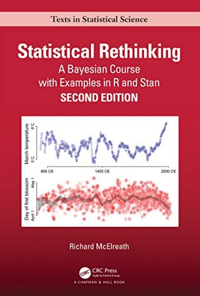

# Some references

.pull-left[
- Next semester: EEB 355 Statistics for Biology (Spring)
    - New companion course with [Merlijn Staps](https://merlijnstaps.nl/)
]
.pull-right[
  
]

---

# Some references

.pull-left[
- Next semester: EEB 355 Statistics for Biology (Spring)
    - New companion course with [Merlijn Staps](https://merlijnstaps.nl/)

- My favourite modern introduction to statistics:
    - [Statistical Rethinking](https://xcelab.net/rm/statistical-rethinking/) by [Richard McElreath](https://xcelab.net/)
    - [Full course on YouTube](https://www.youtube.com/watch?v=FdnMWdICdRs&list=PLDcUM9US4XdPz-KxHM4XHt7uUVGWWVSus&ab_channel=RichardMcElreath)
]
.pull-right[
  
]

---


# Some references

.pull-left[
- Next semester: EEB 355 Statistics for Biology (Spring)
    - New companion course with [Merlijn Staps](https://merlijnstaps.nl/)

- My favourite modern introduction to statistics:
    - [Statistical Rethinking](https://xcelab.net/rm/statistical-rethinking/) by [Richard McElreath](https://xcelab.net/)
    - [Full course on YouTube](https://www.youtube.com/watch?v=FdnMWdICdRs&list=PLDcUM9US4XdPz-KxHM4XHt7uUVGWWVSus&ab_channel=RichardMcElreath)

- The brutal second book to read:
  - [Bayesian Data Analysis](http://www.stat.columbia.edu/~gelman/book/) by [Andrew Gelman](http://www.stat.columbia.edu/~gelman/) and the gang
  - And companinon software: [Stan](https://mc-stan.org/)
]
.pull-right[
  
]

---

# Some references

.pull-left[
- Next semester: EEB 355 Statistics for Biology (Spring)
    - New companion course with [Merlijn Staps](https://merlijnstaps.nl/)

- My favourite modern introduction to statistics:
    - [Statistical Rethinking](https://xcelab.net/rm/statistical-rethinking/) by [Richard McElreath](https://xcelab.net/)
    - [Full course on YouTube](https://www.youtube.com/watch?v=FdnMWdICdRs&list=PLDcUM9US4XdPz-KxHM4XHt7uUVGWWVSus&ab_channel=RichardMcElreath)

- The brutal second book to read:
  - [Bayesian Data Analysis](http://www.stat.columbia.edu/~gelman/book/) by [Andrew Gelman](http://www.stat.columbia.edu/~gelman/) and the gang
  - And companinon software: [Stan](https://mc-stan.org/)

- Cool short advanced-ish book
  - [Computer Age Statistical Inference](https://hastie.su.domains/CASI/)
  - by [Bradley Efron](https://statistics.stanford.edu/people/bradley-efron) and [Trevor Hastie](https://web.stanford.edu/~hastie/)
]
.pull-right[
  
]

---

# Honorable mentions

.pull-left[
  
]
.pull-right[
  
]

---

# Statistical Inference

## What is Statistical Inference?

- Statistical inference is the process of drawing conclusions about populations based on sample data.

## Objectives of Statistical Inference

- Primary objectives of statistical inference:

  1. Estimation
  2. Hypothesis Testing
  3. Decision making
  1. Causal inference
  1. Prediction

---

# Statistics in the old days

.center[

]

---

# Linear models are great

.ref[https://lindeloev.github.io/tests-as-linear/]
.center[
    
]

---


# What is a Linear Model?

- A linear model is a statistical approach that represents a linear relationship between a dependent variable (Y) and one or more independent variables (X).

.pull-left[
## The linear model equation
  
$y = \beta_0 + \beta_1 x + \epsilon$
  
  - y: Dependent variable
  - x: Independent variable
  - β₀: Intercept
  - β₁: Slope
  - ε: Error term (residuals)
]
.pull-right[
```r
# Simulate some continuous x and y and 
# fit a linear model
x <- rnorm(100)
y <- 1 + 2*x + rnorm(100)

# Fit model
m1 = lm(y ~ x)
summary(m1)

library(ggplot2)
ggplot(data.frame(x, y), aes(x, y)) + 
    geom_point() + 
    geom_smooth(method = "lm")
```
]
---

# The bootstrap method

.pull-left[
- The Bootstrap Method is a powerful resampling technique used in statistics to estimate the sampling distribution of a statistic by repeatedly resampling from the observed data.

- Instead of taking repeated samples from a populations, the bootstrap method attemps to estimate the sampling distribution by using the observed data as a proxy for the true population.

- These samples can be used to estimate standard errors and make hypothesis tests.
]
.pull-right[

.ref[https://www.currentaffairs.org/2023/06/we-must-banish-bootstraps-mythology-from-american-life]
]

---

