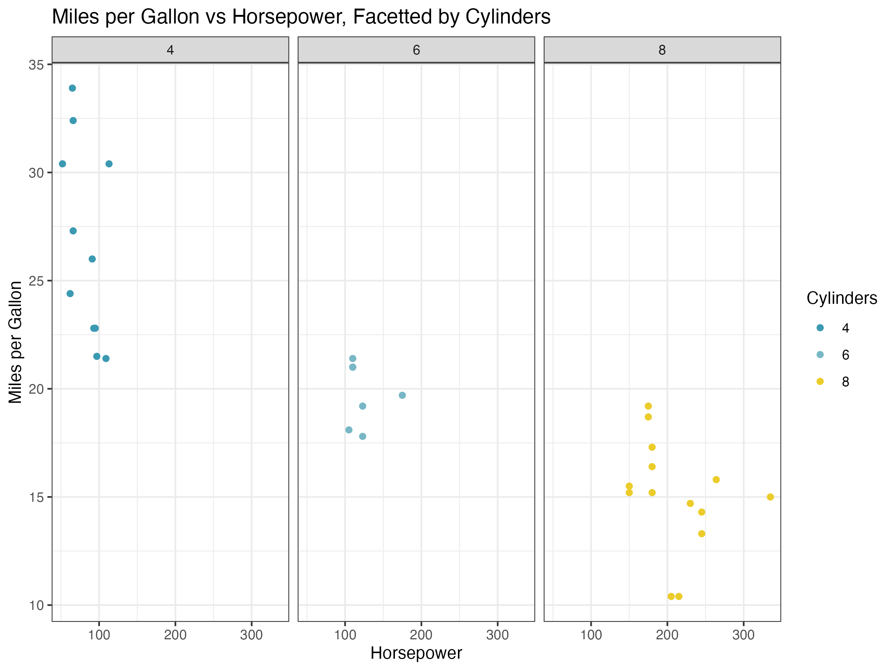
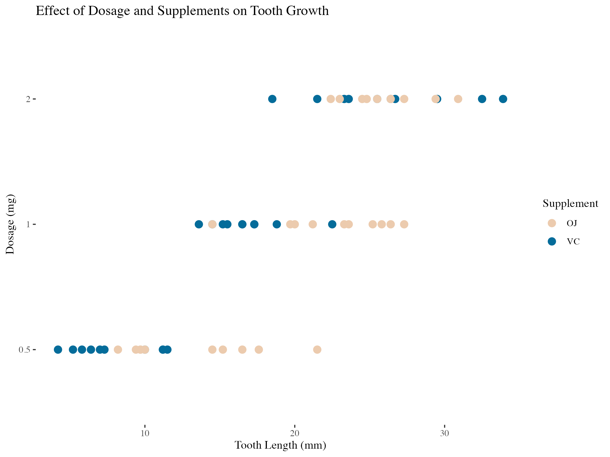
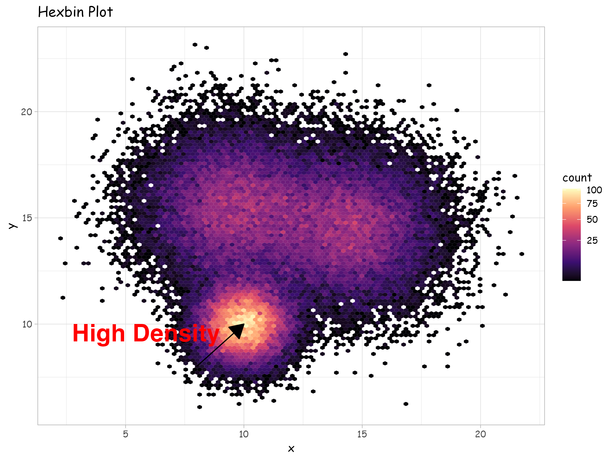

## Exercises

```{r setup, include=FALSE}
# Load the required libraries -- you may need to install them.
library(ggplot2)
library(wesanderson)
library(viridis)
library(ggthemes)
library(hexbin)
```

###  Exercise 1 -- Facetted Scatterplot
- **Dataset:** `mtcars`
- **Task:**
    * Replicate the plot below.

- **Hints:**
    * Use Wes Anderson's "Zissou1" color palette for points.
    * Use `theme_bw()`



```{r}
# YOUR CODE HERE
```


###  Exercise 2 -- Cleveland Dot Plot
- **Dataset:** `ToothGrowth`
- **Task:**
    * Replicate the plot below.

- **Hints:**
    * Use Wes Anderson's "Darjeeling2" color palette for points.
    * Use `theme_tufte()`



```{r}
# YOUR CODE HERE
```


###  Exercise 3 -- Hexbin Plot with Custom Font and Annotations

- **Dataset:** Generated in example code below.
- **Task:**
    * Replicate the plot below.

- **Hints:**
    * Use Wes Anderson's "Darjeeling2" color palette for points.
    * Use `theme_light()`
    * Use `annotate()` to add text and arrows to the plot.
    * `bins = 100`



```{r}
a <- data.frame(x = rnorm(20000, 10, 1), y = rnorm(20000, 10, 1))
b <- data.frame(x = rnorm(20000, 14.5, 1.9), y = rnorm(20000, 14.5, 1.9))
c <- data.frame(x = rnorm(20000, 9.5, 1.9), y = rnorm(20000, 15.5, 1.9))
data <- rbind(a, b, c)
```

```{r}
# YOUR CODE HERE
```