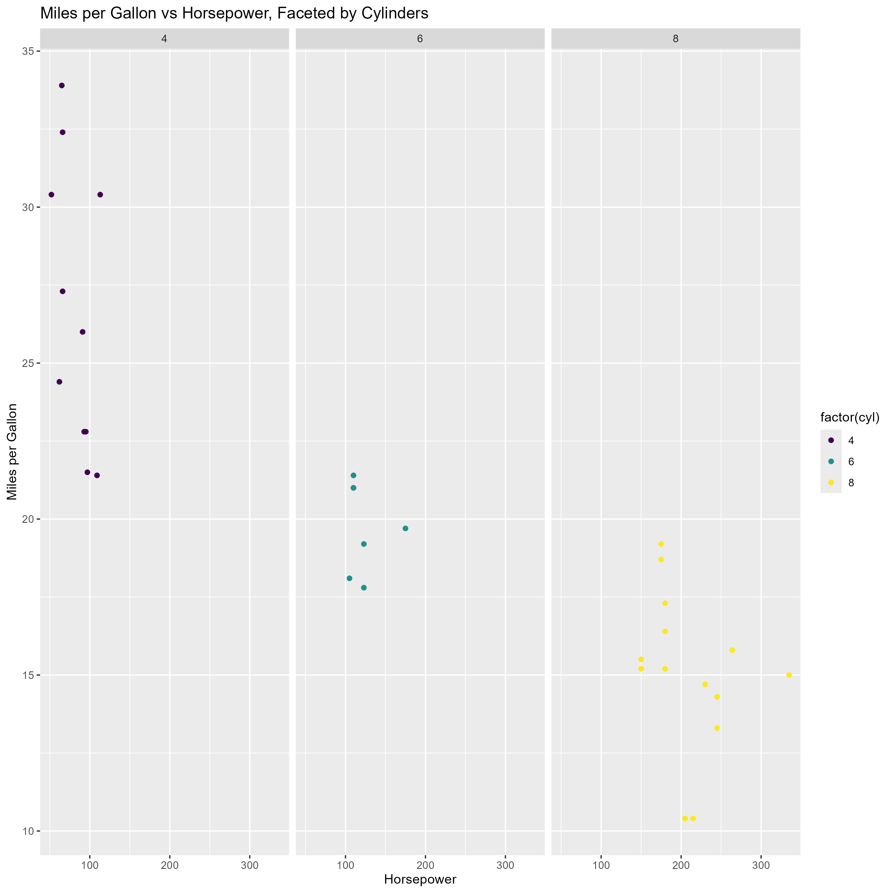
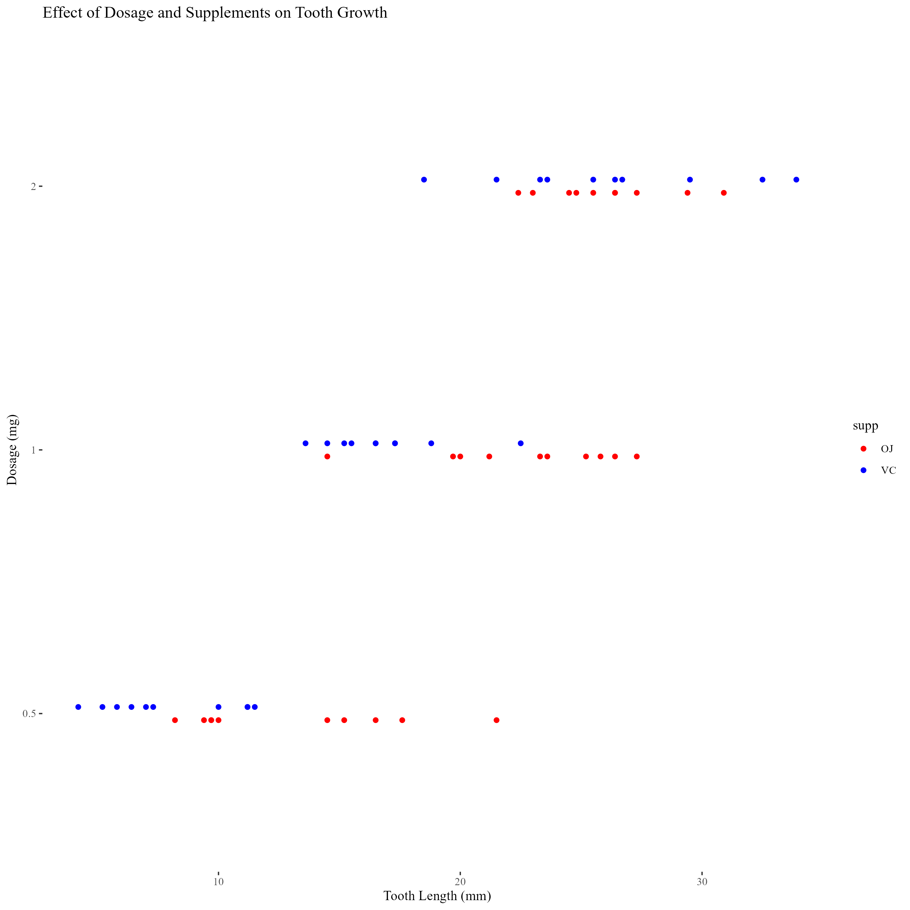
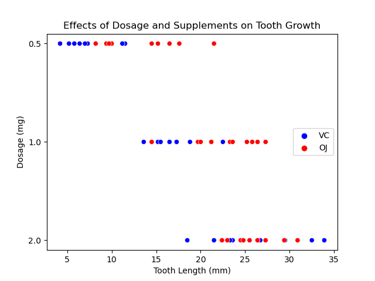
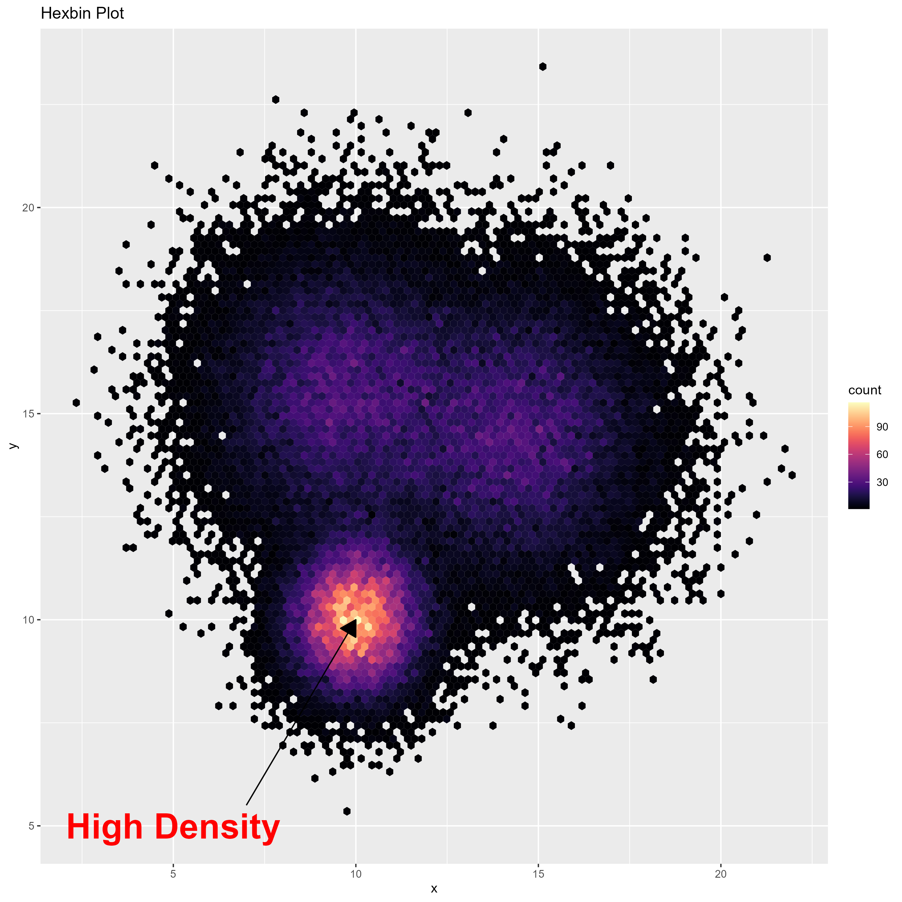
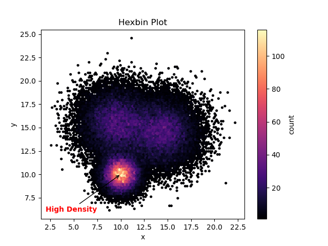

## [GitHub Classroom Link](https://classroom.github.com/a/a1s6cxEJ)
* Deadline is 1 week from today
* Choose one language to complete all exercises

## Exercises

```{r setup, include=FALSE}
# Load the required libraries -- you may need to install them.
library(ggplot2)
library(ggthemes)
library(viridis)
library(hexbin)
```

```{python}
import numpy as np
import pandas as pd
import matplotlib.pyplot as plt
import seaborn as sns
```

###  Exercise 1 -- Facetted Scatterplot
- **Dataset:** `mtcars`
- **Task:**
    * Replicate the plot below.

- **Hints:**
    * Use the viridis color palette.




###  Exercise 2 -- Cleveland Dot Plot
- **Dataset:** `ToothGrowth`
- **Task:**
    * Replicate the plot below.

- **Hints:**
    * Make sure `dose` is a categorical variable
    * Use `theme_tufte()` in R or save your figure with transparency in Python





###  Exercise 3 -- Hexbin Plot with Custom Font and Annotations

- **Dataset:** Generated in example code below.
- **Task:**
    * Replicate the plot below.

- **Hints:**
    * Use the "magma" color map from viridis.
    * Use `annotate()` to add text and arrows to the plot.
    * `bins = 100`




```{r}
a <- data.frame(x = rnorm(20000, 10, 1), y = rnorm(20000, 10, 1))
b <- data.frame(x = rnorm(20000, 14.5, 1.9), y = rnorm(20000, 14.5, 1.9))
c <- data.frame(x = rnorm(20000, 9.5, 1.9), y = rnorm(20000, 15.5, 1.9))
data <- rbind(a, b, c)
```

```{python}
a = pd.DataFrame({'x': np.random.normal(10, 1, 20000), 'y': np.random.normal(10, 1, 20000)})
b = pd.DataFrame({'x': np.random.normal(14.5, 1.9, 20000), 'y': np.random.normal(14.5, 1.9, 20000)})
c = pd.DataFrame({'x': np.random.normal(9.5, 1.9, 20000), 'y': np.random.normal(15.5, 1.9, 20000)})
data = pd.concat([a, b, c])
```